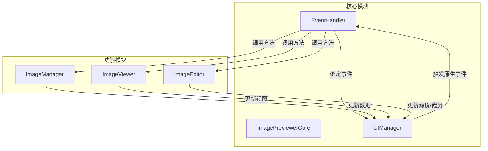
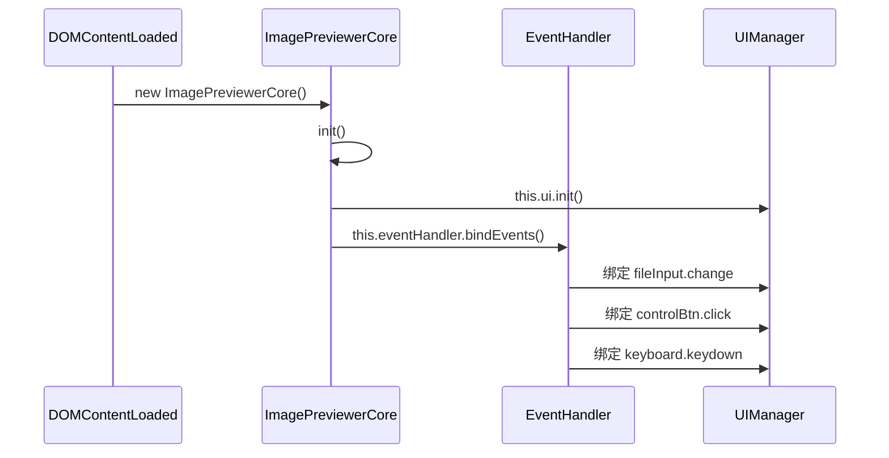
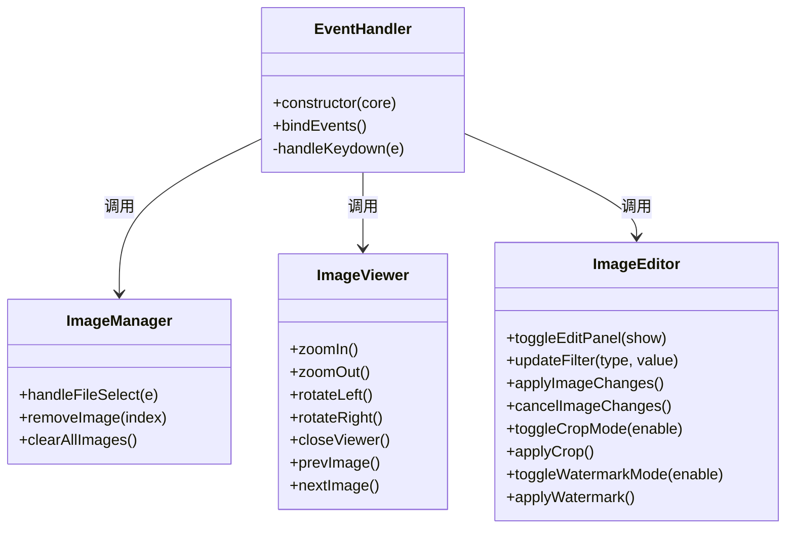

# 事件系统API

<cite>
**本文档中引用的文件**  
- [core.js](file://js/core.js)
- [eventHandler.js](file://js/eventHandler.js)
- [imageManager.js](file://js/imageManager.js)
- [viewer.js](file://js/viewer.js)
- [editor.js](file://js/editor.js)
- [ui.js](file://js/ui.js)
</cite>

## 目录
1. [简介](#简介)
2. [事件系统架构](#事件系统架构)
3. [可监听的自定义事件](#可监听的自定义事件)
4. [事件负载结构（event.detail）](#事件负载结构eventdetail)
5. [事件触发时机与传播机制](#事件触发时机与传播机制)
6. [addEventListener 使用示例](#addeventlistener-使用示例)
7. [核心模块事件派发机制](#核心模块事件派发机制)
8. [常见事件监听错误与调试方法](#常见事件监听错误与调试方法)
9. [结论](#结论)

## 简介
本项目实现了一个基于 DOM 事件模型的轻量级图像预览器应用，其交互逻辑通过事件驱动机制进行解耦。虽然未使用自定义发布订阅模式，但通过 `EventTarget` 接口和 DOM 元素的原生事件机制实现了模块间的通信。`ImagePreviewerCore` 作为核心协调者，通过 `EventHandler` 统一绑定用户操作事件，并由各功能模块（如 `ImageManager`、`ImageViewer`、`ImageEditor`）响应并触发状态变更。

## 事件系统架构



**Diagram sources**  
- [core.js](file://js/core.js#L1-L28)
- [eventHandler.js](file://js/eventHandler.js#L1-L83)
- [ui.js](file://js/ui.js#L1-L126)

**Section sources**  
- [core.js](file://js/core.js#L1-L28)
- [eventHandler.js](file://js/eventHandler.js#L1-L83)

## 可监听的自定义事件
本应用未定义全局自定义事件（如 `new CustomEvent('imageLoaded')`），而是通过模块方法调用和 DOM 状态更新来驱动 UI 变化。开发者可通过监听底层 DOM 事件或扩展模块来实现类似功能。以下是可被外部脚本监听的关键状态变更点：

- **文件选择**：`fileInput` 的 `change` 事件
- **图片加载完成**：`img` 元素的 `load` 事件（通过懒加载触发）
- **预览器打开/关闭**：`viewer` 元素的 `display` 样式变化
- **编辑模式切换**：`editPanel` 元素的 `display` 样式变化
- **图像变换操作**：`zoomIn`、`zoomOut`、`rotateLeft`、`rotateRight` 按钮的 `click` 事件
- **滤镜更新**：滑块（`brightnessSlider` 等）的 `input` 事件
- **裁剪/水印模式**：`cropOverlay` 和 `watermarkOverlay` 的 `display` 变化

## 事件负载结构（event.detail）
由于应用主要依赖 DOM 事件而非自定义事件，`event.detail` 的使用有限。但可通过以下方式获取事件相关数据：

- **文件选择事件** (`fileInput.change`)  
  - `event.target.files`: FileList 对象，包含所选文件元信息（name, size, type, lastModified）

- **图片加载事件** (`img.load`)  
  - `event.target.src`: 图片的 Data URL 或 Blob URL
  - `event.target.naturalWidth/Height`: 图像原始尺寸

- **键盘事件** (`document.keydown`)  
  - `event.key`: 按下的键值（如 'Escape', 'ArrowLeft'）

- **滑块输入事件** (`input`)  
  - `event.target.value`: 当前滑块数值（如亮度值）

## 事件触发时机与传播机制
事件系统基于标准 DOM 事件流（捕获、目标、冒泡），使用 `addEventListener` 进行监听，`removeEventListener` 进行清理。

- **触发时机**：
  - 用户交互（点击、拖拽、键盘输入）直接触发 DOM 事件。
  - 模块内部状态变更（如图片加载、索引更新）通过调用 `updateViewer()` 等方法间接更新 UI。
  - `ImageManager` 在 `processFiles` 中为每张新图片创建 DOM 元素并绑定事件。

- **传播机制**：
  - 所有事件均通过 DOM 元素传播，遵循标准事件流。
  - `EventHandler` 在 `bindEvents` 中集中注册事件监听器，确保事件处理逻辑集中管理。
  - 事件处理函数通过 `core` 引用调用其他模块的方法，实现跨模块通信。

## addEventListener 使用示例
以下示例展示如何在外部脚本中监听图像状态变更：

```javascript
// 监听文件选择事件
document.getElementById('fileInput').addEventListener('change', function(e) {
    console.log('选择了', e.target.files.length, '张图片');
});

// 监听预览器关闭事件（通过 MutationObserver）
const viewer = document.getElementById('viewer');
const observer = new MutationObserver(function(mutations) {
    mutations.forEach(function(mutation) {
        if (mutation.attributeName === 'style') {
            const display = window.getComputedStyle(viewer).display;
            if (display === 'none') {
                console.log('预览器已关闭');
            }
        }
    });
});
observer.observe(viewer, { attributes: true });

// 监听滤镜调整
document.getElementById('brightness').addEventListener('input', function(e) {
    console.log('亮度调整为:', e.target.value + '%');
});
```

## 核心模块事件派发机制

### ImagePreviewerCore 模块
`ImagePreviewerCore` 是应用的入口点，负责初始化所有模块并启动事件绑定。



**Diagram sources**  
- [core.js](file://js/core.js#L1-L28)
- [eventHandler.js](file://js/eventHandler.js#L1-L83)

**Section sources**  
- [core.js](file://js/core.js#L1-L28)

### EventHandler 模块
`EventHandler` 是事件处理的中枢，集中管理所有用户交互事件的监听与分发。



**Diagram sources**  
- [eventHandler.js](file://js/eventHandler.js#L1-L83)
- [imageManager.js](file://js/imageManager.js#L1-L196)
- [viewer.js](file://js/viewer.js#L1-L153)
- [editor.js](file://js/editor.js#L1-L754)

**Section sources**  
- [eventHandler.js](file://js/eventHandler.js#L1-L83)

## 常见事件监听错误与调试方法

### 常见错误
1. **未正确移除监听器**：在动态创建/销毁元素时，未调用 `removeEventListener`，导致内存泄漏。
2. **事件委托不当**：对大量子元素单独绑定事件，应使用事件委托优化性能。
3. **this 上下文丢失**：在回调函数中未正确绑定 `this`，导致无法访问模块实例。
4. **重复绑定**：多次调用 `bindEvents` 导致同一事件被多次触发。

### 调试方法
1. **使用浏览器开发者工具**：
   - 在 Elements 面板查看元素绑定的事件监听器。
   - 在 Console 中使用 `getEventListeners(element)` 查看监听器列表。
2. **添加日志**：
   ```javascript
   this.core.ui.elements.fileInput.addEventListener('change', (e) => {
       console.log('文件选择事件触发', e);
       this.core.imageManager.handleFileSelect(e);
   });
   ```
3. **使用 MutationObserver**：监听关键 DOM 元素的属性变化，如 `display`、`src` 等，以追踪状态变更。
4. **单元测试**：为 `EventHandler.bindEvents` 编写测试，验证事件是否正确绑定。

## 结论
该应用的事件系统虽未采用复杂的发布订阅模式，但通过清晰的模块划分和集中的事件管理（`EventHandler`），实现了良好的解耦和可维护性。开发者可通过监听 DOM 事件和观察 UI 状态变化来实现扩展逻辑。建议未来可引入自定义事件（`CustomEvent`）以提供更明确的 API，便于第三方集成。