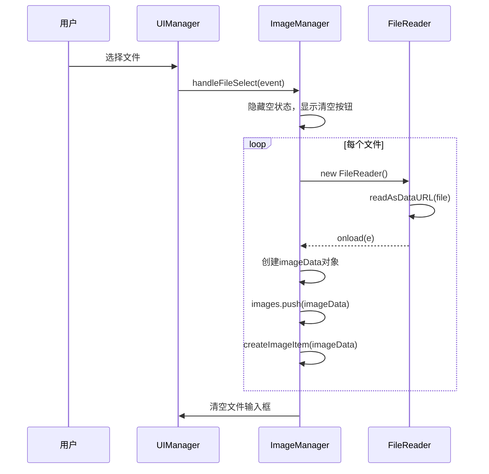
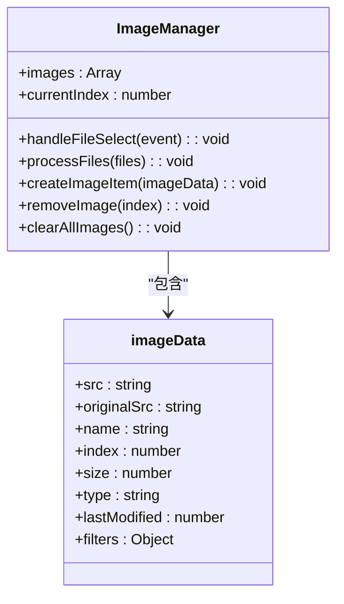
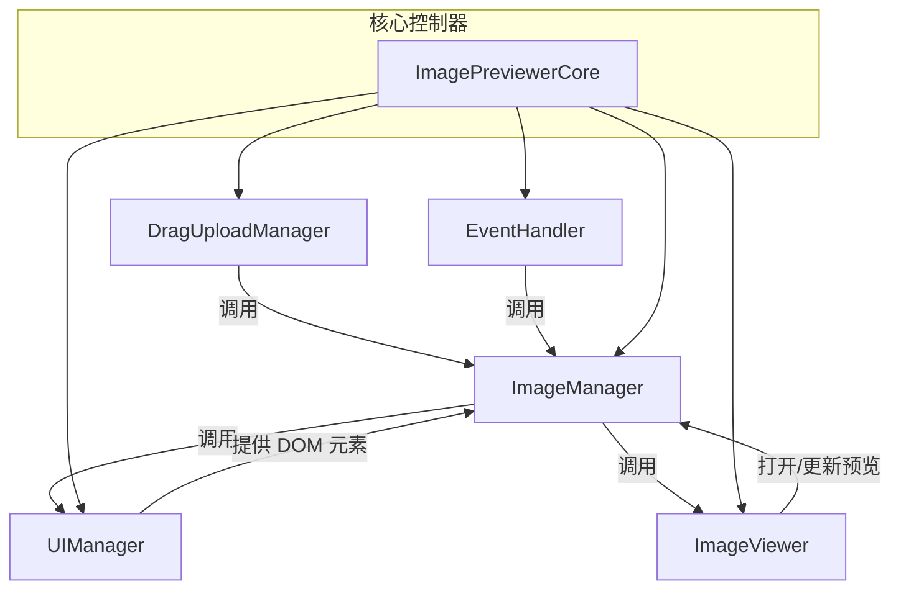

# 图像管理API

<cite>
**本文档中引用的文件**  
- [imageManager.js](file://js/imageManager.js)
- [core.js](file://js/core.js)
- [dragUpload.js](file://js/dragUpload.js)
- [ui.js](file://js/ui.js)
- [viewer.js](file://js/viewer.js)
</cite>

## 目录
1. [简介](#简介)
2. [核心组件](#核心组件)
3. [公共接口详细说明](#公共接口详细说明)
4. [图像元数据结构](#图像元数据结构)
5. [代码示例](#代码示例)
6. [与其他模块的交互关系](#与其他模块的交互关系)
7. [常见使用误区与应对策略](#常见使用误区与应对策略)
8. [结论](#结论)

## 简介
`ImageManager` 类是图像预览器的核心组件之一，负责管理用户上传的图像文件。它提供了添加、删除、清空、获取图像列表和当前图像等核心功能，同时与 UI、拖拽上传、预览器等模块紧密协作，实现完整的图像管理流程。本文档详细说明其公共接口、数据结构、使用方式及最佳实践。

## 核心组件

**Section sources**
- [imageManager.js](file://js/imageManager.js#L1-L10)
- [core.js](file://js/core.js#L2-L10)

## 公共接口详细说明

### addImage (通过 handleFileSelect 和 processFiles 实现)
该功能通过 `handleFileSelect` 和 `processFiles` 方法协同实现，用于添加本地文件到图像列表。

- **参数**: `event` (FileSelect 事件对象)
  - `event.target.files`: 包含用户选择的文件的 FileList 对象。
- **数据类型**: `Event`
- **返回值**: 无显式返回值，操作为异步。
- **内部处理逻辑**:
  1. 从事件中提取文件列表。
  2. 如果是首次添加图片，则隐藏空状态提示。
  3. 显示“清空所有”按钮。
  4. 遍历文件列表，使用 `FileReader` 读取每个图片文件。
  5. 在读取完成 (`onload`) 后，创建包含元数据的 `imageData` 对象并推入 `images` 数组。
  6. 调用 `createImageItem` 创建对应的 DOM 元素。
  7. 清空文件输入框，允许用户重复选择相同文件。



**Diagram sources**
- [imageManager.js](file://js/imageManager.js#L11-L60)

### removeImage
用于删除指定索引的单张图片。

- **参数**: `index` (要删除的图片在 `images` 数组中的索引)
  - **数据类型**: `number`
- **返回值**: 无显式返回值，操作为同步。
- **内部处理逻辑**:
  1. 弹出确认对话框。
  2. 如果确认，检查被删除图片的 `src` 是否为 `blob:` URL，若是则调用 `URL.revokeObjectURL()` 释放内存。
  3. 从 `images` 数组中移除该图片。
  4. 从 DOM 中移除对应的 `.image-item` 元素。
  5. 如果删除的是当前预览的图片，调整 `currentIndex`。
  6. 如果删除后图片列表为空，显示空状态并隐藏清空按钮；否则，如果预览器处于打开状态，则更新预览器。

**Section sources**
- [imageManager.js](file://js/imageManager.js#L137-L175)

### clearAll
用于清空所有已添加的图片。

- **参数**: 无
- **返回值**: 无显式返回值，操作为同步。
- **内部处理逻辑**:
  1. 弹出确认对话框。
  2. 遍历 `images` 数组，对所有 `src` 为 `blob:` URL 的图片调用 `URL.revokeObjectURL()` 释放内存。
  3. 将 `images` 数组置空，重置 `currentIndex` 为 0。
  4. 清空 DOM 中的图片列表。
  5. 显示空状态，隐藏清空按钮，并清空文件输入框。
  6. 如果预览器处于打开状态，则关闭它。

**Section sources**
- [imageManager.js](file://js/imageManager.js#L178-L195)

### getImageList
获取当前所有图片的列表。

- **参数**: 无
- **返回值**: `Array<Object>` - 包含所有 `imageData` 对象的数组。
- **数据类型**: `Array`
- **内部处理逻辑**: 直接返回 `this.images` 数组的引用。



**Diagram sources**
- [imageManager.js](file://js/imageManager.js#L1-L195)

### getCurrentImage
获取当前正在预览的图片。

- **参数**: 无
- **返回值**: `Object` - 当前 `images` 数组中 `currentIndex` 索引处的 `imageData` 对象，如果数组为空则返回 `undefined`。
- **数据类型**: `Object | undefined`
- **内部处理逻辑**: 通过 `this.images[this.currentIndex]` 获取。

## 图像元数据结构

`ImageManager` 使用一个名为 `images` 的数组来存储所有图片的元数据。每个图片对象 (`imageData`) 包含以下属性：

| 属性名 | 数据类型 | 描述 |
| :--- | :--- | :--- |
| `src` | `string` | 图片的 Data URL 或 Blob URL，用于在 DOM 中显示。 |
| `originalSrc` | `string` | 图片的原始 Data URL，在重置编辑时使用。 |
| `name` | `string` | 文件的原始名称。 |
| `index` | `number` | 图片在 `images` 数组中的索引，用于 DOM 元素的 `data-index` 属性。 |
| `size` | `number` | 文件的大小（字节）。 |
| `type` | `string` | 文件的 MIME 类型（如 `image/jpeg`）。 |
| `lastModified` | `number` | 文件最后修改的时间戳。 |
| `filters` | `Object` | 存储图片编辑滤镜的配置，包括 `brightness`、`contrast`、`saturation` 和 `filter`。 |

**Section sources**
- [imageManager.js](file://js/imageManager.js#L35-L45)

## 代码示例

以下示例展示如何通过 `ImageManager` 添加本地文件、获取图像列表及监听状态变更。

### 添加本地文件
```javascript
// 假设有一个 fileInput 元素
const fileInput = document.getElementById('fileInput');
const imageManager = window.app.imageManager; // 从核心实例获取

fileInput.addEventListener('change', (event) => {
    imageManager.handleFileSelect(event);
});
```

### 获取图像列表
```javascript
const imageManager = window.app.imageManager;
const imageList = imageManager.images; // 直接访问 images 数组

console.log('当前图片数量:', imageList.length);
imageList.forEach((image, index) => {
    console.log(`图片 ${index + 1}: ${image.name}, 大小: ${image.size} bytes`);
});
```

### 获取当前图像
```javascript
const imageManager = window.app.imageManager;
const currentImage = imageManager.images[imageManager.currentIndex];

if (currentImage) {
    console.log('当前预览图片:', currentImage.name);
    // 可以将 currentImage.src 设置到某个 img 元素的 src 属性
} else {
    console.log('没有图片被选中');
}
```

**Section sources**
- [imageManager.js](file://js/imageManager.js#L11-L60)
- [core.js](file://js/core.js#L2-L10)

## 与其他模块的交互关系

`ImageManager` 与多个核心模块紧密协作：



**Diagram sources**
- [core.js](file://js/core.js#L2-L10)
- [imageManager.js](file://js/imageManager.js#L1-L195)
- [dragUpload.js](file://js/dragUpload.js#L30-L35)
- [ui.js](file://js/ui.js#L102)
- [viewer.js](file://js/viewer.js#L104)

- **与 FileReader 的交互**: `ImageManager` 在 `processFiles` 方法中直接使用 `FileReader` API 将文件对象异步读取为 Data URL，这是将本地文件转换为可在网页中显示的图片数据的关键步骤。
- **与 DragUploadManager 的交互**: `DragUploadManager` 负责处理拖拽事件。当用户拖拽图片到页面时，`DragUploadManager` 会调用 `this.core.imageManager.processFiles(imageFiles)`，将文件列表传递给 `ImageManager` 进行处理，实现了拖拽上传功能。
- **与核心控制器 (ImagePreviewerCore) 的交互**: `ImageManager` 在构造时接收一个 `core` 实例作为参数。它通过 `this.core.ui` 访问 UI 元素和方法（如显示/隐藏空状态），通过 `this.core.viewer` 调用预览器的 `openViewer` 和 `updateViewer` 方法，实现了与 UI 和预览功能的深度集成。

**Section sources**
- [imageManager.js](file://js/imageManager.js#L1-L195)
- [dragUpload.js](file://js/dragUpload.js#L30-L35)
- [core.js](file://js/core.js#L2-L10)

## 常见使用误区与应对策略

| 误区 | 问题描述 | 应对策略 |
| :--- | :--- | :--- |
| 重复添加同名文件 | 用户可能多次选择同一个文件，导致重复。 | `ImageManager` 在 `processFiles` 中通过 `find(img => img.name === file.name)` 检查文件名，若已存在则跳过并输出日志，有效防止了重复添加。 |
| 内存泄漏 | 删除图片后，其 `blob:` URL 未被释放，可能导致内存占用持续增加。 | `ImageManager` 在 `removeImage` 和 `clearAllImages` 方法中，都会检查 `src` 是否为 `blob:` URL，若是则调用 `URL.revokeObjectURL()` 主动释放，避免了内存泄漏。 |
| 状态不同步 | 删除图片后，预览器或 UI 状态未及时更新。 | `ImageManager` 在删除或清空图片后，会主动调用 `this.core.ui.showEmptyState()`、`this.core.viewer.closeViewer()` 或 `this.core.viewer.updateViewer()`，确保 UI 和预览器状态与数据模型保持一致。 |

**Section sources**
- [imageManager.js](file://js/imageManager.js#L25-L30)
- [imageManager.js](file://js/imageManager.js#L145-L148)
- [imageManager.js](file://js/imageManager.js#L160-L175)

## 结论
`ImageManager` 类设计合理，提供了清晰的公共接口来管理图像。它不仅处理了图像数据的增删改查，还通过与 `FileReader`、`DragUploadManager` 和核心控制器的紧密协作，实现了完整的用户交互流程。其内置的防重复添加和内存释放机制，确保了应用的稳定性和性能。开发者在集成时，应遵循其设计模式，通过核心实例访问 `ImageManager`，并理解其状态变更的触发逻辑，即可正确、高效地使用图像管理功能。