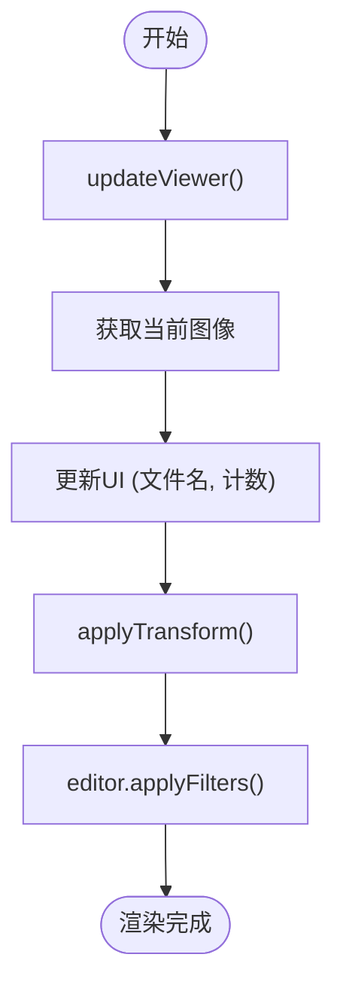

# 查看器API

<cite>
**本文档引用的文件**
- [viewer.js](file://js/viewer.js)
- [ui.js](file://js/ui.js)
- [core.js](file://js/core.js)
</cite>

## 目录
1. [简介](#简介)
2. [核心组件](#核心组件)
3. [API 方法详解](#api-方法详解)
4. [图像变换与渲染机制](#图像变换与渲染机制)
5. [全屏模式处理](#全屏模式处理)
6. [UI 状态联动逻辑](#ui-状态联动逻辑)
7. [性能优化建议](#性能优化建议)
8. [调用示例](#调用示例)

## 简介
`ImageViewer` 类是图像预览功能的核心控制器，负责图像的缩放、旋转、拖拽、全屏切换和导航操作。它通过与 `UIManager`、`ImageManager` 和 `ImageEditor` 模块协同工作，实现完整的图像预览体验。本 API 文档详细说明其方法、参数限制、状态同步机制及性能优化策略。

## 核心组件

**Section sources**
- [viewer.js](file://js/viewer.js#L1-L152)
- [core.js](file://js/core.js#L1-L28)

## API 方法详解

### zoomIn
放大当前图像，缩放比例每次增加 20%，最大限制为 5 倍。

**参数范围**：无输入参数，内部缩放因子最大为 5。

**调用频率**：无显式限制，但受 `requestAnimationFrame` 优化控制。

**状态同步**：调用后立即更新 `scale` 并触发 `applyTransform`。

**Section sources**
- [viewer.js](file://js/viewer.js#L85-L88)

### zoomOut
缩小当前图像，缩放比例每次减少约 16.7%（除以 1.2），最小限制为 0.1 倍。

**参数范围**：无输入参数，内部缩放因子最小为 0.1。

**调用频率**：同 `zoomIn`。

**状态同步**：更新 `scale` 后调用 `applyTransform`。

**Section sources**
- [viewer.js](file://js/viewer.js#L90-L93)

### resetZoom
重置图像的缩放、旋转和平移状态至初始值。该方法通过 `resetTransform` 实现。

- 缩放 (`scale`) 重置为 1
- 旋转 (`rotation`) 重置为 0
- 平移 (`translateX`, `translateY`) 重置为 0

**状态同步**：调用 `applyTransform` 立即应用初始变换。

**Section sources**
- [viewer.js](file://js/viewer.js#L108-L114)

### rotate
图像旋转功能由 `rotateLeft` 和 `rotateRight` 实现，每次旋转 90 度。

- `rotateLeft`: 逆时针旋转 90 度（`rotation -= 90`）
- `rotateRight`: 顺时针旋转 90 度（`rotation += 90`）

**旋转角度步长**：固定为 90 度，符合常见图像查看器习惯。

**状态同步**：更新 `rotation` 后调用 `applyTransform`。

**Section sources**
- [viewer.js](file://js/viewer.js#L95-L106)

### toggleFullscreen
切换全屏模式，使用标准 `Fullscreen API`。

- 若当前未全屏，则请求进入全屏
- 若已全屏，则退出全屏
- 使用 `catch` 捕获浏览器不支持或权限拒绝的异常

**浏览器兼容性**：现代主流浏览器均支持，旧版浏览器需 polyfill。

**事件绑定**：由 `EventHandler` 模块绑定按钮点击事件。

**Section sources**
- [viewer.js](file://js/viewer.js#L116-L124)

### navigate
图像导航通过 `prevImage` 和 `nextImage` 实现。

- `prevImage`: 当前索引大于 0 时，索引减 1
- `nextImage`: 当前索引小于图片总数减 1 时，索引加 1

**状态同步**：
- 更新 `imageManager.currentIndex`
- 调用 `resetTransform()` 重置视图
- 调用 `updateViewer()` 更新 UI 和变换

**UI 联动**：导航按钮在首张或末张时自动禁用。

**Section sources**
- [viewer.js](file://js/viewer.js#L70-L83)

## 图像变换与渲染机制

### 预览容器初始化
预览容器在 `UIManager.initElements()` 中初始化，通过 `getElementById` 获取 DOM 引用，包括：
- `viewer`: 预览器容器
- `viewerImage`: 图像显示元素
- 各控制按钮（缩放、旋转、全屏等）

初始化后，通过 `openViewer(index)` 显示指定图像。

**Section sources**
- [ui.js](file://js/ui.js#L10-L60)
- [viewer.js](file://js/viewer.js#L30-L37)

### 图像渲染流程
1. 调用 `openViewer` 或 `navigate` 方法
2. 设置 `currentIndex`
3. 调用 `updateViewer`
4. 从 `imageManager` 获取当前图像
5. 更新 `viewerImage.src` 和 UI 文本（如计数器、文件名）
6. 调用 `applyTransform` 应用当前变换
7. 调用 `editor.applyFilters` 应用滤镜



**Diagram sources**
- [viewer.js](file://js/viewer.js#L40-L60)

### 变换矩阵应用方式
使用 CSS `transform` 属性组合应用平移、缩放和旋转：

```javascript
const transform = `translate(${this.translateX}px, ${this.translateY}px) scale(${this.scale}) rotate(${this.rotation}deg)`;
this.core.ui.elements.viewerImage.style.transform = transform;
```

变换顺序：先缩放，再旋转，最后平移（符合 CSS 标准）。

**Section sources**
- [viewer.js](file://js/viewer.js#L100-L106)

## 全屏模式处理

### 浏览器兼容性
- 使用标准 `requestFullscreen()` 和 `exitFullscreen()`
- 检查 `document.fullscreenElement` 判断当前状态
- 异常捕获避免因权限或不支持导致崩溃

### 事件绑定机制
- 全屏按钮点击事件由 `EventHandler` 绑定
- 调用 `toggleFullscreen` 方法
- 状态变更后自动更新按钮图标（由 UI 模块处理）

**Section sources**
- [viewer.js](file://js/viewer.js#L116-L124)

## UI 状态联动逻辑

### 按钮禁用/启用规则
- **上一张按钮**：当 `currentIndex === 0` 时禁用
- **下一张按钮**：当 `currentIndex === images.length - 1` 时禁用
- 在 `updateViewerUI` 中动态更新按钮状态

```javascript
this.elements.prevBtn.disabled = currentIndex === 0;
this.elements.nextBtn.disabled = currentIndex === totalImages - 1;
```

**Section sources**
- [ui.js](file://js/ui.js#L110-L114)

## 性能优化建议

### 防抖处理频繁缩放操作
虽然未使用传统防抖（debounce），但通过 `requestAnimationFrame` 实现了性能优化：

- 在 `drag` 方法中，每次拖动前取消上一动画帧
- 使用 `requestAnimationFrame` 确保变换更新与屏幕刷新率同步
- 避免频繁重排重绘，提升拖拽流畅度

```javascript
if (this.animationId) {
    cancelAnimationFrame(this.animationId);
}
this.animationId = requestAnimationFrame(() => {
    // 更新位置并应用变换
});
```

### 建议的进一步优化
1. **缩放操作节流**：对 `zoomIn`/`zoomOut` 添加节流（throttle），防止鼠标滚轮过快触发
2. **变换合并**：避免连续调用 `applyTransform`，可批量更新后统一应用
3. **GPU 加速**：确保 `viewerImage` 启用硬件加速（可通过 `transform: translateZ(0)` 触发）

**Section sources**
- [viewer.js](file://js/viewer.js#L126-L144)

## 调用示例

### 基本调用方式
```javascript
// 获取应用实例
const app = window.app;

// 打开第 0 张图像
app.viewer.openViewer(0);

// 放大图像
app.viewer.zoomIn();

// 顺时针旋转 90 度
app.viewer.rotateRight();

// 重置视图
app.viewer.resetTransform();

// 切换全屏
app.viewer.toggleFullscreen();

// 导航到下一张
app.viewer.nextImage();
```

### 事件绑定示例
```javascript
// 绑定滚轮事件（已在 handleWheel 中实现）
viewerElement.addEventListener('wheel', (e) => {
    if (!editPanel.contains(e.target)) {
        e.preventDefault();
        if (e.deltaY < 0) app.viewer.zoomIn();
        else app.viewer.zoomOut();
    }
});
```

**Section sources**
- [viewer.js](file://js/viewer.js#L146-L152)