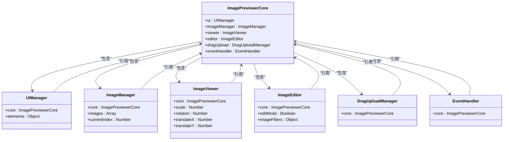
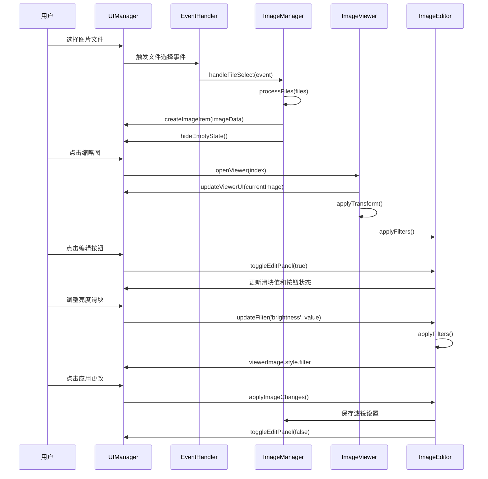
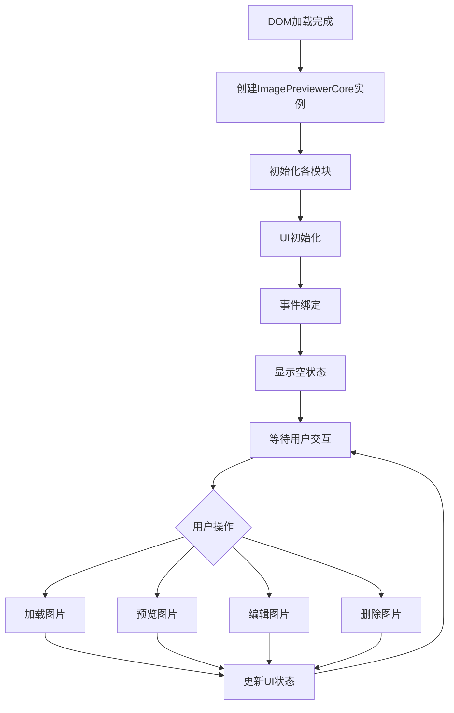

# 核心API

<cite>
**本文档中引用的文件**  
- [core.js](file://js/core.js)
- [imageManager.js](file://js/imageManager.js)
- [viewer.js](file://js/viewer.js)
- [editor.js](file://js/editor.js)
- [ui.js](file://js/ui.js)
- [eventHandler.js](file://js/eventHandler.js)
</cite>

## 目录
1. [简介](#简介)
2. [构造函数与初始化](#构造函数与初始化)
3. [核心控制接口](#核心控制接口)
4. [模块协调机制](#模块协调机制)
5. [使用示例](#使用示例)
6. [异常与错误处理](#异常与错误处理)
7. [生命周期管理](#生命周期管理)

## 简介
`ImagePreviewerCore` 是轻量级图片预览器的核心控制器类，负责协调UI、图像管理、查看器、编辑器等模块的初始化与交互。该类作为应用的入口点，封装了图片加载、删除、编辑、预览等核心功能，为开发者提供统一的API接口。通过该核心类，开发者可以轻松集成图片预览与编辑功能到自己的应用中。

## 构造函数与初始化

`ImagePreviewerCore` 类的构造函数负责初始化所有子模块并启动应用。构造函数不接受任何参数，通过内部调用 `init()` 方法完成初始化流程。

### 构造函数
```javascript
constructor()
```

**功能说明**：
- 初始化 `UIManager`、`ImageManager`、`ImageViewer`、`ImageEditor`、`DragUploadManager` 和 `EventHandler` 六个核心模块
- 每个模块都接收 `this`（即 `ImagePreviewerCore` 实例）作为参数，建立双向引用关系
- 调用 `init()` 方法启动初始化流程

**Section sources**
- [core.js](file://js/core.js#L2-L15)

### 初始化方法
```javascript
init()
```

**初始化流程**：
1. **UI初始化**：调用 `this.ui.init()` 初始化所有DOM元素引用和UI组件
2. **事件绑定**：调用 `this.eventHandler.bindEvents()` 绑定所有用户交互事件
3. **状态显示**：调用 `this.ui.showEmptyState()` 显示空状态界面

**调用条件**：
- 该方法在构造函数中自动调用，无需手动调用
- 只在应用启动时执行一次

**副作用**：
- 修改DOM结构，添加清空按钮等UI元素
- 建立全局事件监听器
- 改变页面显示状态

**Section sources**
- [core.js](file://js/core.js#L17-L22)
- [ui.js](file://js/ui.js#L6-L10)
- [eventHandler.js](file://js/eventHandler.js#L6-L10)

## 核心控制接口

`ImagePreviewerCore` 类通过其子模块提供了一系列核心控制方法，用于管理图片和应用状态。

### 图片加载
```javascript
this.imageManager.handleFileSelect(event)
```

**参数**：
- `event`: 文件输入元素的 `change` 事件对象，包含 `event.target.files` 文件列表

**返回值**：无

**调用条件**：
- 当用户通过文件输入控件选择图片时自动触发
- 可以通过编程方式调用，传入模拟的事件对象

**副作用**：
- 将新图片添加到 `images` 数组中（避免重复添加）
- 在DOM中创建对应的缩略图项
- 隐藏空状态界面（如果是首次添加图片）
- 显示清空所有按钮
- 清空文件输入控件以便重新选择相同文件

**Section sources**
- [imageManager.js](file://js/imageManager.js#L4-L40)

### 删除图片
```javascript
this.imageManager.removeImage(index)
```

**参数**：
- `index`: 要删除的图片在 `images` 数组中的索引

**返回值**：无

**调用条件**：
- 用户点击缩略图上的删除按钮时触发
- 可以通过编程方式调用

**副作用**：
- 显示确认对话框
- 从 `images` 数组中移除指定图片
- 从DOM中移除对应的缩略图项
- 如果删除的是当前预览的图片，调整 `currentIndex`
- 如果删除后没有图片了，显示空状态并关闭预览器
- 释放Blob URL内存（如果存在）

**Section sources**
- [imageManager.js](file://js/imageManager.js#L134-L195)

### 清空所有图片
```javascript
this.imageManager.clearAllImages()
```

**参数**：无

**返回值**：无

**调用条件**：
- 用户点击"清空所有"按钮时触发
- 可以通过编程方式调用

**副作用**：
- 显示确认对话框
- 释放所有图片的Blob URL内存
- 清空 `images` 数组和 `currentIndex`
- 清空缩略图容器的HTML内容
- 显示空状态界面
- 隐藏清空所有按钮
- 清空文件输入控件
- 如果预览器处于打开状态，则关闭预览器

**Section sources**
- [imageManager.js](file://js/imageManager.js#L177-L195)

### 进入编辑模式
```javascript
this.editor.toggleEditPanel(true)
```

**参数**：
- `true`: 显示编辑面板

**返回值**：无

**调用条件**：
- 用户点击编辑按钮时触发
- 可以通过编程方式调用

**副作用**：
- 显示编辑面板
- 保存当前图片的原始滤镜设置
- 将滑块值更新为当前图片的滤镜设置
- 更新滤镜按钮的激活状态

**Section sources**
- [editor.js](file://js/editor.js#L100-L118)

### 退出编辑模式
```javascript
this.editor.toggleEditPanel(false)
```

**参数**：
- `false`: 隐藏编辑面板

**返回值**：无

**调用条件**：
- 用户点击关闭编辑面板按钮或应用/取消更改按钮时触发
- 可以通过编程方式调用

**副作用**：
- 隐藏编辑面板
- 确保退出裁剪和水印模式
- 不保存任何更改（如需保存更改，应先调用 `applyImageChanges`）

**Section sources**
- [editor.js](file://js/editor.js#L100-L118)

## 模块协调机制

`ImagePreviewerCore` 作为中央协调器，通过实例化和连接各个模块来实现功能整合。

### 模块依赖关系


**Diagram sources**
- [core.js](file://js/core.js#L2-L15)
- [ui.js](file://js/ui.js#L2-L5)
- [imageManager.js](file://js/imageManager.js#L2-L5)
- [viewer.js](file://js/viewer.js#L2-L10)
- [editor.js](file://js/editor.js#L2-L15)
- [eventHandler.js](file://js/eventHandler.js#L2-L5)

### 事件流与数据流


**Diagram sources**
- [core.js](file://js/core.js#L2-L15)
- [ui.js](file://js/ui.js#L6-L10)
- [eventHandler.js](file://js/eventHandler.js#L6-L10)
- [imageManager.js](file://js/imageManager.js#L4-L40)
- [viewer.js](file://js/viewer.js#L14-L20)
- [editor.js](file://js/editor.js#L100-L118)

## 使用示例

### 基本实例化
```javascript
// 在DOM加载完成后创建核心控制器实例
document.addEventListener('DOMContentLoaded', () => {
    window.app = new ImagePreviewerCore();
});
```

### 编程方式加载图片
```javascript
// 模拟文件选择事件
function loadImagesProgrammatically(files) {
    const event = {
        target: {
            files: files
        }
    };
    window.app.imageManager.handleFileSelect(event);
}

// 使用示例
const fileInput = document.getElementById('fileInput');
fileInput.addEventListener('change', (e) => {
    // 可以在这里进行额外的处理
    console.log('开始加载图片...');
    // 核心功能仍然由ImagePreviewerCore处理
});
```

### 控制预览器
```javascript
// 打开特定图片预览
function previewImage(index) {
    if (index >= 0 && index < window.app.imageManager.images.length) {
        window.app.viewer.openViewer(index);
    }
}

// 关闭预览器
function closeViewer() {
    window.app.viewer.closeViewer();
}

// 导航图片
function navigateImages(direction) {
    if (direction === 'next') {
        window.app.viewer.nextImage();
    } else if (direction === 'prev') {
        window.app.viewer.prevImage();
    }
}
```

### 图片编辑控制
```javascript
// 进入/退出编辑模式
function toggleEditMode(show) {
    window.app.editor.toggleEditPanel(show);
}

// 应用滤镜
function applyFilter(type, value) {
    window.app.editor.updateFilter(type, value);
}

// 应用所有更改
function saveEdits() {
    window.app.editor.applyImageChanges();
}

// 取消所有更改
function cancelEdits() {
    window.app.editor.cancelImageChanges();
}
```

### 批量操作
```javascript
// 删除所有图片
function clearAllImages() {
    window.app.imageManager.clearAllImages();
}

// 删除特定图片
function deleteImage(index) {
    window.app.imageManager.removeImage(index);
}
```

**Section sources**
- [core.js](file://js/core.js#L24-L26)
- [imageManager.js](file://js/imageManager.js#L4-L40)
- [viewer.js](file://js/viewer.js#L14-L20)
- [editor.js](file://js/editor.js#L100-L118)

## 异常与错误处理

### 可能出现的错误场景

| 错误类型 | 描述 | 处理建议 |
|---------|------|---------|
| 文件类型错误 | 用户选择了非图片文件 | 系统会自动过滤，只处理以'image/'开头的文件类型 |
| 重复文件添加 | 用户尝试添加已存在的同名文件 | 系统会跳过添加并在控制台输出提示信息 |
| 内存泄漏风险 | 大量图片加载后未正确释放 | 系统会在删除图片时撤销Blob URL，建议及时清理不用的图片 |
| 全屏模式失败 | 浏览器不支持或用户拒绝全屏 | 系统会捕获异常并在控制台输出错误信息，不影响其他功能 |
| 图片加载失败 | 原始图像无法加载 | 系统会使用当前显示的图像作为回退方案 |

### 错误码与异常
目前系统主要通过控制台输出错误信息，没有使用传统的错误码系统。

**常见错误输出**：
- `"无法进入全屏模式:"` + 错误对象 - 当全屏请求被拒绝或失败时
- `"图片 "${file.name}" 已存在，跳过添加"` - 当尝试添加重复文件时
- `"加载带水印的图像失败。"` - 当水印应用过程中图像加载失败时

**处理建议**：
- 监听控制台输出以捕获潜在问题
- 在生产环境中考虑重定向控制台输出到错误日志系统
- 对于关键操作，可以添加额外的try-catch包装

**Section sources**
- [viewer.js](file://js/viewer.js#L118-L121)
- [imageManager.js](file://js/imageManager.js#L22-L24)
- [editor.js](file://js/editor.js#L718-L721)

## 生命周期管理

### 应用生命周期


**Diagram sources**
- [core.js](file://js/core.js#L24-L26)
- [ui.js](file://js/ui.js#L6-L10)
- [eventHandler.js](file://js/eventHandler.js#L6-L10)

### 模块生命周期
`ImagePreviewerCore` 的生命周期与其他模块紧密耦合：

1. **创建阶段**：在 `new ImagePreviewerCore()` 时，所有子模块被实例化
2. **初始化阶段**：通过 `init()` 方法完成各模块的初始化
3. **运行阶段**：各模块通过事件驱动和方法调用进行交互
4. **销毁阶段**：目前没有显式的销毁方法，依赖浏览器的垃圾回收

**最佳实践**：
- 确保在 `DOMContentLoaded` 事件后创建实例
- 通过 `window.app` 全局引用保持核心实例
- 利用内置的清空功能管理内存使用
- 避免创建多个核心实例，以免造成状态混乱

**Section sources**
- [core.js](file://js/core.js#L1-L22)
- [ui.js](file://js/ui.js#L6-L10)
- [eventHandler.js](file://js/eventHandler.js#L6-L10)