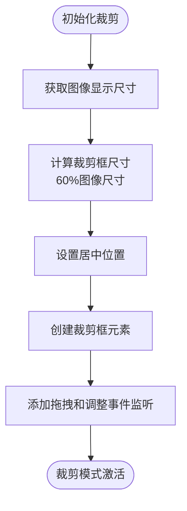
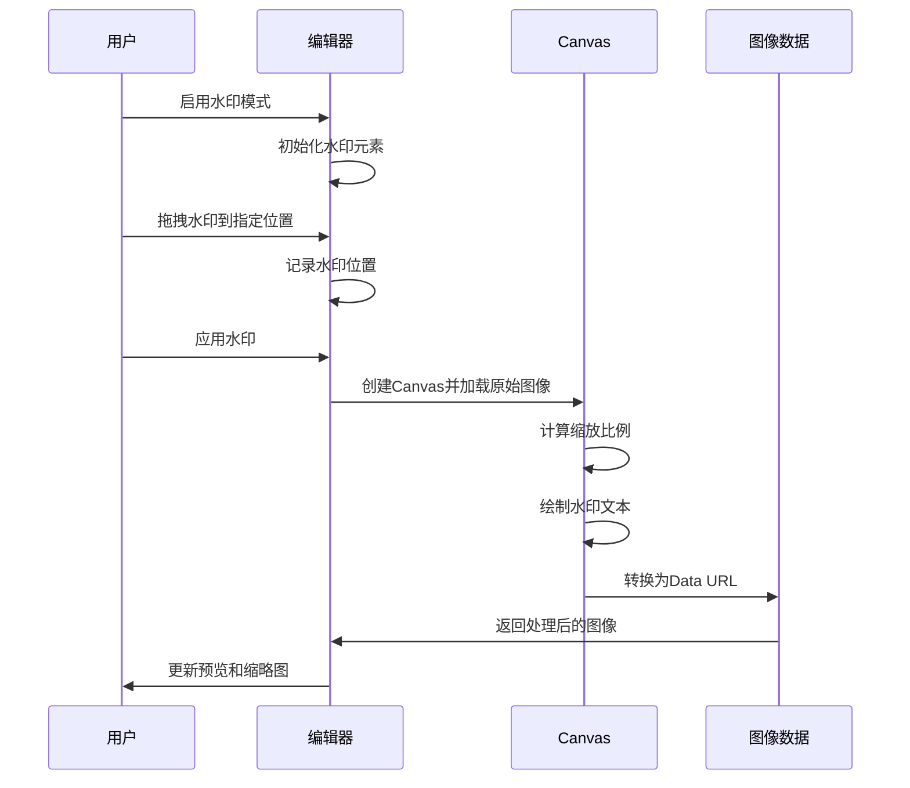
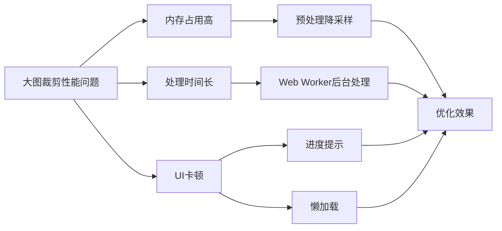

# 编辑器API

<cite>
**本文档引用的文件**
- [editor.js](file://js/editor.js)
- [core.js](file://js/core.js)
- [imageManager.js](file://js/imageManager.js)
- [ui.js](file://js/ui.js)
</cite>

## 目录
1. [简介](#简介)
2. [图像编辑接口](#图像编辑接口)
3. [裁剪功能实现](#裁剪功能实现)
4. [水印叠加机制](#水印叠加机制)
5. [JavaScript示例](#javascript示例)
6. [性能考量与优化建议](#性能考量与优化建议)

## 简介
ImageEditor类提供了完整的图像编辑功能，包括亮度、对比度、饱和度调整，滤镜应用，图像裁剪和水印添加等操作。所有编辑功能均在编辑模式下激活，通过Canvas进行像素级处理，并实时更新预览效果。编辑操作会修改图像的Data URL，确保更改持久化。

**Section sources**
- [editor.js](file://js/editor.js#L1-L50)

## 图像编辑接口

### 亮度调整 (adjustBrightness)
- **参数类型**: 数值范围0~200（100为原始亮度）
- **应用时机**: 编辑模式下有效
- **影响过程**: 通过CSS filter属性的brightness()函数调整图像亮度，实时反映在预览图上
- **方法调用**: `updateFilter('brightness', value)`

### 对比度调整 (adjustContrast)
- **参数类型**: 数值范围0~200（100为原始对比度）
- **应用时机**: 编辑模式下有效
- **影响过程**: 通过CSS filter属性的contrast()函数调整图像对比度
- **方法调用**: `updateFilter('contrast', value)`

### 饱和度调整 (adjustSaturation)
- **参数类型**: 数值范围0~200（100为原始饱和度）
- **应用时机**: 编辑模式下有效
- **影响过程**: 通过CSS filter属性的saturate()函数调整图像色彩饱和度
- **方法调用**: `updateFilter('saturation', value)`

### 滤镜应用 (applyFilter)
- **参数类型**: 'none', 'grayscale', 'sepia', 'invert', 'blur'
- **应用时机**: 编辑模式下有效
- **影响过程**: 根据选择的滤镜类型，添加相应的CSS filter效果
- **方法调用**: `updateFilter('filter', filterType)`

### 编辑结果提交
- **应用更改**: `applyImageChanges()` - 保存当前滤镜设置到图片数据
- **取消更改**: `cancelImageChanges()` - 恢复原始滤镜设置

**Section sources**
- [editor.js](file://js/editor.js#L100-L180)

## 裁剪功能实现

### 裁剪框初始化
裁剪框初始化时，会创建一个覆盖在图像上的透明层，其中包含一个可拖拽和调整大小的裁剪框。裁剪框初始大小为图像显示尺寸的60%，居中显示。



**Diagram sources**
- [editor.js](file://js/editor.js#L250-L300)

### 裁剪操作流程
1. 用户拖拽裁剪框或调整其大小
2. 系统实时计算裁剪区域相对于原始图像的位置和尺寸
3. 创建Canvas元素进行像素级裁剪处理
4. 使用drawImage()方法将指定区域绘制到Canvas上
5. 转换Canvas为Data URL并更新图像数据

**Section sources**
- [editor.js](file://js/editor.js#L300-L400)

## 水印叠加机制

### 水印初始化
水印功能通过在图像上叠加文本元素实现。初始化时创建一个可拖拽的水印文本元素，支持自定义文字、颜色、大小和样式。

### 水印叠加过程
1. 创建Canvas元素，加载原始图像
2. 计算水印位置的缩放比例，确保在不同分辨率下位置准确
3. 根据用户设置的样式（阴影、描边、透明度）绘制水印文本
4. 将处理后的图像转换为Data URL并更新



**Diagram sources**
- [editor.js](file://js/editor.js#L450-L750)

## JavaScript示例

### 链式调用滤镜并提交结果
```javascript
// 获取编辑器实例
const editor = window.app.editor;

// 进入编辑模式
editor.toggleEditPanel(true);

// 链式调用滤镜调整
editor.updateFilter('brightness', 120);
editor.updateFilter('contrast', 110);
editor.updateFilter('saturation', 130);
editor.updateFilter('filter', 'sepia');

// 应用所有更改
editor.applyImageChanges();
```

### 批量处理多张图片
```javascript
// 对当前图片应用一系列编辑操作
function batchEditCurrentImage() {
    const editor = window.app.editor;
    const imageManager = window.app.imageManager;
    
    // 保存原始索引
    const currentIndex = imageManager.currentIndex;
    
    // 遍历所有图片进行批量处理
    imageManager.images.forEach((image, index) => {
        imageManager.currentIndex = index;
        editor.toggleEditPanel(true);
        
        // 应用统一的编辑设置
        editor.updateFilter('brightness', 115);
        editor.updateFilter('contrast', 105);
        editor.updateFilter('saturation', 120);
        
        editor.applyImageChanges();
    });
    
    // 恢复原始索引
    imageManager.currentIndex = currentIndex;
    window.app.viewer.updateViewer();
}
```

**Section sources**
- [editor.js](file://js/editor.js#L100-L180)

## 性能考量与优化建议

### 撤销/重做支持
当前实现中，编辑器提供了基本的撤销功能：
- `cancelImageChanges()`: 恢复到进入编辑模式前的状态
- 通过`originalImageData`保存原始滤镜设置
- 不支持多级撤销/重做历史

### 像素级处理性能
- **滤镜应用**: 使用CSS filter，性能高效，GPU加速
- **裁剪操作**: 使用Canvas像素级处理，性能消耗较大
- **水印叠加**: 需要重新绘制整个图像，性能消耗中等

### 资源密集型操作
**大图裁剪的性能瓶颈**:
1. 内存占用高：大尺寸Canvas占用大量内存
2. 处理时间长：像素级操作随图像尺寸平方增长
3. 可能导致页面卡顿

**优化建议**:
1. 对超大图像（>5000px）进行预处理降采样
2. 使用Web Worker进行后台处理，避免阻塞UI线程
3. 添加处理进度提示
4. 实现懒加载和按需处理
5. 考虑使用WebAssembly进行高性能图像处理



**Diagram sources**
- [editor.js](file://js/editor.js#L380-L400)
- [editor.js](file://js/editor.js#L650-L750)