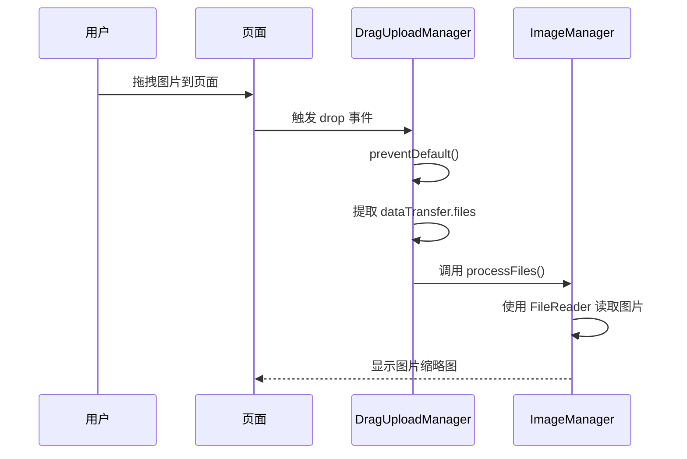
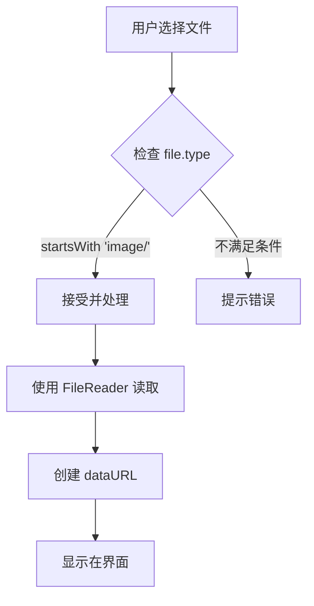

# 常见问题解答

<cite>
**本文档引用的文件**
- [README.md](file://README.md)
- [dragUpload.js](file://js/dragUpload.js)
- [editor.js](file://js/editor.js)
- [themes.js](file://themes.js)
- [_variables.scss](file://src/scss/_variables.scss)
- [build.js](file://build.js)
</cite>

## 目录
1. [无法上传图片怎么办？](#无法上传图片怎么办)
2. [拖拽上传不生效？](#拖拽上传不生效)
3. [编辑后图片质量下降？](#编辑后图片质量下降)
4. [如何自定义主题？](#如何自定义主题)
5. [构建时报Sass错误？](#构建时报sass错误)
6. [支持哪些图片格式？](#支持哪些图片格式)
7. [性能优化建议](#性能优化建议)
8. [已知问题与限制](#已知问题与限制)

## 无法上传图片怎么办？

当用户无法上传图片时，可能涉及浏览器兼容性或服务器权限问题。请按以下步骤排查：

1. **检查浏览器兼容性**：
   - 确保使用现代浏览器（Chrome、Firefox、Edge、Safari 最新版）
   - 检查是否启用了 JavaScript
   - 确认浏览器支持 `FileReader` API 和 `DataTransfer` 对象

2. **检查文件输入功能**：
   - 确保 HTML 中的文件输入元素存在且未被禁用
   - 检查 `input[type="file"]` 是否正确绑定事件

3. **服务器权限检查**：
   - 项目为纯前端应用，无需服务器写入权限
   - 图片通过 `FileReader` 读取为 `dataURL`，不涉及服务器上传
   - 若部署在受限环境（如某些 IDE 内嵌浏览器），请确保允许本地文件访问

4. **调试建议**：
   - 打开开发者工具，检查控制台是否有错误
   - 确认 `handleFileSelect` 事件是否被正确触发

**Section sources**
- [README.md](file://README.md#L1-L143)
- [js/imageManager.js](file://js/imageManager.js#L0-L97)

## 拖拽上传不生效？

拖拽上传功能由 `dragUpload.js` 实现。若功能不生效，请按以下步骤排查：

1. **确认 `dragUpload.js` 已正确加载**：
   - 检查 `index.html` 中是否包含 `<script src="js/dragUpload.js"></script>`
   - 确保脚本加载顺序正确（应在核心模块之后）

2. **检查事件绑定**：
   - `DragUploadManager` 类负责初始化拖拽事件
   - 确保 `setupDragAndDrop()` 方法被调用
   - 检查是否正确传递 `core` 实例

3. **验证 DOM 结构**：
   - 拖拽区域为 `document.body`
   - 确保页面无其他脚本阻止默认事件

4. **调试步骤**：
   - 在 `handleDrop` 方法中添加断点，确认是否触发
   - 检查 `dataTransfer.files` 是否包含文件
   - 确认文件类型是否为图片（`file.type.startsWith('image/')`）

5. **常见问题**：
   - 浏览器扩展可能阻止拖拽行为
   - 移动端浏览器对拖拽支持有限



**Diagram sources**
- [js/dragUpload.js](file://js/dragUpload.js#L0-L218)
- [js/imageManager.js](file://js/imageManager.js#L0-L32)

## 编辑后图片质量下降？

图片编辑（如裁剪、水印）通过 Canvas 实现，可能导致质量下降。原因及解决方案如下：

1. **Canvas 压缩设置**：
   - 默认使用 `canvas.toDataURL()`，可能应用浏览器默认压缩
   - 解决方案：在 `toDataURL()` 中指定高质量格式

2. **图像缩放问题**：
   - 裁剪时使用 `naturalWidth` 和显示尺寸的比例计算
   - 确保正确处理高分辨率图片

3. **优化建议**：
   - 在 `applyCrop` 和 `applyWatermark` 方法中，可指定图片质量：
     ```javascript
     canvas.toDataURL('image/jpeg', 0.95) // 保持 95% 质量
     ```
   - 避免多次重复编辑，每次编辑都会导致质量损失

4. **代码位置**：
   - 裁剪功能：`editor.js` 中的 `applyCrop()` 方法
   - 水印功能：`editor.js` 中的 `applyWatermark()` 方法

**Section sources**
- [js/editor.js](file://js/editor.js#L0-L754)

## 如何自定义主题？

项目支持通过 `themes.js` 和 SCSS 变量自定义主题。

### 方法一：修改 `themes.js`

1. 编辑 `themes.js` 文件
2. 添加新主题到 `themes` 对象：
```javascript
custom: {
    name: '自定义主题',
    icon: '🎨',
    colors: {
        primary: '#ff6b6b',
        secondary: '#4ecdc4',
        accent: '#45b7d1',
        background: 'linear-gradient(135deg, #ff6b6b 0%, #4ecdc4 100%)',
        cardBg: 'rgba(255, 255, 255, 0.95)',
        textPrimary: '#2d3748',
        textSecondary: '#718096'
    }
}
```

### 方法二：修改 SCSS 变量

1. 编辑 `src/scss/_variables.scss`
2. 修改颜色、圆角、阴影等变量
3. 重新构建项目以生成 CSS

### 主题应用机制

```mermaid
classDiagram
class ThemeManager {
+currentTheme
+init()
+createThemeSelector()
+applyTheme(themeKey)
+switchTheme(themeKey)
}
class themes {
+default
+dark
+ocean
+sunset
+forest
}
ThemeManager --> themes : "使用"
ThemeManager --> "document.documentElement" : "设置CSS变量"
ThemeManager --> "localStorage" : "保存选择"
```

**Diagram sources**
- [themes.js](file://themes.js#L0-L365)
- [src/scss/_variables.scss](file://src/scss/_variables.scss#L0-L61)

## 构建时报Sass错误？

构建过程由 `build.js` 控制，不直接处理 Sass。若出现 Sass 相关错误，请检查：

1. **Sass 编译步骤**：
   - 项目使用预编译的 `style.css`
   - `build.js` 仅压缩现有 CSS，不编译 Sass
   - 确保先使用 Sass 编译器将 `main.scss` 编译为 `style.css`

2. **正确构建流程**：
   ```bash
   # 1. 编译 Sass
   sass src/scss/main.scss style.css
   
   # 2. 运行构建脚本
   node build.js
   ```

3. **检查 SCSS 语法**：
   - 验证 `main.scss` 及其导入的 SCSS 文件语法正确
   - 检查变量、混合器使用是否正确

4. **路径引用问题**：
   - 确保 `@use` 和 `@import` 路径正确
   - 推荐使用相对路径

**Section sources**
- [build.js](file://build.js#L0-L116)
- [src/scss/main.scss](file://src/scss/main.scss#L0-L19)

## 支持哪些图片格式？

项目支持所有浏览器支持的图片格式，主要通过 `FileReader` 和 `img` 标签实现。

### 支持的格式

| 格式 | MIME 类型 | 支持情况 |
|------|----------|----------|
| JPEG | image/jpeg | ✅ 完全支持 |
| PNG | image/png | ✅ 完全支持 |
| GIF | image/gif | ✅ 完全支持 |
| WebP | image/webp | ✅ 完全支持 |
| SVG | image/svg+xml | ⚠️ 仅显示，编辑受限 |
| BMP | image/bmp | ✅ 通过 dataURL 支持 |

### 格式检测机制



**Diagram sources**
- [js/dragUpload.js](file://js/dragUpload.js#L0-L218)
- [js/imageManager.js](file://js/imageManager.js#L0-L32)

## 性能优化建议

当处理大量图片时，应注意内存管理和性能优化。

### 内存管理

1. **及时释放对象 URL**：
   - 在 `clearAllImages()` 中已实现 `URL.revokeObjectURL()`
   - 确保处理 Blob URL

2. **图片懒加载**：
   - 使用 `Intersection Observer` 实现缩略图懒加载
   - 减少初始内存占用

3. **限制同时加载数量**：
   - 可添加配置项限制最大图片数

### 性能优化

1. **避免重复计算**：
   - 缓存图片元数据
   - 减少 DOM 查询

2. **使用 CSS 变换**：
   - 缩放、旋转使用 `transform` 而非修改宽高

3. **事件委托**：
   - 减少事件监听器数量

4. **构建优化**：
   - `build.js` 使用 `terser` 和 `clean-css` 压缩资源
   - 生成 zip 发布包

**Section sources**
- [js/imageManager.js](file://js/imageManager.js#L177-L195)

## 已知问题与限制

根据 `README.md` 文档，项目存在以下已知问题和限制：

1. **功能限制**：
   - 当前为轻量级预览器，不支持云存储集成
   - 无用户账户系统
   - 缺少批量操作功能

2. **浏览器兼容性**：
   - 依赖现代浏览器 API
   - 在旧版浏览器中可能无法正常工作

3. **性能限制**：
   - 大量高分辨率图片可能导致内存不足
   - 长时间使用可能产生内存泄漏

4. **未来规划**：
   - 计划添加图像处理功能（亮度、对比度调整）
   - 考虑支持插件系统
   - 可能增加多语言界面支持

5. **开发建议**：
   - 保持代码模块化以便扩展
   - 优先实现基础图像处理功能
   - 后续可添加性能优化和自定义主题功能

**Section sources**
- [README.md](file://README.md#L122-L143)