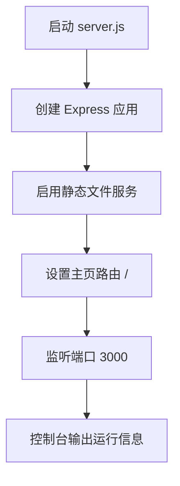
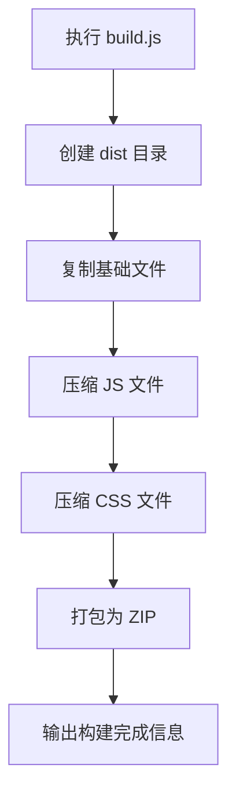
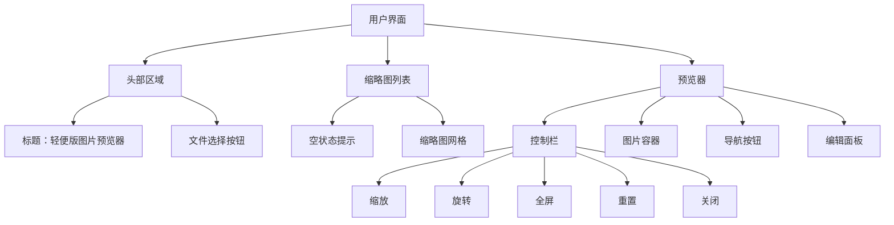

# 快速开始

<cite>
**本文档中引用的文件**  
- [README.md](file://README.md)
- [server.js](file://server.js)
- [build.js](file://build.js)
- [package.json](file://package.json)
- [index.html](file://index.html)
- [js/core.js](file://js/core.js)
</cite>

## 目录
1. [简介](#简介)
2. [环境要求](#环境要求)
3. [安装与运行步骤](#安装与运行步骤)
4. [核心脚本解析](#核心脚本解析)
5. [基本使用流程](#基本使用流程)
6. [常见问题与解决方案](#常见问题与解决方案)
7. [命令行操作示例](#命令行操作示例)
8. [界面元素说明](#界面元素说明)

## 简介
`liteImagePreviewer` 是一个基于 Web 技术的轻量级图片预览工具，支持多图预览、缩放、旋转、全屏、拖拽上传等交互功能，适用于集成到代码编辑器或本地快速查看图片。本指南将帮助新手在 5 分钟内完成环境搭建并成功运行项目。

## 环境要求
- Node.js >= 14.0.0
- npm >= 6.0.0

可通过以下命令检查版本：
```bash
node --version
npm --version
```

## 安装与运行步骤
按照以下四步即可快速启动项目：

1. **克隆仓库**
   ```bash
   git clone https://github.com/Mr6pets/liteImagePreviewer.git
   cd liteImagePreviewer
   ```

2. **安装依赖**
   ```bash
   npm install
   ```

3. **启动开发服务器**
   ```bash
   npm start
   ```
   此命令会执行 `server.js`，使用 Express 启动本地服务器。

4. **访问应用**
   打开浏览器，访问：[http://localhost:3000](http://localhost:3000)

**Section sources**
- [README.md](file://README.md#L60-L80)
- [package.json](file://package.json#L6-L8)
- [server.js](file://server.js#L0-L15)

## 核心脚本解析

### server.js：静态文件服务与路由
`server.js` 使用 Express 框架托管静态资源并提供主页服务：
- `express.static(__dirname)`：将项目根目录设为静态资源目录，自动服务 `index.html`、`js/`、`public/css/` 等文件。
- `/` 路由：返回 `index.html` 作为首页。
- 监听端口 `3000`（可通过 `PORT` 环境变量修改）。



**Diagram sources**
- [server.js](file://server.js#L5-L15)

### build.js：构建与资源压缩
`build.js` 负责打包发布版本，主要功能包括：
- 创建 `dist` 输出目录
- 复制无需处理的文件（如 `index.html`、`LICENSE`）
- 使用 `terser` 压缩 JavaScript 文件
- 使用 `clean-css` 压缩 CSS 文件
- 使用 `archiver` 将 `dist` 打包为 `liteImagePreviewer.zip`

该脚本通过 `npm run dist` 调用，用于生成可部署的轻量级发布包。



**Diagram sources**
- [build.js](file://build.js#L0-L115)

**Section sources**
- [build.js](file://build.js#L0-L115)
- [package.json](file://package.json#L12-L13)

## 基本使用流程
1. **打开页面**：访问 `http://localhost:3000`
2. **上传图片**：
   - 点击“选择图片文件”按钮
   - 或直接将图片拖拽至页面
3. **查看缩略图网格**：上传的图片以缩略图形式展示在列表中
4. **点击缩略图预览**：点击任一缩略图进入预览模式
5. **使用控制按钮**：
   - 🔍+ / 🔍-：放大/缩小
   - ↺ / ↻：逆时针/顺时针旋转
   - ⛶：全屏切换
   - ⟲：重置视图
   - ✕：关闭预览
6. **进入编辑模式**：点击“编辑图片”按钮（或按 `E`），可调整亮度、对比度、饱和度，添加滤镜、裁剪、水印等

**Section sources**
- [index.html](file://index.html#L20-L165)
- [js/core.js](file://js/core.js#L0-L28)

## 常见问题与解决方案

| 问题 | 原因 | 解决方案 |
|------|------|----------|
| 端口 3000 被占用 | 其他程序正在使用 3000 端口 | 修改 `server.js` 中的 `PORT` 变量，如 `const PORT = 3001` |
| 权限错误 | 无写入权限或全局安装权限不足 | 使用管理员权限运行命令，或检查项目目录权限 |
| 依赖安装失败 | 网络问题或 npm 源不稳定 | 更换 npm 源（如 `npm config set registry https://registry.npmmirror.com`）后重试 |
| Sass 编译失败 | 未安装 Sass 或版本不兼容 | 运行 `npm install -g sass` 全局安装 Sass |
| 页面空白 | 构建未完成或路径错误 | 确保已运行 `npm run sass:build` 生成 `public/css/main.css` |

**Section sources**
- [README.md](file://README.md#L85-L95)
- [package.json](file://package.json#L9-L11)

## 命令行操作示例
```bash
# 1. 克隆项目
git clone https://github.com/Mr6pets/liteImagePreviewer.git
cd liteImagePreviewer

# 2. 安装依赖
npm install

# 3. 启动服务器
npm start

# （可选）开发模式：监听 Sass 变化并自动重启服务器
npm run dev

# （可选）构建压缩版本
npm run dist
```

## 界面元素说明
- **选择图片文件按钮**：触发文件选择对话框，支持多选
- **缩略图网格**：显示已上传图片的缩略图，点击可预览
- **预览窗口**：
  - 图片容器：支持鼠标滚轮缩放、拖拽移动
  - 控制栏：提供缩放、旋转、全屏、重置等按钮
  - 图片信息：显示当前图片序号和文件名
  - 导航按钮：‹ 和 › 用于切换上下张图片
- **编辑面板**：
  - 基础调整：亮度、对比度、饱和度滑块
  - 滤镜效果：黑白、复古、反色等一键应用
  - 裁剪与水印：支持交互式裁剪和自定义水印



**Diagram sources**
- [index.html](file://index.html#L20-L165)

**Section sources**
- [index.html](file://index.html#L20-L165)
- [js/core.js](file://js/core.js#L0-L28)