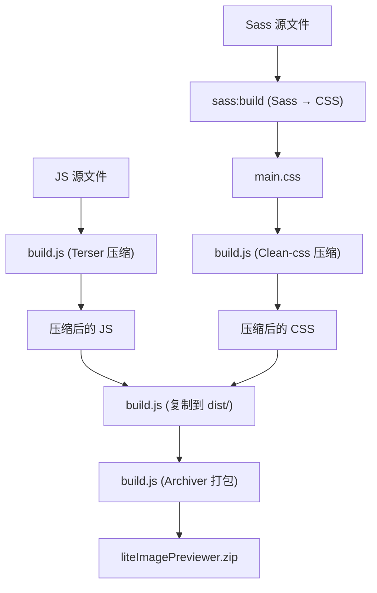

# 技术栈与依赖

<cite>
**本文档引用的文件**  
- [package.json](file://package.json)
- [server.js](file://server.js)
- [build.js](file://build.js)
- [src/scss/main.scss](file://src/scss/main.scss)
- [js/core.js](file://js/core.js)
- [js/dragUpload.js](file://js/dragUpload.js)
</cite>

## 目录
1. [简介](#简介)
2. [开发依赖](#开发依赖)
3. [运行时技术](#运行时技术)
4. [构建流程与工具协作](#构建流程与工具协作)
5. [Node.js版本与npm脚本](#nodejs版本与npm脚本)
6. [开发者环境准备指南](#开发者环境准备指南)
7. [轻量化设计哲学](#轻量化设计哲学)

## 简介
liteImagePreviewer 是一个轻量级的前端图片预览工具，无需依赖大型前端框架，通过原生技术栈实现完整的图片浏览、编辑与上传功能。本项目采用模块化设计，结合现代前端构建工具链，确保开发效率与生产环境性能的平衡。其技术选型聚焦于轻量、高效与可维护性，适用于快速部署和静态资源托管场景。

**Section sources**
- [package.json](file://package.json#L1-L37)

## 开发依赖
项目在 `package.json` 的 `devDependencies` 字段中定义了多个开发阶段依赖工具，用于提升开发体验、优化资源和打包发布。

### Express：本地开发服务器
Express 作为轻量级 Node.js Web 框架，用于启动本地开发服务器。`server.js` 文件通过 `express.static` 提供静态文件服务，使开发者可在本地通过浏览器访问应用，模拟真实运行环境。

```js
app.use(express.static(__dirname));
```

### Multer：文件上传处理
尽管当前代码中未直接调用 Multer，但其作为依赖存在，为未来可能的后端文件接收功能预留支持。Multer 专为处理 `multipart/form-data` 类型请求设计，适合高效处理图片上传。

### Sass：CSS 预处理器
Sass 用于将 `src/scss/` 目录下的模块化 `.scss` 文件编译为标准 CSS。项目采用 `@use` 规则组织样式，提升可维护性与复用性。主入口文件 `main.scss` 导入多个组件样式模块，如 `_base.scss`、`_viewer.scss` 等。

```scss
@use 'base';
@use 'viewer';
@use 'editor';
```

### Concurrently：并行脚本执行
`concurrently` 允许同时运行多个 npm 脚本。在 `dev` 脚本中，它并行启动 Sass 监听和 Express 服务器，实现开发时的实时样式更新与服务热加载。

```json
"dev": "concurrently \"npm run sass:watch\" \"npm run start\""
```

### Terser 与 Clean-css：资源压缩
Terser 用于压缩 JavaScript 文件，移除空格、注释并进行代码优化，减小文件体积。Clean-css 则用于压缩 CSS 文件，优化选择器与属性，提升加载性能。

### Archiver：发布包打包
Archiver 用于在构建完成后将 `dist/` 目录打包为 `liteImagePreviewer.zip`，便于分发和部署。

**Section sources**
- [package.json](file://package.json#L20-L28)
- [server.js](file://server.js#L3-L15)
- [src/scss/main.scss](file://src/scss/main.scss#L1-L19)

## 运行时技术
项目运行时完全基于原生 Web 技术栈，不依赖任何前端框架，确保轻量化与高性能。

### 原生 JavaScript
所有功能逻辑由原生 JavaScript 实现，包括图片管理、拖拽上传、滤镜编辑、主题切换等。通过 ES6 类（如 `ImagePreviewerCore`、`DragUploadManager`）组织代码，提升可读性与可维护性。

```js
class ImagePreviewerCore {
    constructor() {
        this.ui = new UIManager(this);
        this.imageManager = new ImageManager(this);
    }
}
```

### HTML5
使用语义化 HTML5 标签构建用户界面，如 `<header>`、`<main>`、`<section>` 等，增强可访问性与 SEO 友好性。通过 `data-*` 属性实现行为与样式的解耦。

### CSS3/Sass
样式基于 CSS3 特性构建，包括 Flexbox 布局、动画、渐变、阴影等。Sass 的变量、混合器（mixins）和模块系统显著提升了 CSS 的可维护性。例如，`_variables.scss` 定义全局颜色与尺寸，`_mixins.scss` 提供响应式断点封装。

**Section sources**
- [js/core.js](file://js/core.js#L1-L28)
- [js/dragUpload.js](file://js/dragUpload.js#L1-L218)
- [src/scss/main.scss](file://src/scss/main.scss#L1-L19)

## 构建流程与工具协作
项目的构建流程通过 npm 脚本与 Node.js 脚本协同完成，形成自动化工作流。

### 构建流程图


**Diagram sources**
- [package.json](file://package.json#L10-L15)
- [build.js](file://build.js#L1-L116)

### 工具协作说明
1. **Sass 编译**：`npm run sass:build` 将 SCSS 编译为压缩的 CSS 文件至 `public/css/main.css`。
2. **JS/CSS 压缩**：`build.js` 调用 Terser 和 Clean-css 分别压缩所有 JS 和 CSS 文件。
3. **文件复制**：静态文件（如 `index.html`）直接复制到 `dist/` 目录。
4. **打包发布**：`dist` 目录被 Archiver 打包为 ZIP 文件，供发布使用。

**Section sources**
- [build.js](file://build.js#L1-L116)
- [package.json](file://package.json#L14-L15)

## Node.js版本与npm脚本
项目通过 `package.json` 的 `engines` 字段明确要求 Node.js 版本不低于 14.0.0，确保兼容现代 JavaScript 特性与依赖包。

### npm 脚本说明
| 脚本名称 | 用途 |
|--------|------|
| `start` | 启动 Express 服务器，监听 3000 端口 |
| `dev` | 并行运行 Sass 监听与服务器，用于开发模式 |
| `sass:watch` | 监听 SCSS 文件变化并实时编译 |
| `sass:build` | 一次性编译并压缩 SCSS 为 CSS |
| `build` | 执行构建流程（当前仅调用 `sass:build`） |
| `dist` | 运行 `build.js` 完成完整构建与打包 |

**Section sources**
- [package.json](file://package.json#L35-L37)
- [server.js](file://server.js#L5-L15)
- [build.js](file://build.js#L1-L116)

## 开发者环境准备指南
为顺利运行和开发本项目，请遵循以下步骤：

1. **安装 Node.js**  
   确保安装 Node.js 14.0.0 或更高版本。可通过以下命令验证：
   ```bash
   node --version
   ```

2. **安装依赖**  
   在项目根目录执行：
   ```bash
   npm install
   ```

3. **启动开发服务器**  
   运行以下命令启动开发环境：
   ```bash
   npm run dev
   ```
   浏览器将自动打开 `http://localhost:3000`。

4. **构建生产版本**  
   执行以下命令生成 `dist/` 目录并打包：
   ```bash
   npm run dist
   ```

**Section sources**
- [package.json](file://package.json#L5-L37)
- [server.js](file://server.js#L1-L15)
- [build.js](file://build.js#L1-L116)

## 轻量化设计哲学
liteImagePreviewer 的核心设计理念是“轻量、简洁、高效”。项目**不依赖任何大型前端框架**（如 React、Vue），避免引入庞大的运行时开销。所有功能通过原生 JavaScript 与模块化 CSS 实现，确保：

- **快速加载**：无框架启动开销，资源体积小。
- **易于部署**：纯静态文件，可托管于任何静态服务器或 CDN。
- **高可维护性**：代码结构清晰，依赖少，学习成本低。
- **灵活扩展**：模块化设计便于功能增删。

这种设计特别适合个人项目、快速原型或对性能要求较高的静态应用。

**Section sources**
- [package.json](file://package.json#L1-L37)
- [js/core.js](file://js/core.js#L1-L28)
- [build.js](file://build.js#L1-L116)