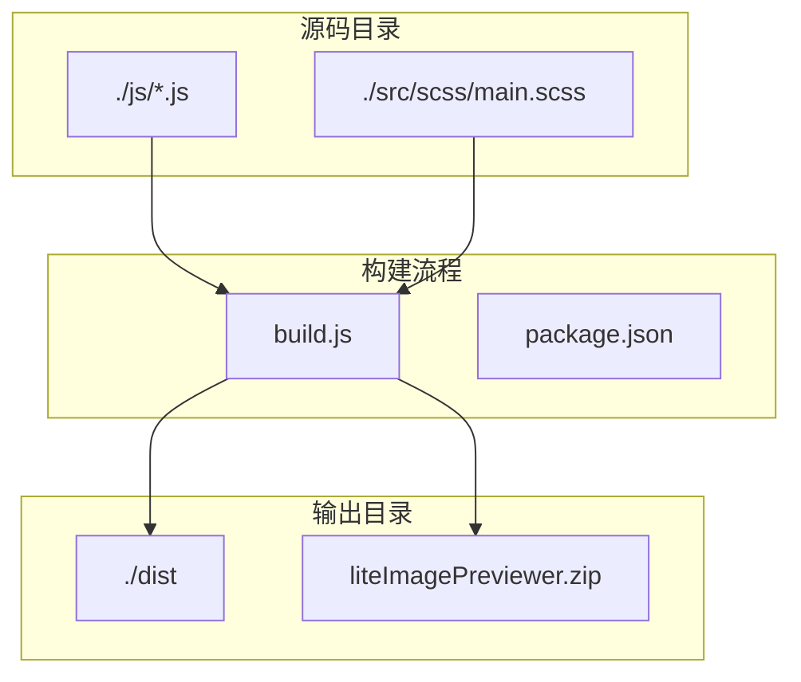
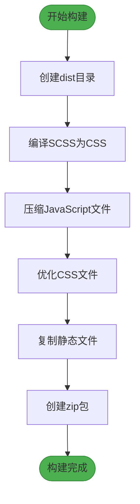
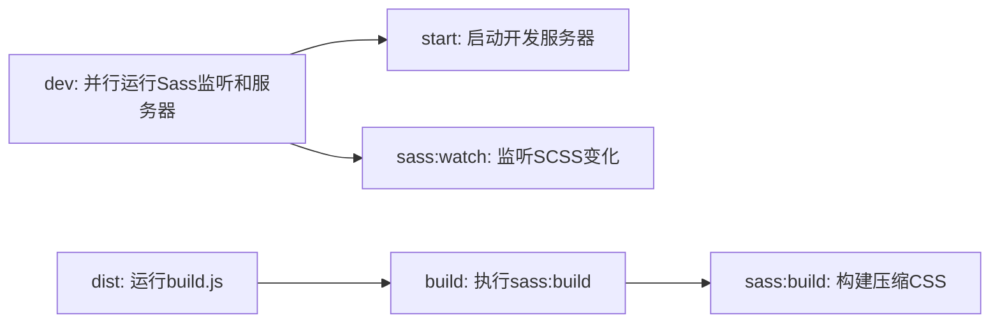
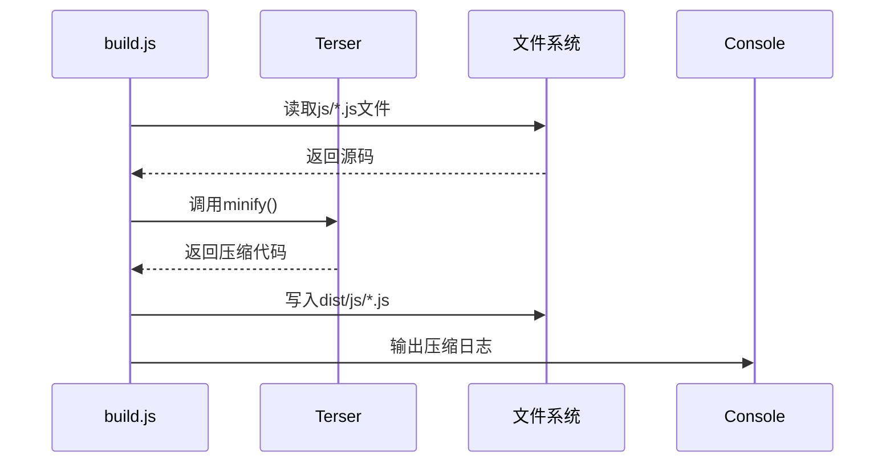
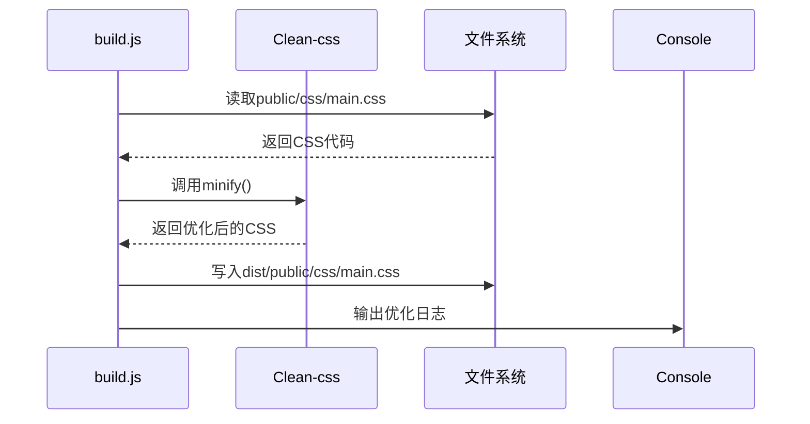
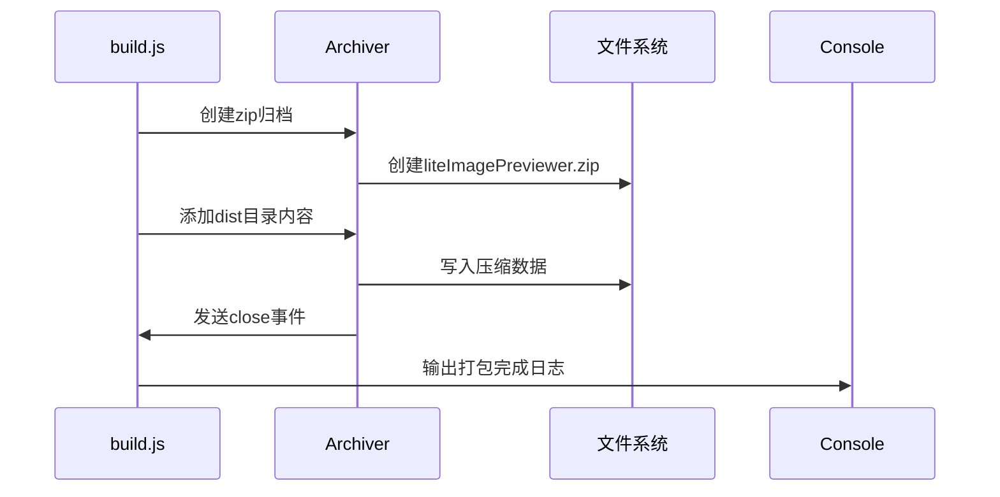
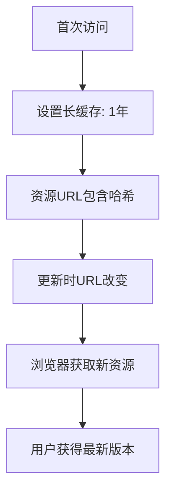

# 构建与部署

<cite>
**本文档引用的文件**  
- [build.js](file://build.js)
- [package.json](file://package.json)
- [server.js](file://server.js)
</cite>

## 目录
1. [简介](#简介)
2. [项目结构](#项目结构)
3. [核心构建流程](#核心构建流程)
4. [构建脚本分析](#构建脚本分析)
5. [生产环境构建指南](#生产环境构建指南)
6. [开发与生产环境对比](#开发与生产环境对比)
7. [部署最佳实践](#部署最佳实践)
8. [故障排查指南](#故障排查指南)
9. [结论](#结论)

## 简介
本文档详细说明了轻便版图片预览器（Lite Image Previewer）的构建与部署流程。涵盖从源码编译、资源压缩到打包发布的完整过程，帮助开发者顺利将应用部署到生产环境。

## 项目结构
项目采用模块化结构，主要包含JavaScript源码、SCSS样式文件和构建脚本。静态资源通过构建流程处理后输出至dist目录，便于部署。



**Diagram sources**  
- [build.js](file://build.js#L1-L116)
- [package.json](file://package.json#L1-L37)

**Section sources**  
- [build.js](file://build.js#L1-L116)
- [package.json](file://package.json#L1-L37)

## 核心构建流程
构建流程由`build.js`脚本驱动，执行以下关键步骤：

1. 创建dist输出目录
2. 编译SCSS为CSS（通过npm脚本调用Sass）
3. 压缩所有JavaScript文件
4. 优化CSS文件
5. 复制静态文件
6. 打包为zip发布包



**Diagram sources**  
- [build.js](file://build.js#L1-L116)

**Section sources**  
- [build.js](file://build.js#L1-L116)

## 构建脚本分析
`package.json`中的npm脚本定义了构建流程的执行顺序和依赖关系。



**Diagram sources**  
- [package.json](file://package.json#L10-L16)

**Section sources**  
- [package.json](file://package.json#L10-L16)

### JavaScript压缩流程
`build.js`使用Terser库对所有JavaScript文件进行压缩。



**Diagram sources**  
- [build.js](file://build.js#L35-L42)

### CSS优化流程
使用Clean-css库对编译后的CSS进行优化处理。



**Diagram sources**  
- [build.js](file://build.js#L44-L50)

### 打包发布流程
使用Archiver库将dist目录打包为zip文件。



**Diagram sources**  
- [build.js](file://build.js#L91-L115)

## 生产环境构建指南
按照以下步骤生成生产版本：

1. **执行构建命令**
   ```bash
   npm run build
   ```

2. **生成压缩资源**
   - Sass编译并压缩CSS到`public/css/main.css`
   - Terser压缩所有JS文件到`dist/js/`目录
   - Clean-css优化CSS文件

3. **运行打包脚本**
   ```bash
   npm run dist
   ```

4. **部署到服务器**
   将`dist`目录中的内容部署到任何静态服务器。

**Section sources**  
- [build.js](file://build.js#L1-L116)
- [package.json](file://package.json#L14-L16)

## 开发与生产环境对比
| 特性 | 开发环境 | 生产环境 |
|------|----------|----------|
| **启动命令** | `npm start` 或 `npm run dev` | `npm run build` → `npm run dist` |
| **CSS处理** | 监听SCSS变化，未压缩 | 编译并压缩CSS |
| **JS处理** | 原始文件 | 压缩优化 |
| **服务器** | Node.js Express | 静态文件服务器 |
| **性能** | 开发友好 | 优化加载速度 |
| **调试** | 易于调试 | 不适合调试 |

**Section sources**  
- [package.json](file://package.json#L10-L14)
- [server.js](file://server.js#L1-L15)

## 部署最佳实践
### 缓存策略


### CDN加速建议
- 将静态资源托管到CDN
- 启用Gzip/Brotli压缩
- 使用HTTP/2协议
- 启用预加载和预连接

### 安全性配置
推荐的HTTP安全头：
- `Content-Security-Policy`: 限制资源加载来源
- `X-Content-Type-Options`: nosniff
- `X-Frame-Options`: DENY
- `Strict-Transport-Security`: 启用HTTPS

**Section sources**  
- [server.js](file://server.js#L7-L10)

## 故障排查指南
### 构建失败
**症状**：`npm run build`报错  
**解决方案**：
- 检查Node.js版本是否>=14.0.0
- 确保已安装依赖：`npm install`
- 检查SCSS语法错误

### 文件未生成
**症状**：dist目录缺少文件  
**解决方案**：
- 检查`build.js`中的文件路径配置
- 确认源文件存在
- 检查文件权限

### 路径错误
**症状**：页面资源404  
**解决方案**：
- 检查`build.js`中的路径处理逻辑
- 确认相对路径正确性
- 验证服务器静态文件配置

**Section sources**  
- [build.js](file://build.js#L6-L11)
- [build.js](file://build.js#L64-L81)

## 结论
通过`npm run build`和`npm run dist`命令，可以顺利生成生产版本并部署到任何静态服务器。构建流程自动化程度高，确保了代码质量和性能优化。遵循本文档的指导，开发者可以高效地将应用发布到生产环境。