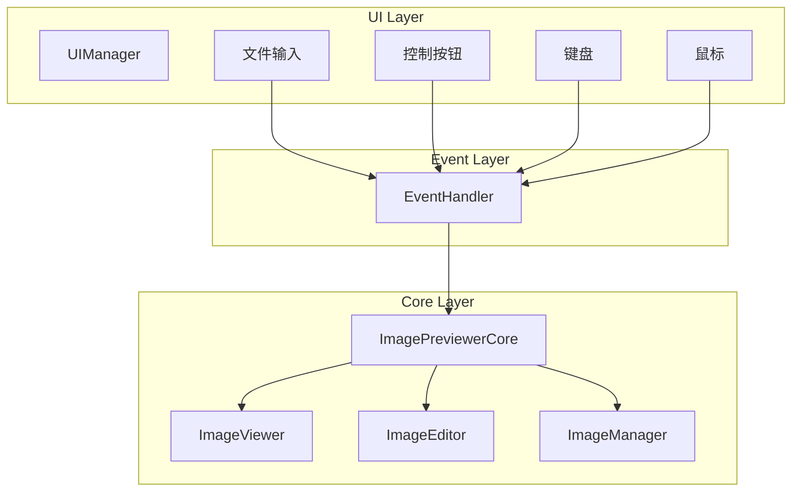
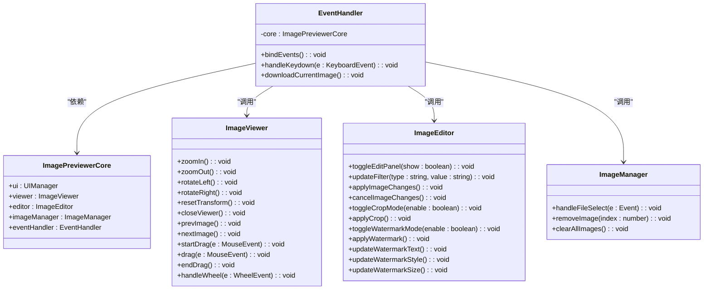
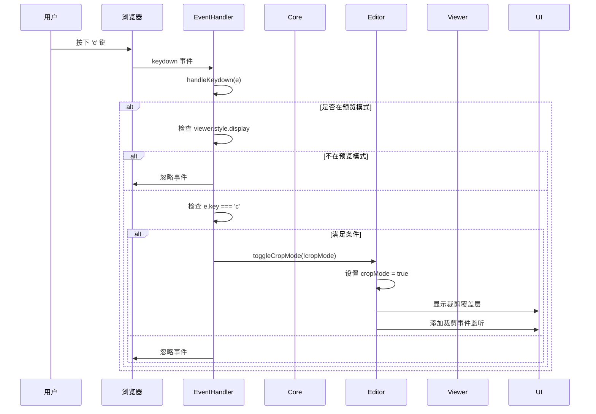
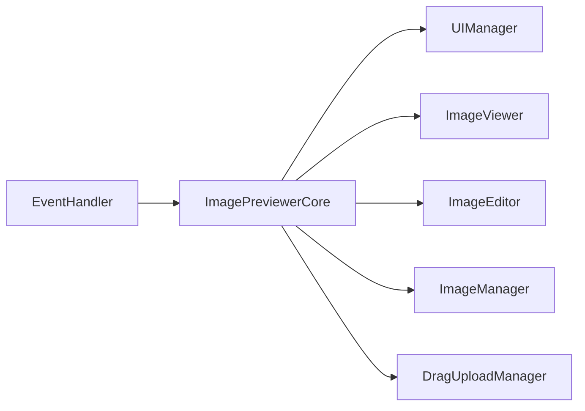

# 事件处理机制

<cite>
**本文档中引用的文件**  
- [eventHandler.js](file://js/eventHandler.js)
- [core.js](file://js/core.js)
- [editor.js](file://js/editor.js)
- [viewer.js](file://js/viewer.js)
- [ui.js](file://js/ui.js)
</cite>

## 目录
1. [简介](#简介)
2. [项目结构](#项目结构)
3. [核心组件](#核心组件)
4. [架构概述](#架构概述)
5. [详细组件分析](#详细组件分析)
6. [依赖分析](#依赖分析)
7. [性能考虑](#性能考虑)
8. [故障排除指南](#故障排除指南)
9. [结论](#结论)

## 简介
本文件全面解析 `eventHandler.js` 模块实现的事件驱动架构。该模块作为图像预览器的核心事件中枢，集中管理所有用户交互事件，包括鼠标操作、键盘快捷键、文件输入和UI控件事件。通过统一的事件绑定和分发机制，`EventHandler` 将原始DOM事件规范化后转发至 `ImagePreviewerCore` 进行业务逻辑处理，实现了关注点分离和可维护性增强。

## 项目结构
`EventHandler` 模块位于 `js/eventHandler.js`，是 `ImagePreviewerCore` 初始化流程中的关键组件。它依赖于 `core` 实例访问 `ui`、`viewer`、`editor` 等其他模块，形成以 `core` 为中心的星型架构。事件处理器在应用初始化时通过 `bindEvents` 方法一次性注册所有事件监听器，确保了事件管理的集中性和一致性。

**Section sources**
- [eventHandler.js](file://js/eventHandler.js#L1-L214)
- [core.js](file://js/core.js#L1-L28)

## 核心组件
`EventHandler` 类是事件处理的核心，其主要职责是：
- **集中绑定**：在 `bindEvents` 方法中，为所有UI元素（按钮、输入框、图片等）绑定事件监听器。
- **事件分发**：将捕获的DOM事件直接调用 `core` 关联模块的方法，如 `viewer.zoomIn()` 或 `editor.updateFilter()`。
- **键盘处理**：通过 `handleKeydown` 方法统一处理键盘快捷键，根据当前应用状态（如是否在编辑模式）决定行为。
- **辅助功能**：实现 `downloadCurrentImage` 等辅助功能，利用Canvas API处理图像下载。

**Section sources**
- [eventHandler.js](file://js/eventHandler.js#L1-L214)

## 架构概述

**Diagram sources**
- [eventHandler.js](file://js/eventHandler.js#L1-L214)
- [core.js](file://js/core.js#L1-L28)

## 详细组件分析

### EventHandler 分析
`EventHandler` 是一个典型的集中式事件管理器，它通过构造函数接收 `core` 实例，从而获得对整个应用状态和功能的访问权。

#### 类图

**Diagram sources**
- [eventHandler.js](file://js/eventHandler.js#L1-L214)
- [core.js](file://js/core.js#L1-L28)
- [viewer.js](file://js/viewer.js#L1-L153)
- [editor.js](file://js/editor.js#L1-L754)
- [ui.js](file://js/ui.js#L1-L126)

#### 键盘事件处理流程

**Diagram sources**
- [eventHandler.js](file://js/eventHandler.js#L100-L150)
- [editor.js](file://js/editor.js#L150-L200)

#### 事件流示例：'c' 键触发裁剪模式
1.  **事件捕获**：用户在预览器打开状态下按下键盘上的 'c' 键。
2.  **事件识别**：`EventHandler` 的 `handleKeydown` 方法捕获到 `keydown` 事件，并通过 `e.key` 识别为 'c' 键。
3.  **状态检查**：处理器检查当前是否处于编辑模式（`editMode`）且未处于水印模式（`watermarkMode`）。
4.  **业务调用**：条件满足后，调用 `this.core.editor.toggleCropMode(!this.core.editor.cropMode)`。
5.  **状态切换**：`ImageEditor` 模块将 `cropMode` 状态切换为 `true`，显示裁剪覆盖层，并绑定裁剪相关的鼠标事件监听器（拖拽、调整大小）。
6.  **UI更新**：UI相应更新，显示裁剪控制按钮（应用、取消），用户可以开始进行裁剪操作。

**Section sources**
- [eventHandler.js](file://js/eventHandler.js#L135-L140)
- [editor.js](file://js/editor.js#L150-L200)

## 依赖分析

**Diagram sources**
- [eventHandler.js](file://js/eventHandler.js#L1-L214)
- [core.js](file://js/core.js#L1-L28)

## 性能考虑
`EventHandler` 的设计对性能有积极影响：
- **减少监听器数量**：虽然绑定的事件较多，但每个元素通常只绑定一个监听器，避免了监听器泛滥。
- **避免重复绑定**：`bindEvents` 在应用初始化时只执行一次，防止了事件监听器的重复注册。
- **高效分发**：事件处理逻辑直接调用方法，没有复杂的中间件或发布-订阅开销，延迟极低。
- **鼠标拖拽优化**：虽然 `drag` 事件在 `EventHandler` 中绑定，但实际处理在 `ImageViewer` 中通过 `requestAnimationFrame` 优化，保证了拖拽的流畅性。

**Section sources**
- [eventHandler.js](file://js/eventHandler.js#L60-L62)
- [viewer.js](file://js/viewer.js#L90-L100)

## 故障排除指南
- **事件未触发**：检查 `core` 实例是否正确传递，以及 `bindEvents` 是否在 `core.init()` 中被调用。
- **快捷键无效**：确认预览器是否已打开（`viewer.style.display === 'flex'`），并检查 `handleKeydown` 中的条件判断逻辑。
- **功能调用错误**：确保 `core` 对象的属性（如 `viewer`, `editor`）在事件绑定时已初始化。
- **内存泄漏**：对于像裁剪、水印这类需要动态添加/移除的事件，`ImageEditor` 类中使用了 `bound` 函数引用，确保了 `addEventListener` 和 `removeEventListener` 能正确配对，避免了因匿名函数导致的无法移除监听器的问题。

**Section sources**
- [eventHandler.js](file://js/eventHandler.js#L100-L150)
- [editor.js](file://js/editor.js#L50-L100)

## 结论
`EventHandler` 模块成功实现了一个集中式、可维护的事件驱动架构。其优势在于：
- **统一处理**：所有事件在一个地方管理，便于理解和维护。
- **易于调试**：事件流清晰，从绑定到分发的路径明确。
- **便于扩展**：添加新的快捷键或UI事件只需在 `bindEvents` 或 `handleKeydown` 中添加相应逻辑。

潜在风险是单点复杂度高，`eventHandler.js` 文件可能随着功能增加而变得臃肿。建议未来可考虑将不同类型的事件（如UI控制、键盘、编辑）拆分为子处理器，以保持模块的单一职责。

对于高级定制，开发者可以：
1.  在 `handleKeydown` 中添加新的 `case` 语句来支持自定义快捷键。
2.  在 `bindEvents` 中为新的UI元素添加事件监听。
3.  通过修改 `downloadCurrentImage` 方法来自定义下载文件的命名规则或格式。