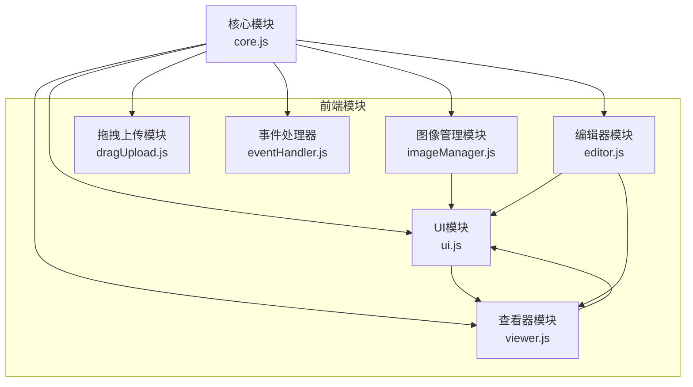
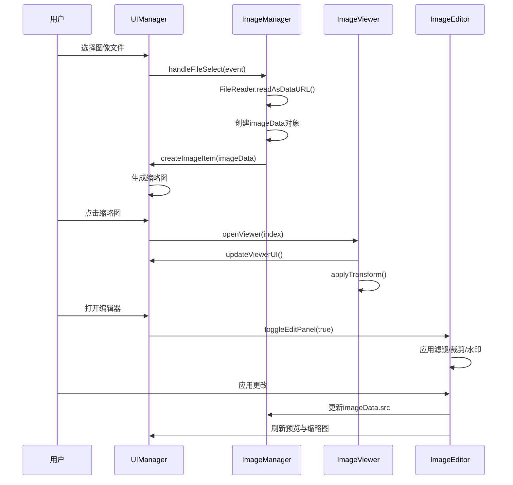
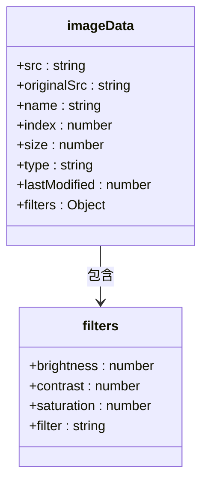
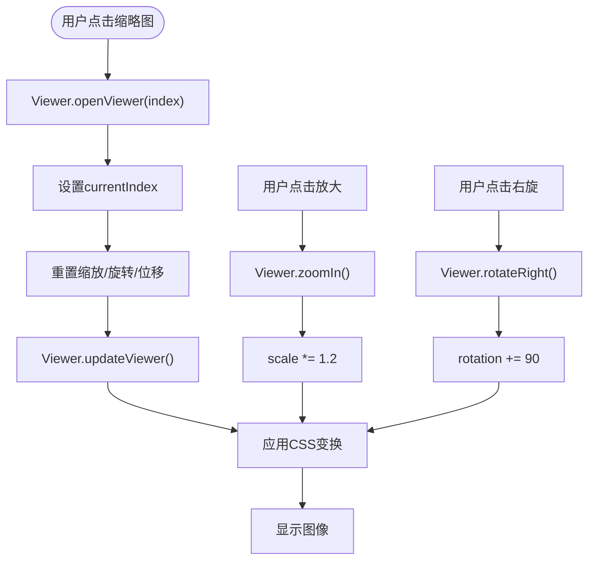
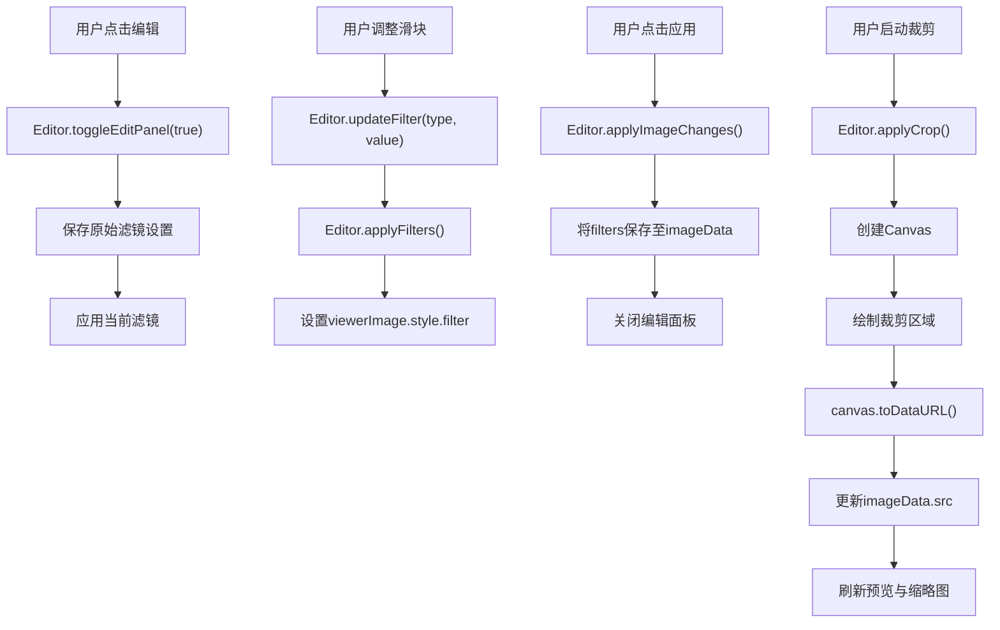
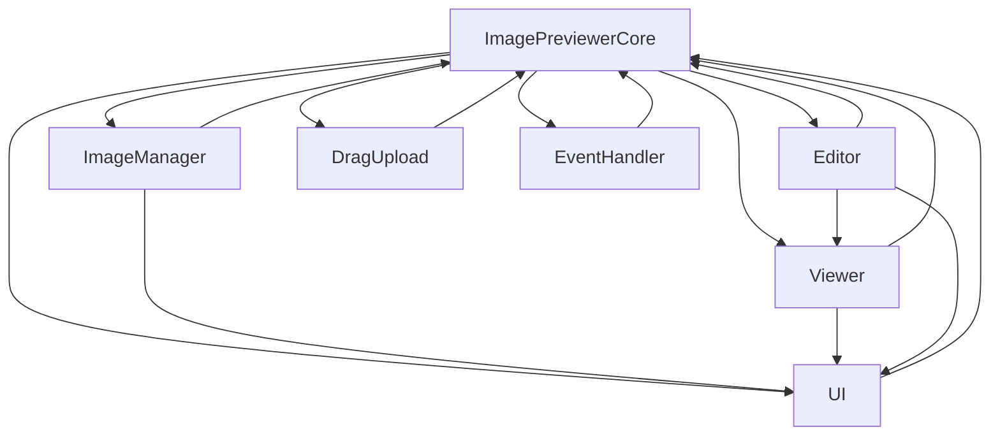

# 数据流与状态管理

<cite>
**本文档引用的文件**
- [core.js](file://js/core.js)
- [imageManager.js](file://js/imageManager.js)
- [ui.js](file://js/ui.js)
- [viewer.js](file://js/viewer.js)
- [editor.js](file://js/editor.js)
</cite>

## 目录
1. [简介](#简介)
2. [项目结构](#项目结构)
3. [核心组件](#核心组件)
4. [架构概览](#架构概览)
5. [详细组件分析](#详细组件分析)
6. [依赖分析](#依赖分析)
7. [性能考虑](#性能考虑)
8. [故障排除指南](#故障排除指南)
9. [结论](#结论)

## 简介
本文件旨在构建liteImagePreviewer的数据流动模型，从用户选择图像文件开始，追踪其在系统中的完整生命周期。文档详细说明了`imageData`对象的结构及其在各模块间的传递方式，并分析了当前由核心模块集中管理状态的策略。通过可视化数据流与状态变更路径，帮助高级开发者理解系统内部机制，识别潜在瓶颈，并提出可扩展的优化建议。

## 项目结构
liteImagePreviewer采用模块化JavaScript架构，将功能划分为多个独立但相互协作的类。核心模块通过依赖注入方式协调各子模块，形成清晰的控制流与数据流。UI、图像管理、查看器、编辑器、拖拽上传和事件处理均封装在独立文件中，便于维护和扩展。

**Diagram sources**
- [core.js](file://js/core.js#L1-L28)
- [ui.js](file://js/ui.js#L1-L126)

**Section sources**
- [core.js](file://js/core.js#L1-L28)
- [js](file://js/)

## 核心组件
系统以`ImagePreviewerCore`为核心控制器，初始化并协调所有功能模块。用户操作通过`UIManager`捕获，交由`ImageManager`处理文件读取与图像数据管理，`ImageViewer`负责全屏预览，`ImageEditor`提供图像变换功能。数据流始于文件选择，终于图像显示更新，形成闭环。

**Section sources**
- [core.js](file://js/core.js#L1-L28)
- [ui.js](file://js/ui.js#L1-L126)
- [imageManager.js](file://js/imageManager.js#L1-L196)

## 架构概览
系统采用中心化状态管理模式，`ImagePreviewerCore`持有对所有模块的引用，各模块通过`this.core`访问彼此状态与方法。`imageData`对象作为核心数据载体，在文件读取、缩略图生成、预览和编辑过程中被持续传递与修改。

**Diagram sources**
- [imageManager.js](file://js/imageManager.js#L34-L66)
- [ui.js](file://js/ui.js#L0-L31)
- [viewer.js](file://js/viewer.js#L0-L153)
- [editor.js](file://js/editor.js#L0-L754)

## 详细组件分析

### 图像数据管理分析
`ImageManager`负责接收用户选择的文件，使用`FileReader`将其读取为Data URL，并构建`imageData`对象进行管理。

#### imageData对象结构

**Diagram sources**
- [imageManager.js](file://js/imageManager.js#L45-L55)

**Section sources**
- [imageManager.js](file://js/imageManager.js#L34-L66)

### 预览与交互分析
`ImageViewer`模块管理全屏查看状态，处理缩放、旋转、拖拽等交互操作。其状态（scale, rotation, translate）独立于`imageData`，仅在显示时应用。

#### 查看器状态流

**Diagram sources**
- [viewer.js](file://js/viewer.js#L0-L153)

**Section sources**
- [viewer.js](file://js/viewer.js#L0-L153)

### 图像编辑分析
`ImageEditor`模块在Canvas上应用变换，并将结果回写至`imageData.src`，实现永久性修改。

#### 编辑流程

**Diagram sources**
- [editor.js](file://js/editor.js#L0-L754)

**Section sources**
- [editor.js](file://js/editor.js#L0-L754)

## 依赖分析
系统依赖关系以`ImagePreviewerCore`为中心，各模块通过`this.core`引用进行通信，避免了复杂的直接依赖链。

**Diagram sources**
- [core.js](file://js/core.js#L1-L28)
- [imageManager.js](file://js/imageManager.js#L34-L66)
- [viewer.js](file://js/viewer.js#L0-L153)
- [editor.js](file://js/editor.js#L0-L754)

**Section sources**
- [core.js](file://js/core.js#L1-L28)

## 性能考虑
- **内存管理**：`ImageManager`在删除或清空图片时调用`URL.revokeObjectURL()`释放Blob URL内存。
- **懒加载**：缩略图使用`IntersectionObserver`实现懒加载，提升初始渲染性能。
- **变换优化**：图像拖拽使用`requestAnimationFrame`进行节流，防止过度重绘。
- **状态同步**：所有UI更新均通过模块方法调用触发，确保状态一致性。

## 故障排除指南
- **图像未显示**：检查`imageData.src`是否为有效Data URL，确认`originalSrc`字段存在。
- **编辑不生效**：确保`applyImageChanges()`或`applyCrop()`被调用，且`imageData.src`被正确更新。
- **缩略图不刷新**：确认编辑后是否同步更新了缩略图`img.src`。
- **内存泄漏**：确保在`clearAllImages()`和`removeImage()`中调用`revokeObjectURL()`。
- **事件未绑定**：检查`eventHandler.bindEvents()`是否执行，DOM元素是否正确初始化。

**Section sources**
- [imageManager.js](file://js/imageManager.js#L177-L195)
- [editor.js](file://js/editor.js#L732-L753)

## 结论
liteImagePreviewer通过清晰的模块划分和中心化状态管理，实现了高效的图像预览与编辑功能。`imageData`对象作为核心数据载体，贯穿文件读取、显示、编辑全过程。当前状态管理策略虽有效，但随着功能扩展，模块间通过`this.core`直接调用可能增加耦合度。建议引入观察者模式或轻量级状态机，使状态变更可监听、可追溯，提升系统的可维护性与可扩展性。