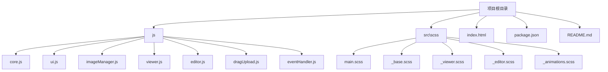
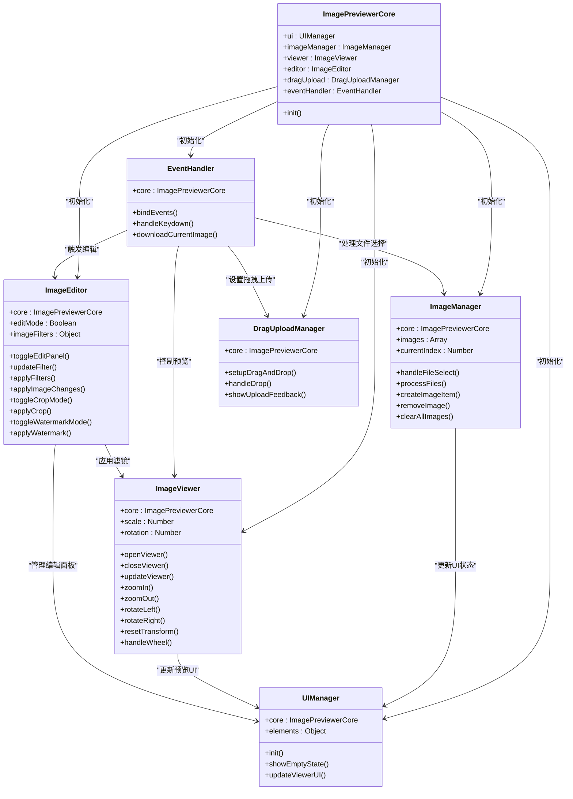
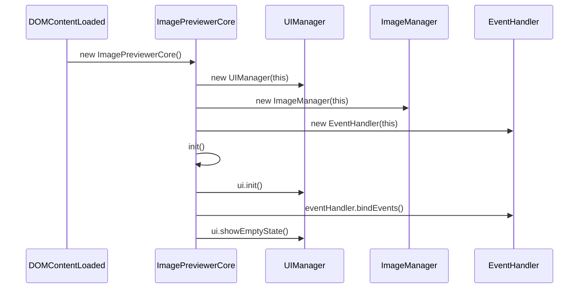
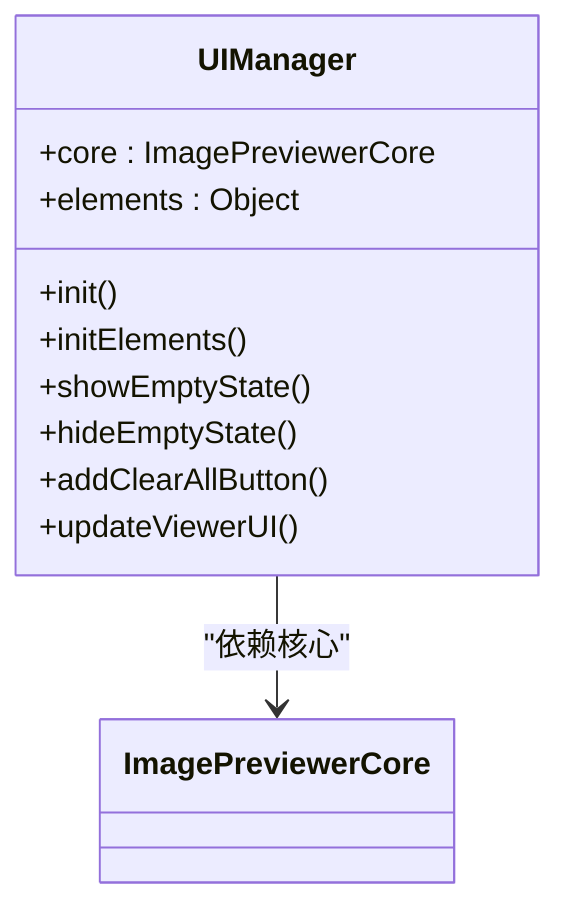
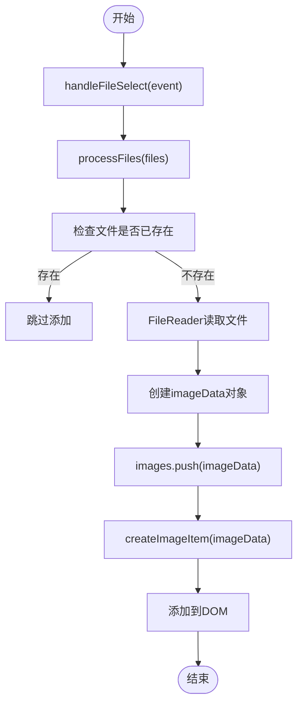
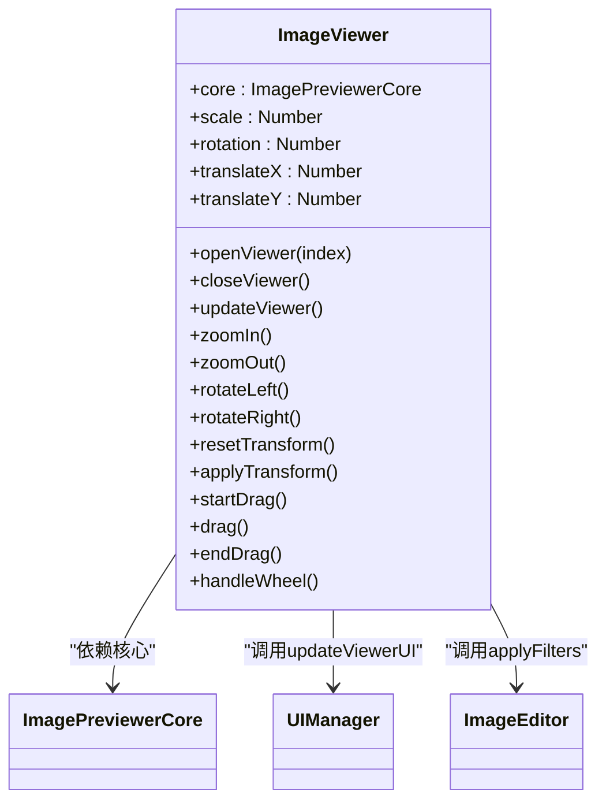
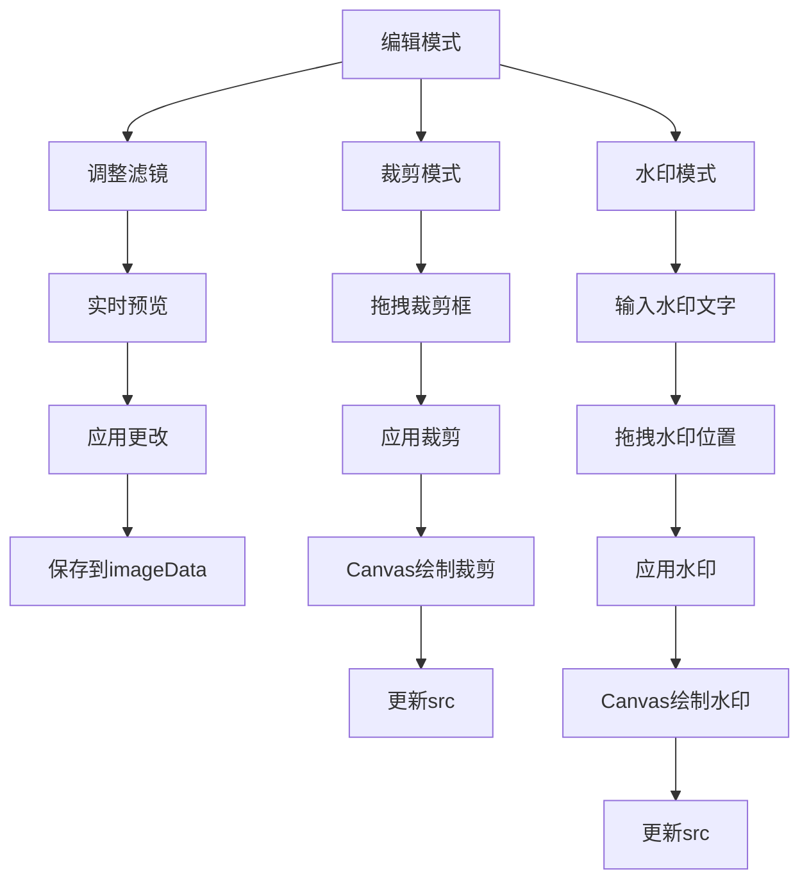
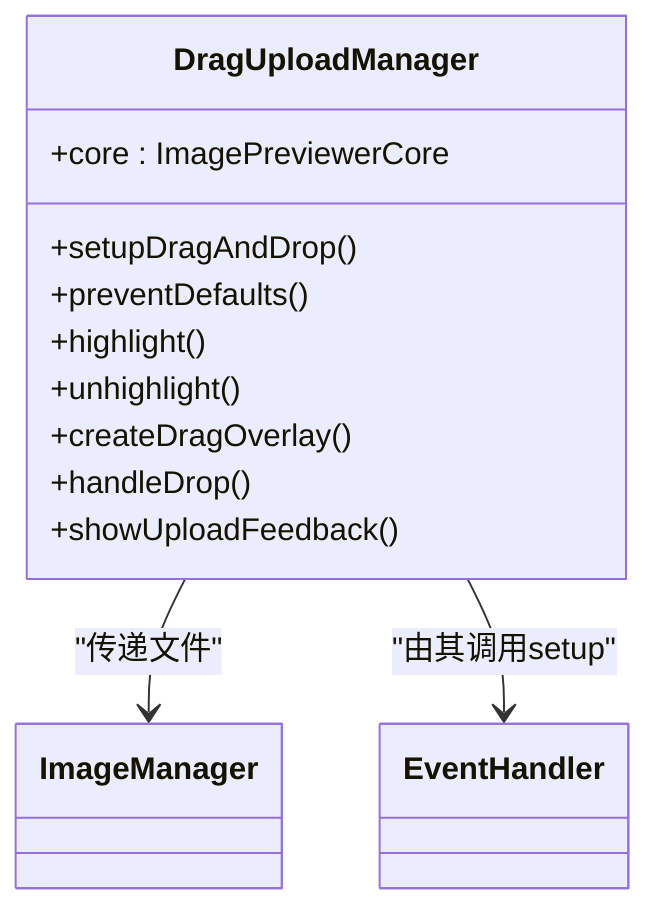
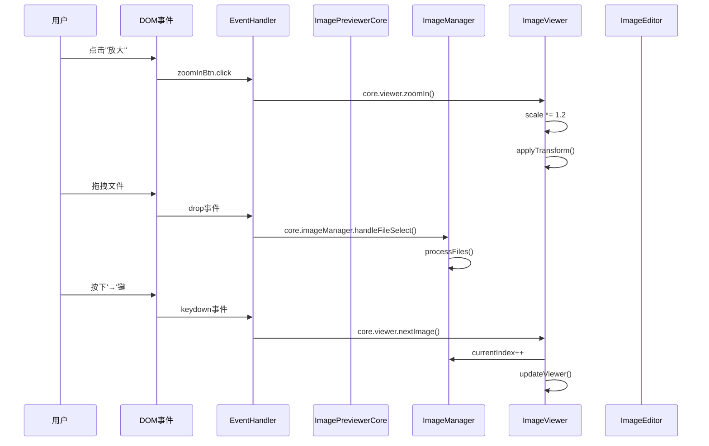
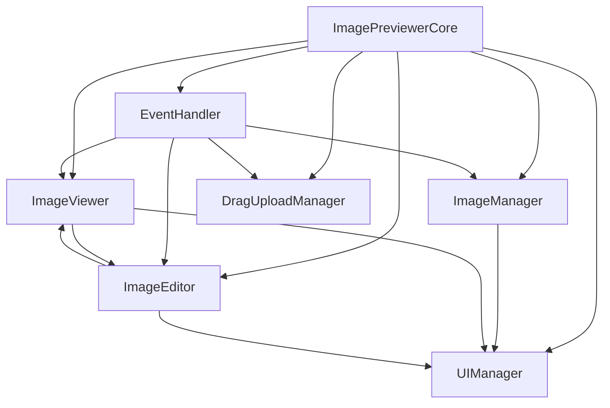

# 架构设计

<cite>
**本文档引用的文件**  
- [core.js](file://js/core.js)
- [ui.js](file://js/ui.js)
- [imageManager.js](file://js/imageManager.js)
- [viewer.js](file://js/viewer.js)
- [editor.js](file://js/editor.js)
- [dragUpload.js](file://js/dragUpload.js)
- [eventHandler.js](file://js/eventHandler.js)
</cite>

## 目录
1. [简介](#简介)
2. [项目结构](#项目结构)
3. [核心组件](#核心组件)
4. [架构概览](#架构概览)
5. [详细组件分析](#详细组件分析)
6. [依赖分析](#依赖分析)
7. [性能考虑](#性能考虑)
8. [故障排除指南](#故障排除指南)
9. [结论](#结论)

## 简介
liteImagePreviewer 是一个轻量级的图片预览与编辑工具，采用模块化设计，支持图片上传、浏览、缩放、旋转、滤镜、裁剪和水印等功能。本架构设计文档旨在深入解析其模块化组织结构和组件间协作机制，重点围绕 `ImagePreviewerCore` 核心控制器展开，说明其如何协调各功能模块实现高效、可维护的系统架构。

## 项目结构
项目采用清晰的分层结构，前端逻辑与样式分离，JavaScript 模块化组织，便于维护与扩展。

**图示来源**  
- [core.js](file://js/core.js)
- [ui.js](file://js/ui.js)
- [imageManager.js](file://js/imageManager.js)
- [viewer.js](file://js/viewer.js)
- [editor.js](file://js/editor.js)
- [dragUpload.js](file://js/dragUpload.js)
- [eventHandler.js](file://js/eventHandler.js)

**本节来源**  
- [js/core.js](file://js/core.js#L1-L28)
- [js/ui.js](file://js/ui.js#L1-L126)
- [js/imageManager.js](file://js/imageManager.js#L1-L196)
- [js/viewer.js](file://js/viewer.js#L1-L153)
- [js/editor.js](file://js/editor.js#L1-L754)
- [js/dragUpload.js](file://js/dragUpload.js#L1-L218)
- [js/eventHandler.js](file://js/eventHandler.js#L1-L214)

## 核心组件
`ImagePreviewerCore` 是整个应用的核心控制器，负责初始化所有功能模块并协调它们之间的交互。它采用依赖注入的方式，将自身实例传递给各模块，形成统一的控制中心。

**本节来源**  
- [core.js](file://js/core.js#L1-L28)

## 架构概览
liteImagePreviewer 采用面向对象的模块化架构，以 `ImagePreviewerCore` 为核心，各功能模块（`UIManager`、`ImageManager`、`ImageViewer`、`ImageEditor`、`DragUploadManager`、`EventHandler`）通过核心实例相互协作，形成清晰的控制流与数据流。

**图示来源**  
- [core.js](file://js/core.js#L1-L28)
- [ui.js](file://js/ui.js#L1-L126)
- [imageManager.js](file://js/imageManager.js#L1-L196)
- [viewer.js](file://js/viewer.js#L1-L153)
- [editor.js](file://js/editor.js#L1-L754)
- [dragUpload.js](file://js/dragUpload.js#L1-L218)
- [eventHandler.js](file://js/eventHandler.js#L1-L214)

## 详细组件分析
### ImagePreviewerCore 分析
`ImagePreviewerCore` 是应用的主控制器，负责模块的初始化与协调。在构造函数中，它创建了所有功能模块的实例，并传入自身引用，使各模块能够通过 `this.core` 访问其他模块。

**图示来源**  
- [core.js](file://js/core.js#L1-L28)

**本节来源**  
- [core.js](file://js/core.js#L1-L28)

### UIManager 分析
`UIManager` 负责管理所有 DOM 元素的引用和基本 UI 状态更新。它在 `initElements()` 中集中获取所有 UI 元素，避免重复查询，提高性能。

**图示来源**  
- [ui.js](file://js/ui.js#L1-L126)

**本节来源**  
- [ui.js](file://js/ui.js#L1-L126)

### ImageManager 分析
`ImageManager` 是图片数据的管理中心，负责处理文件上传、存储图片元数据、管理图片列表和执行图片的增删操作。它通过 `processFiles()` 方法处理文件输入，并使用 `createImageItem()` 创建缩略图项。

**图示来源**  
- [imageManager.js](file://js/imageManager.js#L1-L196)

**本节来源**  
- [imageManager.js](file://js/imageManager.js#L1-L196)

### ImageViewer 分析
`ImageViewer` 负责大图预览的交互逻辑，包括缩放、拖拽、旋转和全屏。它通过 CSS `transform` 属性实现视觉变换，并使用 `requestAnimationFrame` 优化拖拽性能。

**图示来源**  
- [viewer.js](file://js/viewer.js#L1-L153)

**本节来源**  
- [viewer.js](file://js/viewer.js#L1-L153)

### ImageEditor 分析
`ImageEditor` 提供图像编辑功能，包括亮度、对比度、饱和度调整、滤镜应用、裁剪和水印。它通过 CSS `filter` 属性实现实时预览，并使用 Canvas 进行最终的图像处理。

**图示来源**  
- [editor.js](file://js/editor.js#L1-L754)

**本节来源**  
- [editor.js](file://js/editor.js#L1-L754)

### DragUploadManager 分析
`DragUploadManager` 实现了拖拽上传功能，提供视觉反馈和文件处理。它通过监听 `dragenter`、`dragover`、`drop` 等事件，创建拖拽覆盖层，并将文件传递给 `ImageManager` 处理。

**图示来源**  
- [dragUpload.js](file://js/dragUpload.js#L1-L218)

**本节来源**  
- [dragUpload.js](file://js/dragUpload.js#L1-L218)

### EventHandler 分析
`EventHandler` 是事件驱动机制的核心，集中绑定所有 DOM 事件和键盘事件。它将用户交互（如点击、键盘）转发到相应的处理器，实现了关注点分离。

**图示来源**  
- [eventHandler.js](file://js/eventHandler.js#L1-L214)

**本节来源**  
- [eventHandler.js](file://js/eventHandler.js#L1-L214)

## 依赖分析
系统采用中心化的依赖管理，所有模块都依赖于 `ImagePreviewerCore` 实例。这种设计简化了模块间的通信，但也可能导致核心类变得臃肿。

**图示来源**  
- [core.js](file://js/core.js#L1-L28)
- [eventHandler.js](file://js/eventHandler.js#L1-L214)

**本节来源**  
- [core.js](file://js/core.js#L1-L28)
- [eventHandler.js](file://js/eventHandler.js#L1-L214)

## 性能考虑
系统在性能方面做了多项优化：
- **懒加载**：使用 `IntersectionObserver` 延迟加载缩略图，减少初始加载时间。
- **动画优化**：拖拽操作使用 `requestAnimationFrame`，避免频繁重绘。
- **内存管理**：删除图片时调用 `URL.revokeObjectURL()` 释放 Blob URL 内存。
- **事件委托**：虽然未完全实现，但 `EventHandler` 集中管理事件，便于优化。

## 故障排除指南
常见问题及解决方案：
- **图片无法上传**：检查文件类型是否为图片，或浏览器是否支持 `FileReader` API。
- **拖拽上传无反应**：确保 `EventHandler` 已调用 `setupDragAndDrop()`。
- **编辑功能不生效**：确认 `ImageEditor` 的 `applyFilters()` 是否被正确调用。
- **内存泄漏**：确保在删除图片时撤销了 `objectURL`。

**本节来源**  
- [imageManager.js](file://js/imageManager.js#L1-L196)
- [dragUpload.js](file://js/dragUpload.js#L1-L218)
- [editor.js](file://js/editor.js#L1-L754)

## 结论
liteImagePreviewer 采用清晰的模块化面向对象架构，以 `ImagePreviewerCore` 为核心，实现了高内聚、低耦合的设计。各模块遵循单一职责原则，`EventHandler` 实现了事件驱动的控制流。该架构易于维护和扩展，新增功能（如新的滤镜）只需在 `ImageEditor` 中添加相应方法。潜在改进方向包括引入状态管理库（如 Redux）以解耦核心类，或采用模块注册机制实现更灵活的插件系统。