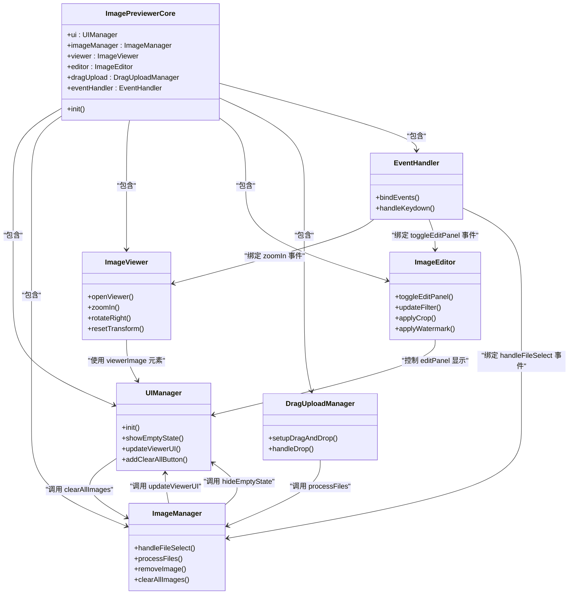

# 模块划分

<cite>
**本文档中引用的文件**  
- [core.js](file://js/core.js)
- [ui.js](file://js/ui.js)
- [imageManager.js](file://js/imageManager.js)
- [viewer.js](file://js/viewer.js)
- [editor.js](file://js/editor.js)
- [dragUpload.js](file://js/dragUpload.js)
- [eventHandler.js](file://js/eventHandler.js)
</cite>

## 目录
1. [简介](#简介)
2. [核心模块职责与接口](#核心模块职责与接口)
3. [模块化设计结构](#模块化设计结构)
4. [模块实例化与依赖注入](#模块实例化与依赖注入)
5. [单一职责原则的体现](#单一职责原则的体现)
6. [可维护性与测试便利性](#可维护性与测试便利性)
7. [模块间调用关系图](#模块间调用关系图)
8. [结论](#结论)

## 简介
`liteImagePreviewer` 是一个轻量级的图片预览与编辑工具，采用模块化设计以提升代码的可维护性与扩展性。本项目通过面向对象的方式将功能划分为多个独立模块，每个模块承担明确的职责，并通过清晰的接口进行通信。本文档详细阐述其模块化设计结构，分析各核心模块的职责、公共接口、调用关系及其实现机制。

## 核心模块职责与接口

### ImagePreviewerCore（core.js）
作为系统的中央控制器，负责初始化所有子模块并协调它们之间的交互。该模块遵循依赖注入原则，将自身实例传递给各子模块，使其能够访问其他模块的功能。

**主要职责：**
- 初始化所有子模块实例
- 调用各模块的初始化方法
- 协调模块间的通信

**公共接口：**
- `constructor()`：创建并初始化所有子模块
- `init()`：启动应用，初始化UI和事件绑定

**Section sources**
- [core.js](file://js/core.js#L1-L28)

### UIManager（ui.js）
负责管理用户界面状态和DOM元素的渲染，封装所有与UI相关的操作，确保视图层的独立性和一致性。

**主要职责：**
- 初始化DOM元素引用
- 管理界面状态（如空状态、预览器显示）
- 更新预览器UI信息
- 动态添加交互按钮（如“清空所有”）

**公共接口：**
- `init()`：初始化UI元素和按钮
- `showEmptyState()`：显示无图片时的空状态
- `hideEmptyState()`：隐藏空状态
- `updateViewerUI()`：更新当前预览图片的信息
- `addClearAllButton()`：添加清空所有图片的按钮

**Section sources**
- [ui.js](file://js/ui.js#L1-L126)

### ImageManager（imageManager.js）
负责图片的加载、存储与生命周期管理，是图片数据的核心管理者。

**主要职责：**
- 处理文件选择和拖拽上传的图片数据
- 维护图片数组（`images`）和当前索引
- 创建缩略图DOM元素
- 实现图片的添加、删除、清空等操作
- 支持懒加载机制以优化性能

**公共接口：**
- `handleFileSelect(event)`：处理文件输入选择事件
- `processFiles(files)`：批量处理图片文件
- `createImageItem(imageData)`：创建单个图片项的DOM
- `removeImage(index)`：删除指定索引的图片
- `clearAllImages()`：清空所有图片

**Section sources**
- [imageManager.js](file://js/imageManager.js#L1-L196)

### ImageViewer（viewer.js）
实现图片的预览功能，包括缩放、旋转、平移、全屏等交互操作。

**主要职责：**
- 控制预览器的打开与关闭
- 实现图片的缩放、旋转、重置变换
- 支持鼠标拖拽平移和滚轮缩放
- 管理图片导航（上一张/下一张）

**公共接口：**
- `openViewer(index)`：打开预览器并显示指定图片
- `closeViewer()`：关闭预览器
- `zoomIn()/zoomOut()`：放大/缩小图片
- `rotateLeft()/rotateRight()`：左/右旋转90度
- `resetTransform()`：重置所有变换
- `prevImage()/nextImage()`：切换到上/下一张图片
- `toggleFullscreen()`：切换全屏模式

**Section sources**
- [viewer.js](file://js/viewer.js#L1-L153)

### ImageEditor（editor.js）
封装图片编辑逻辑，包括滤镜调整、裁剪、水印添加等功能。

**主要职责：**
- 管理滤镜参数（亮度、对比度、饱和度、预设滤镜）
- 实现滤镜的实时预览与应用
- 提供裁剪功能，支持拖拽和调整裁剪框
- 支持添加可拖动的文本水印，并提供样式配置
- 管理编辑面板的显示与状态保存

**公共接口：**
- `toggleEditPanel(show)`：切换编辑面板显示
- `updateFilter(type, value)`：更新滤镜值
- `applyFilters()`：应用当前滤镜到预览图
- `applyImageChanges()` / `cancelImageChanges()`：应用或取消编辑
- `toggleCropMode(enable)`：开启/关闭裁剪模式
- `applyCrop()`：执行裁剪操作
- `toggleWatermarkMode(enable)`：开启/关闭水印模式
- `applyWatermark()`：应用水印到图片

**Section sources**
- [editor.js](file://js/editor.js#L1-L754)

### DragUploadManager（dragUpload.js）
处理拖拽上传的交互逻辑，提供视觉反馈和文件处理。

**主要职责：**
- 设置拖拽区域的事件监听
- 提供拖拽高亮和提示覆盖层
- 过滤非图片文件并处理有效图片
- 显示上传成功反馈

**公共接口：**
- `setupDragAndDrop()`：初始化拖拽上传功能
- `handleDrop(e)`：处理拖放事件中的文件
- `showUploadFeedback(count)`：显示上传结果反馈

**Section sources**
- [dragUpload.js](file://js/dragUpload.js#L1-L218)

## 模块化设计结构
`liteImagePreviewer` 采用典型的模块化架构，以 `ImagePreviewerCore` 为核心，其他模块作为其属性存在，形成树状依赖结构。每个模块通过构造函数接收 `core` 实例，从而获得对其他模块的访问权限，实现松耦合的模块通信。

这种设计遵循了前端应用中常见的“中心控制器 + 功能模块”模式，既保证了模块的独立性，又便于集中管理应用状态和生命周期。

## 模块实例化与依赖注入
所有模块的实例化过程在 `ImagePreviewerCore` 的构造函数中完成，采用依赖注入的方式将核心实例传递给子模块：

```js
constructor() {
    this.ui = new UIManager(this);
    this.imageManager = new ImageManager(this);
    this.viewer = new ImageViewer(this);
    this.editor = new ImageEditor(this);
    this.dragUpload = new DragUploadManager(this);
    this.eventHandler = new EventHandler(this);
    this.init();
}
```

这种方式使得每个模块都能通过 `this.core` 访问其他模块，例如：
- `UIManager` 调用 `this.core.imageManager.clearAllImages()`
- `EventHandler` 绑定事件到 `this.core.viewer.zoomIn()`
- `ImageManager` 更新UI通过 `this.core.ui.updateViewerUI()`

这种依赖注入机制避免了全局变量的使用，提高了代码的可测试性和可维护性。

**Section sources**
- [core.js](file://js/core.js#L1-L28)

## 单一职责原则的体现
本项目严格遵循单一职责原则（SRP），每个模块仅负责一个特定的功能领域：
- `UIManager` 仅处理UI渲染和状态
- `ImageManager` 仅管理图片数据和生命周期
- `ImageViewer` 仅负责预览交互
- `ImageEditor` 仅封装编辑逻辑
- `DragUploadManager` 仅处理拖拽上传

这种职责分离使得每个模块代码清晰、易于理解和修改。例如，要修改水印功能，只需关注 `ImageEditor` 中的相关方法，而无需涉及预览或文件加载逻辑。

## 可维护性与测试便利性
模块化设计显著提升了代码的可维护性：
- **低耦合**：模块间通过明确定义的接口通信，修改一个模块对其他模块影响小。
- **高内聚**：每个模块内部功能集中，逻辑清晰。
- **易扩展**：新增功能（如添加新滤镜）只需在对应模块中扩展，不影响整体结构。

同时，这种设计极大提高了测试便利性：
- 每个模块可以独立进行单元测试
- 依赖注入使得可以轻松模拟 `core` 对象进行隔离测试
- 接口明确，便于编写断言和验证行为

## 模块间调用关系图


**Diagram sources**
- [core.js](file://js/core.js#L1-L28)
- [ui.js](file://js/ui.js#L1-L126)
- [imageManager.js](file://js/imageManager.js#L1-L196)
- [viewer.js](file://js/viewer.js#L1-L153)
- [editor.js](file://js/editor.js#L1-L754)
- [dragUpload.js](file://js/dragUpload.js#L1-L218)
- [eventHandler.js](file://js/eventHandler.js#L1-L214)

## 结论
`liteImagePreviewer` 的模块化设计充分体现了面向对象编程的优势。通过将系统划分为职责明确的模块，并采用依赖注入机制进行协调，项目实现了高内聚、低耦合的架构。这种设计不仅提升了代码的可读性和可维护性，也为未来的功能扩展和单元测试提供了坚实的基础。各模块通过清晰的公共接口进行通信，确保了系统的稳定性和可预测性，是前端应用模块化设计的良好实践。