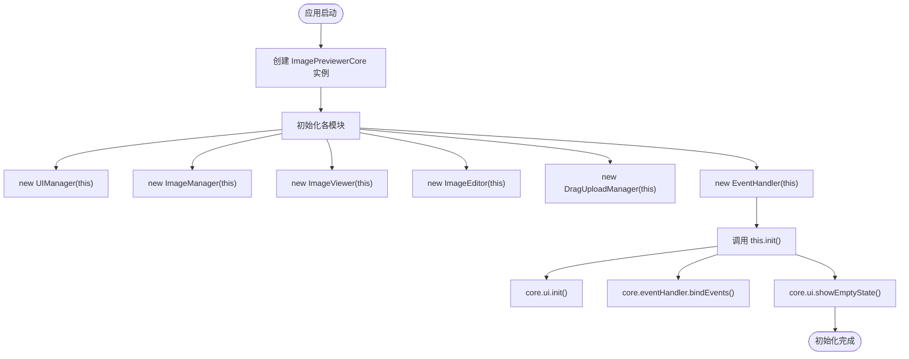
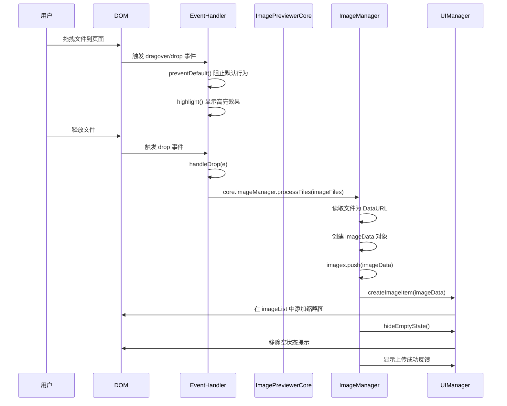
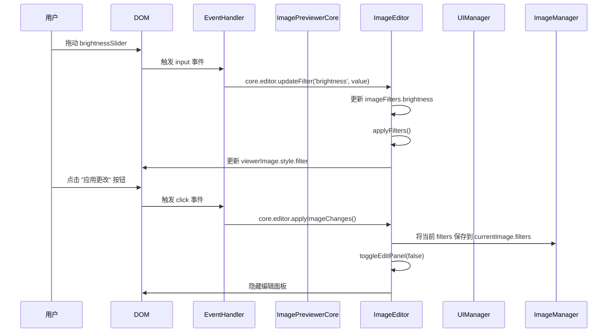
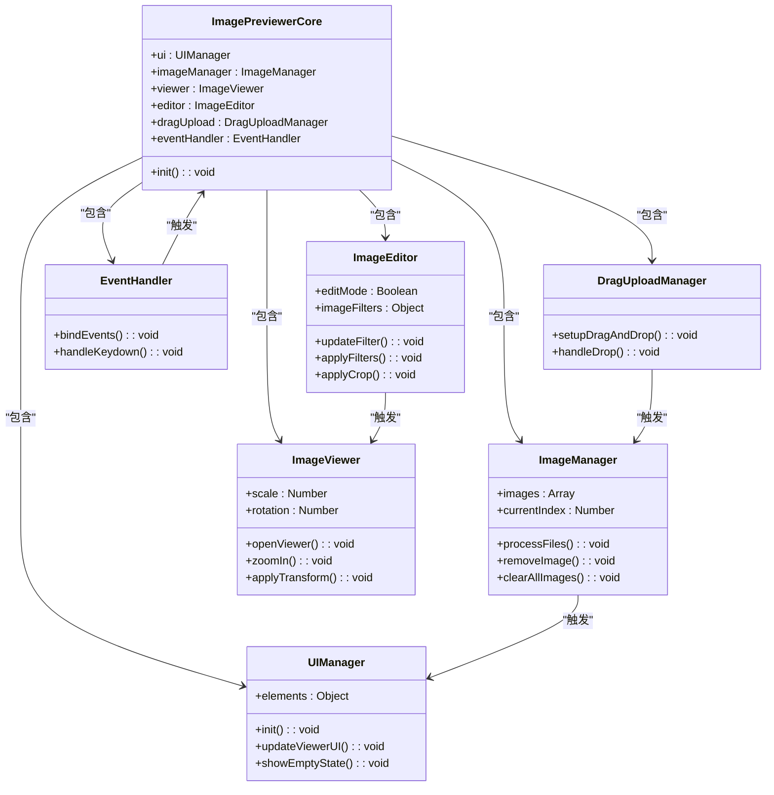

# 组件关系与协作机制

<cite>
**本文档引用的文件**   
- [core.js](file://js/core.js)
- [eventHandler.js](file://js/eventHandler.js)
- [ui.js](file://js/ui.js)
- [imageManager.js](file://js/imageManager.js)
- [viewer.js](file://js/viewer.js)
- [editor.js](file://js/editor.js)
- [dragUpload.js](file://js/dragUpload.js)
</cite>

## 目录
1. [简介](#简介)
2. [核心组件初始化流程](#核心组件初始化流程)
3. [组件通信机制](#组件通信机制)
4. [事件驱动架构分析](#事件驱动架构分析)
5. [典型控制流与数据流示例](#典型控制流与数据流示例)
6. [模块职责与解耦设计](#模块职责与解耦设计)
7. [组件交互图](#组件交互图)
8. [结论](#结论)

## 简介
liteImagePreviewer 是一个轻量级的图像预览与编辑工具，采用事件驱动架构和模块化设计。本文档深入分析其核心组件之间的交互关系，以 `ImagePreviewerCore` 为中心，阐述其如何协调 `UIManager`、`ImageManager`、`ImageViewer`、`ImageEditor` 和 `EventHandler` 等模块的协作。通过解析启动流程、事件处理机制和具体功能实现，揭示系统如何通过核心协调者避免模块间直接耦合，为开发者提供理解系统整体运作机制的清晰视图。

## 核心组件初始化流程

`ImagePreviewerCore` 是整个应用的中枢，负责在启动时实例化并连接所有关键模块。当 DOM 内容加载完成后，`ImagePreviewerCore` 的构造函数被调用，依次创建各个功能模块的实例，并将自身引用（`this`）作为参数传递给它们，从而建立模块与核心之间的双向引用。

**Diagram sources**
- [core.js](file://js/core.js#L1-L28)

**Section sources**
- [core.js](file://js/core.js#L1-L28)

## 组件通信机制

系统采用严格的事件驱动架构进行组件间通信。用户操作首先触发 DOM 事件，`EventHandler` 捕获并解析这些事件，然后将控制权转发给 `ImagePreviewerCore` 进行调度。`Core` 作为协调者，根据事件类型调用相应模块的方法。模块处理完成后，通过更新自身状态或直接操作 DOM 来反馈结果，最终由 `UIManager` 负责更新用户界面。

这种设计模式确保了模块间的松耦合：
- **UIManager**：负责管理所有 DOM 元素的引用和 UI 状态更新。
- **ImageManager**：负责管理图像数据的加载、存储和删除。
- **ImageViewer**：负责处理图像的查看、缩放、旋转和导航。
- **ImageEditor**：负责处理图像的滤镜、裁剪和水印等编辑功能。
- **EventHandler**：作为事件监听的中心，将用户输入与核心逻辑解耦。
- **DragUploadManager**：专门处理拖拽上传的交互逻辑。

所有模块都通过 `core` 引用与核心通信，而模块之间不直接相互调用，这极大地提高了代码的可维护性和可测试性。

## 事件驱动架构分析

事件驱动架构是 liteImagePreviewer 的核心优势。它将用户交互（如点击、拖拽、键盘输入）与业务逻辑处理完全分离。`EventHandler` 类集中管理了所有事件监听器的绑定，这使得事件处理逻辑高度集中且易于维护。

例如，当用户点击“放大”按钮时，事件流如下：
1.  用户点击 `zoomInBtn`。
2.  `EventHandler` 捕获 `click` 事件。
3.  `EventHandler` 调用 `core.viewer.zoomIn()`。
4.  `ImageViewer` 更新其内部的 `scale` 变量，并调用 `applyTransform()` 更新图像的 CSS 变换。
5.  用户界面实时反映放大效果。

这种方式避免了在 UI 按钮的点击事件处理函数中直接编写复杂的图像变换逻辑，使得代码职责清晰，逻辑分离。

**Section sources**
- [eventHandler.js](file://js/eventHandler.js#L0-L214)
- [viewer.js](file://js/viewer.js#L0-L153)

## 典型控制流与数据流示例

### 拖拽上传流程
拖拽上传是展示系统组件协作的典型例子。

**Diagram sources**
- [dragUpload.js](file://js/dragUpload.js#L0-L218)
- [imageManager.js](file://js/imageManager.js#L0-L196)
- [ui.js](file://js/ui.js#L0-L126)

**Section sources**
- [dragUpload.js](file://js/dragUpload.js#L0-L218)
- [imageManager.js](file://js/imageManager.js#L0-L196)

### 图像编辑应用流程
当用户调整亮度滑块时，控制流和数据流如下：

**Diagram sources**
- [eventHandler.js](file://js/eventHandler.js#L0-L214)
- [editor.js](file://js/editor.js#L0-L754)

**Section sources**
- [eventHandler.js](file://js/eventHandler.js#L0-L214)
- [editor.js](file://js/editor.js#L0-L754)

## 模块职责与解耦设计

`ImagePreviewerCore` 的设计价值在于其作为“协调者”的角色，有效避免了模块间的直接耦合。每个模块都只依赖于 `Core`，而不直接依赖其他模块。

- **解耦优势**：如果需要修改 `ImageViewer` 的缩放算法，只需修改 `viewer.js` 文件，而无需改动 `EventHandler` 或 `UIManager` 的代码。同样，如果要更换 UI 框架，只需重写 `UIManager`，其他模块的逻辑保持不变。
- **可维护性**：事件处理逻辑集中在 `EventHandler` 中，使得查找和修改特定功能的事件绑定变得非常容易。
- **可扩展性**：要添加新功能（如旋转90度按钮），只需在 `EventHandler` 中绑定新事件，并在 `ImageViewer` 中添加新方法，`Core` 会自动连接它们。

这种设计遵循了“关注点分离”原则，使得代码库结构清晰，易于理解和维护。

**Section sources**
- [core.js](file://js/core.js#L1-L28)
- [eventHandler.js](file://js/eventHandler.js#L0-L214)

## 组件交互图

**Diagram sources**
- [core.js](file://js/core.js#L1-L28)
- [ui.js](file://js/ui.js#L0-L126)
- [imageManager.js](file://js/imageManager.js#L0-L196)
- [viewer.js](file://js/viewer.js#L0-L153)
- [editor.js](file://js/editor.js#L0-L754)
- [dragUpload.js](file://js/dragUpload.js#L0-L218)

## 结论
liteImagePreviewer 通过 `ImagePreviewerCore` 作为核心协调者，成功构建了一个松耦合、高内聚的模块化系统。事件驱动架构确保了用户交互与业务逻辑的清晰分离，而 `Core` 的集中调度避免了模块间的直接依赖。这种设计不仅提升了代码的可维护性和可扩展性，也为开发者理解系统整体运作机制提供了清晰的视图。通过分析拖拽上传和图像编辑等具体流程，可以深刻体会到这种架构在实际应用中的优势。对于希望学习模块化和事件驱动设计的开发者来说，该项目是一个优秀的实践范例。