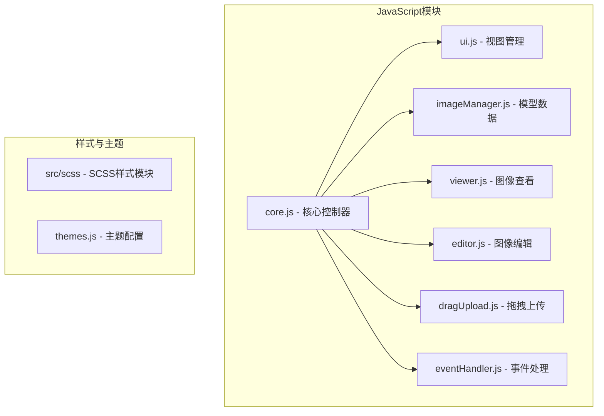
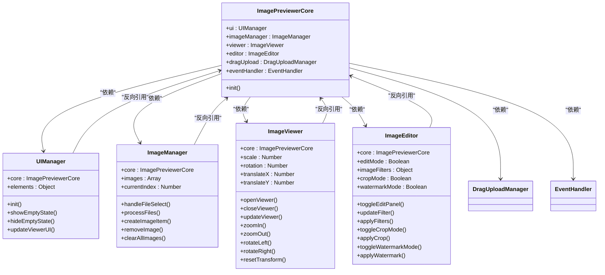
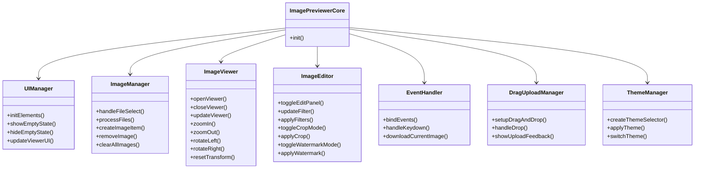
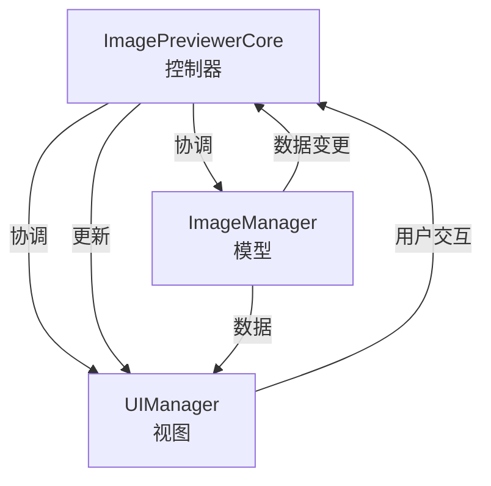
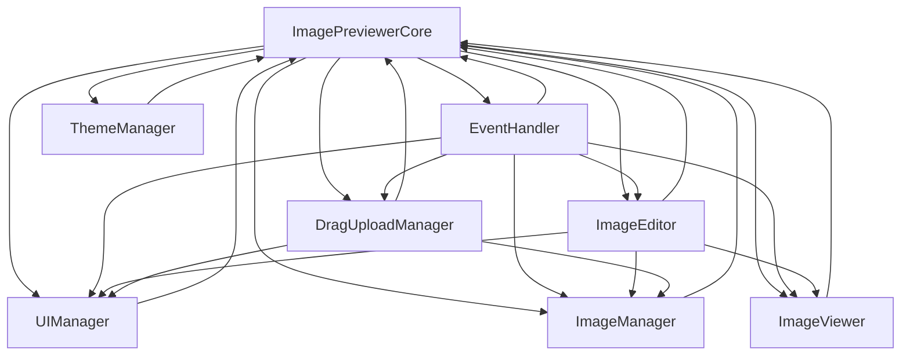
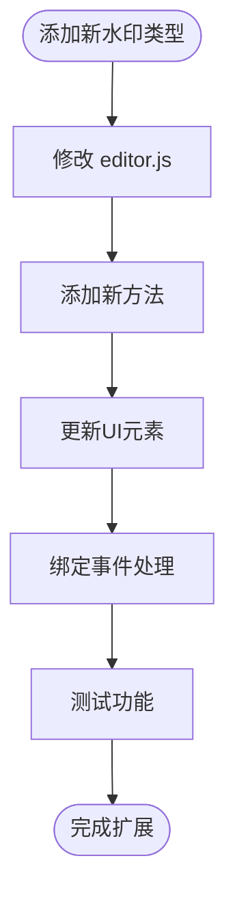
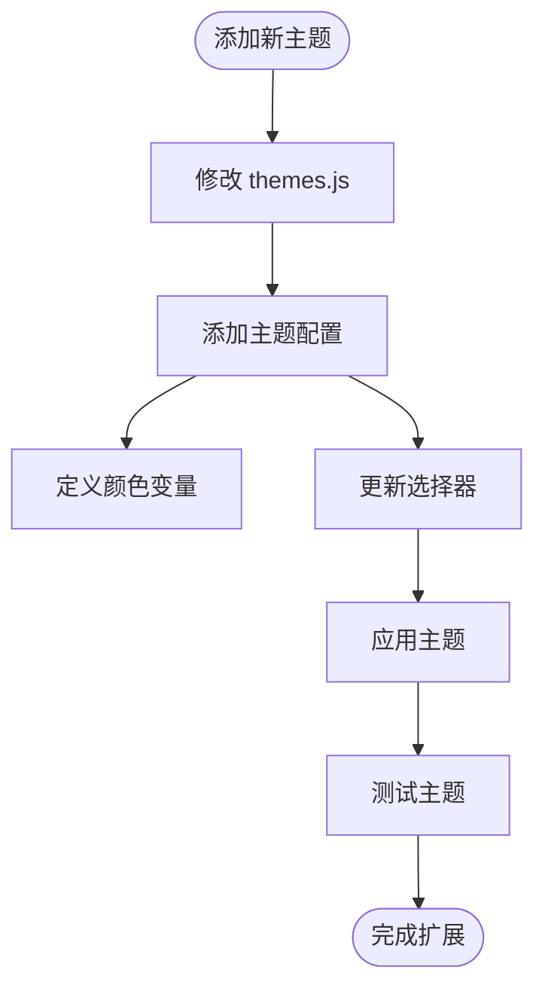

# 设计模式与架构决策

<cite>
**本文档引用的文件**
- [core.js](file://js/core.js)
- [ui.js](file://js/ui.js)
- [imageManager.js](file://js/imageManager.js)
- [editor.js](file://js/editor.js)
- [eventHandler.js](file://js/eventHandler.js)
- [viewer.js](file://js/viewer.js)
- [dragUpload.js](file://js/dragUpload.js)
- [themes.js](file://themes.js)
</cite>

## 目录
1. [引言](#引言)
2. [项目结构](#项目结构)
3. [核心组件](#核心组件)
4. [架构概述](#架构概述)
5. [详细组件分析](#详细组件分析)
6. [依赖分析](#依赖分析)
7. [性能考量](#性能考量)
8. [扩展性设计](#扩展性设计)
9. [架构局限性与演进方向](#架构局限性与演进方向)
10. [结论](#结论)

## 引言
liteImagePreviewer 是一个轻量级的Web图片预览器，具备图片浏览、编辑、主题切换等完整功能。本项目采用面向对象设计原则，通过模块化组织代码，实现了高内聚低耦合的架构。其设计体现了类似MVC的分层思想，同时保持了轻量级特性，避免引入大型框架。本文将深入分析其关键设计模式、架构决策、扩展机制及潜在改进方向。

## 项目结构
项目采用清晰的模块化结构，JavaScript代码按功能拆分为多个独立文件，每个文件对应一个核心类。UI样式使用SCSS进行模块化管理，主题系统独立配置。整体结构体现了关注点分离的设计原则。

**Diagram sources**
- [core.js](file://js/core.js#L1-L28)
- [ui.js](file://js/ui.js#L1-L126)
- [imageManager.js](file://js/imageManager.js#L1-L196)
- [editor.js](file://js/editor.js#L1-L754)
- [dragUpload.js](file://js/dragUpload.js#L1-L218)
- [eventHandler.js](file://js/eventHandler.js#L1-L214)
- [themes.js](file://themes.js#L1-L365)

**Section sources**
- [core.js](file://js/core.js#L1-L28)
- [themes.js](file://themes.js#L1-L365)

## 核心组件
liteImagePreviewer的核心组件包括：`ImagePreviewerCore`作为应用控制器，`UIManager`负责视图管理，`ImageManager`管理图片数据，`ImageViewer`处理图片查看逻辑，`ImageEditor`提供编辑功能，`EventHandler`统一处理事件绑定，`DragUploadManager`实现拖拽上传，`ThemeManager`管理主题切换。这些组件通过构造函数注入依赖，形成松耦合的模块化架构。

**Section sources**
- [core.js](file://js/core.js#L1-L28)
- [ui.js](file://js/ui.js#L1-L126)
- [imageManager.js](file://js/imageManager.js#L1-L196)
- [editor.js](file://js/editor.js#L1-L754)

## 架构概述
liteImagePreviewer采用类似MVC的架构模式，其中`ImagePreviewerCore`充当控制器角色，协调各模块工作；`UIManager`和相关DOM元素构成视图层；`ImageManager`作为模型层管理图片数据。这种分层架构实现了关注点分离，提高了代码的可维护性和可测试性。

**Diagram sources**
- [core.js](file://js/core.js#L1-L28)
- [ui.js](file://js/ui.js#L1-L126)
- [imageManager.js](file://js/imageManager.js#L1-L196)
- [viewer.js](file://js/viewer.js#L1-L153)
- [editor.js](file://js/editor.js#L1-L754)

## 详细组件分析

### 面向对象设计与依赖注入
liteImagePreviewer采用面向对象设计，各功能模块封装为独立类。通过构造函数注入依赖，实现了模块间的松耦合。每个类只关注自身职责，通过核心实例访问其他模块，形成了清晰的依赖关系。

#### 类关系图

**Diagram sources**
- [core.js](file://js/core.js#L1-L28)
- [ui.js](file://js/ui.js#L1-L126)
- [imageManager.js](file://js/imageManager.js#L1-L196)
- [viewer.js](file://js/viewer.js#L1-L153)
- [editor.js](file://js/editor.js#L1-L754)
- [eventHandler.js](file://js/eventHandler.js#L1-L214)
- [dragUpload.js](file://js/dragUpload.js#L1-L218)
- [themes.js](file://themes.js#L1-L365)

**Section sources**
- [core.js](file://js/core.js#L1-L28)
- [ui.js](file://js/ui.js#L1-L126)
- [imageManager.js](file://js/imageManager.js#L1-L196)
- [viewer.js](file://js/viewer.js#L1-L153)
- [editor.js](file://js/editor.js#L1-L754)
- [eventHandler.js](file://js/eventHandler.js#L1-L214)
- [dragUpload.js](file://js/dragUpload.js#L1-L218)
- [themes.js](file://themes.js#L1-L365)

### MVC架构特征
liteImagePreviewer体现了典型的MVC架构特征：`ImagePreviewerCore`作为控制器协调整个应用；`UIManager`处理视图更新和DOM操作；`ImageManager`管理图片数据模型。这种分层设计使得数据、视图和控制逻辑分离，提高了代码的可维护性。

**Diagram sources**
- [core.js](file://js/core.js#L1-L28)
- [ui.js](file://js/ui.js#L1-L126)
- [imageManager.js](file://js/imageManager.js#L1-L196)

## 依赖分析
项目采用中心化的依赖管理方式，所有模块通过`ImagePreviewerCore`进行协调。这种设计避免了模块间的直接耦合，所有交互都通过核心实例进行。依赖关系清晰，易于维护和测试。

**Diagram sources**
- [core.js](file://js/core.js#L1-L28)
- [ui.js](file://js/ui.js#L1-L126)
- [imageManager.js](file://js/imageManager.js#L1-L196)
- [viewer.js](file://js/viewer.js#L1-L153)
- [editor.js](file://js/editor.js#L1-L754)
- [eventHandler.js](file://js/eventHandler.js#L1-L214)
- [dragUpload.js](file://js/dragUpload.js#L1-L218)
- [themes.js](file://themes.js#L1-L365)

**Section sources**
- [core.js](file://js/core.js#L1-L28)
- [eventHandler.js](file://js/eventHandler.js#L1-L214)

## 性能考量
liteImagePreviewer选择轻量级模块化而非引入React或Vue等框架，这一决策对性能和包体积有显著影响。由于不依赖大型框架，项目的JavaScript包体积更小，加载速度更快，内存占用更低。同时，直接操作DOM避免了虚拟DOM的开销，在简单应用场景下性能更优。然而，这种设计在处理复杂UI状态时可能需要更多手动管理。

**Section sources**
- [core.js](file://js/core.js#L1-L28)
- [ui.js](file://js/ui.js#L1-L126)

## 扩展性设计
项目具有良好的扩展性设计。新增水印类型只需在`editor.js`中添加相应方法即可实现。新主题可以通过修改`themes.js`文件轻松扩展，无需改动核心逻辑。这种设计使得功能扩展和主题定制变得简单直接，降低了维护成本。

### 水印功能扩展

**Diagram sources**
- [editor.js](file://js/editor.js#L1-L754)

### 主题系统扩展

**Diagram sources**
- [themes.js](file://themes.js#L1-L365)

**Section sources**
- [editor.js](file://js/editor.js#L1-L754)
- [themes.js](file://themes.js#L1-L365)

## 架构局限性与演进方向
尽管liteImagePreviewer的架构设计合理，但仍存在一些局限性。首先，缺乏插件系统，限制了功能的动态扩展。其次，模块间通信依赖直接引用，存在紧耦合风险。为解决这些问题，可考虑引入事件总线模式，实现模块间的解耦通信。更进一步，可设计依赖注入容器，实现更灵活的依赖管理。此外，可考虑引入简单的插件API，允许第三方扩展功能，同时保持核心的轻量级特性。

**Section sources**
- [core.js](file://js/core.js#L1-L28)
- [eventHandler.js](file://js/eventHandler.js#L1-L214)

## 结论
liteImagePreviewer通过面向对象设计和类似MVC的架构，实现了高内聚低耦合的模块化结构。其轻量级设计在性能和包体积方面具有优势，扩展性机制也较为完善。尽管存在缺乏插件系统和模块间紧耦合等局限性，但整体架构清晰合理，为后续演进提供了良好基础。通过引入事件总线、依赖注入容器等模式，可进一步提升架构的灵活性和可扩展性。