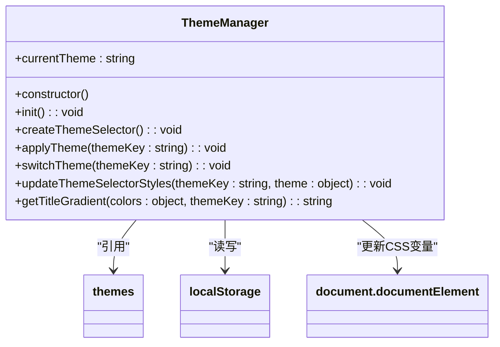
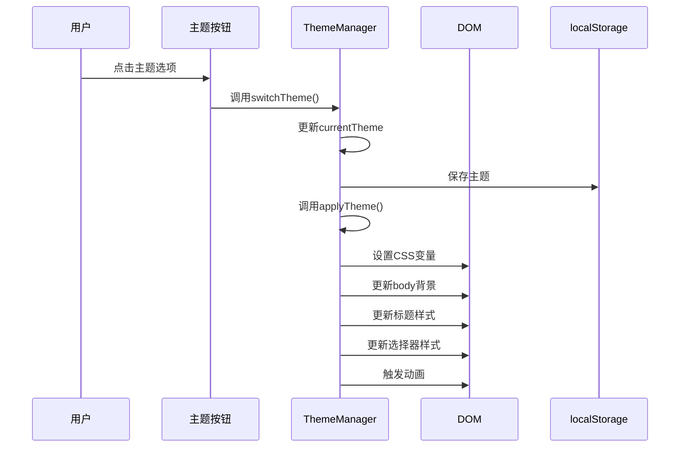

# 主题管理

<cite>
**本文档中引用的文件**  
- [themes.js](file://themes.js)
- [src/scss/_variables.scss](file://src/scss/_variables.scss)
- [src/scss/_base.scss](file://src/scss/_base.scss)
- [index.html](file://index.html)
- [js/ui.js](file://js/ui.js)
- [js/core.js](file://js/core.js)
</cite>

## 目录
1. [简介](#简介)
2. [主题数据结构设计](#主题数据结构设计)
3. [主题管理机制](#主题管理机制)
4. [深色与浅色模式实现](#深色与浅色模式实现)
5. [主题切换触发方式](#主题切换触发方式)
6. [DOM应用过程](#dom应用过程)
7. [可扩展性与自定义主题](#可扩展性与自定义主题)
8. [UI同步更新机制](#ui同步更新机制)
9. [调试方法与常见问题](#调试方法与常见问题)
10. [性能优化建议](#性能优化建议)

## 简介
`liteImagePreviewer` 通过 `ThemeManager` 类实现了一套完整的主题管理系统，支持多种视觉主题（包括默认、暗黑、海洋、日落、森林等），并允许用户通过界面交互或系统偏好进行主题切换。该系统基于CSS变量动态更新界面样式，确保主题切换流畅且不影响用户体验。

**Section sources**  
- [themes.js](file://themes.js#L1-L365)
- [index.html](file://index.html#L1-L165)

## 主题数据结构设计
主题系统的核心是 `themes` 常量对象，它定义了所有可用主题的配置。每个主题包含名称、图标和颜色变量集合，结构清晰且易于扩展。

```js
const themes = {
    default: {
        name: '默认主题',
        icon: '🌈',
        colors: {
            primary: '#667eea',
            secondary: '#764ba2',
            accent: '#f093fb',
            background: 'linear-gradient(...)',
            cardBg: 'rgba(255, 255, 255, 0.95)',
            textPrimary: '#2d3748',
            textSecondary: '#718096'
        }
    },
    // 其他主题...
};
```

这种设计具有以下优点：
- **模块化**：每个主题独立定义，便于维护。
- **一致性**：统一的颜色变量命名规范。
- **可读性**：使用中文名称和emoji图标提升可识别性。

**Section sources**  
- [themes.js](file://themes.js#L1-L45)

## 主题管理机制
`ThemeManager` 类负责主题的初始化、切换和持久化。其构造函数从 `localStorage` 中读取上次选择的主题，若无记录则使用默认主题。



**Diagram sources**  
- [themes.js](file://themes.js#L68-L365)

**Section sources**  
- [themes.js](file://themes.js#L68-L365)

## 深色与浅色模式实现
系统通过 `themes.dark` 明确实现了深色模式，其颜色配置针对暗背景进行了优化：

```js
dark: {
    name: '暗黑主题',
    icon: '🌙',
    colors: {
        primary: '#1a202c',
        secondary: '#2d3748',
        accent: '#4a5568',
        background: 'linear-gradient(135deg, #1a202c 0%, #2d3748 50%, #4a5568 100%)',
        cardBg: 'rgba(45, 55, 72, 0.95)',
        textPrimary: '#f7fafc',
        textSecondary: '#e2e8f0'
    }
}
```

浅色模式由 `themes.default` 提供，背景明亮，文字颜色较深，适合常规使用场景。

**Section sources**  
- [themes.js](file://themes.js#L20-L35)

## 主题切换触发方式
主题切换可通过两种方式触发：

1. **用户点击按钮**：在页面右上角的“主题选择器”中点击不同主题选项。
2. **程序调用**：通过 `ThemeManager.switchTheme(themeKey)` 方法编程式切换。

事件绑定在 `createThemeSelector` 方法中完成，监听 `.theme-option` 按钮的点击事件：

```js
themeSelector.addEventListener('click', (e) => {
    if (e.target.closest('.theme-option')) {
        const themeKey = e.target.closest('.theme-option').dataset.theme;
        this.switchTheme(themeKey);
    }
});
```

**Section sources**  
- [themes.js](file://themes.js#L145-L147)

## DOM应用过程
主题切换时，`applyTheme` 方法会执行以下操作：

1. **更新CSS变量**：通过 `document.documentElement.style.setProperty()` 设置根元素的CSS变量。
2. **更新背景**：直接修改 `document.body.style.background`。
3. **更新标题样式**：为标题应用渐变效果和透明文字。
4. **更新主题选择器自身样式**：根据当前主题调整按钮和下拉菜单的背景、边框和文字颜色。



**Diagram sources**  
- [themes.js](file://themes.js#L190-L259)

**Section sources**  
- [themes.js](file://themes.js#L190-L259)

## 可扩展性与自定义主题
系统设计具有良好的可扩展性：

- **新增主题**：只需在 `themes` 对象中添加新的主题键值对。
- **自定义现有主题**：修改对应主题的颜色值即可。
- **支持CSS变量**：SCSS文件中定义了 `:root` 变量，与JavaScript动态更新兼容。

例如，添加新主题只需：

```js
themes.newTheme = {
    name: '新主题',
    icon: '✨',
    colors: { /* 颜色配置 */ }
};
```

**Section sources**  
- [themes.js](file://themes.js#L1-L365)
- [src/scss/_variables.scss](file://src/scss/_variables.scss#L45-L60)

## UI同步更新机制
主题切换后，UI组件通过以下方式同步更新：

- **CSS变量驱动**：所有使用 `var(--primary-color)` 等变量的样式自动更新。
- **动态样式注入**：主题选择器的样式在运行时动态创建并更新。
- **DOM属性更新**：如标题的 `style.background` 直接修改。

此外，`switchTheme` 方法还会更新按钮图标和活动状态：

```js
// 更新按钮图标
const themeIcon = document.querySelector('.theme-icon');
themeIcon.textContent = themes[themeKey].icon;

// 更新活动状态
option.classList.toggle('active', option.dataset.theme === themeKey);
```

**Section sources**  
- [themes.js](file://themes.js#L339-L364)

## 调试方法与常见问题
### 常见问题及解决方案
| 问题 | 可能原因 | 解决方案 |
|------|--------|---------|
| 主题切换无效 | localStorage 被禁用 | 检查浏览器隐私设置 |
| 样式未更新 | CSS变量未正确引用 | 确保使用 `var(--variable)` |
| 界面闪烁 | 过渡动画冲突 | 检查 `transition` 属性设置 |
| 图标不显示 | 字体或emoji支持问题 | 确保系统支持emoji渲染 |

### 调试方法
1. 使用浏览器开发者工具检查 `:root` 的CSS变量值。
2. 查看 `localStorage` 中 `selectedTheme` 的值。
3. 在控制台手动调用 `new ThemeManager().switchTheme('dark')` 测试。

**Section sources**  
- [themes.js](file://themes.js#L339-L364)
- [js/core.js](file://js/core.js#L27)

## 性能优化建议
1. **减少重排重绘**：使用CSS变量而非直接修改多个样式属性。
2. **避免频繁DOM操作**：将样式注入集中处理。
3. **使用过渡动画**：添加平滑的 `transition` 效果提升体验。
4. **延迟样式计算**：对于复杂样式，可使用 `requestAnimationFrame`。

当前实现已包含性能优化：
```js
document.body.style.transition = 'all 0.5s ease';
setTimeout(() => {
    document.body.style.transition = '';
}, 500);
```

**Section sources**  
- [themes.js](file://themes.js#L358-L363)