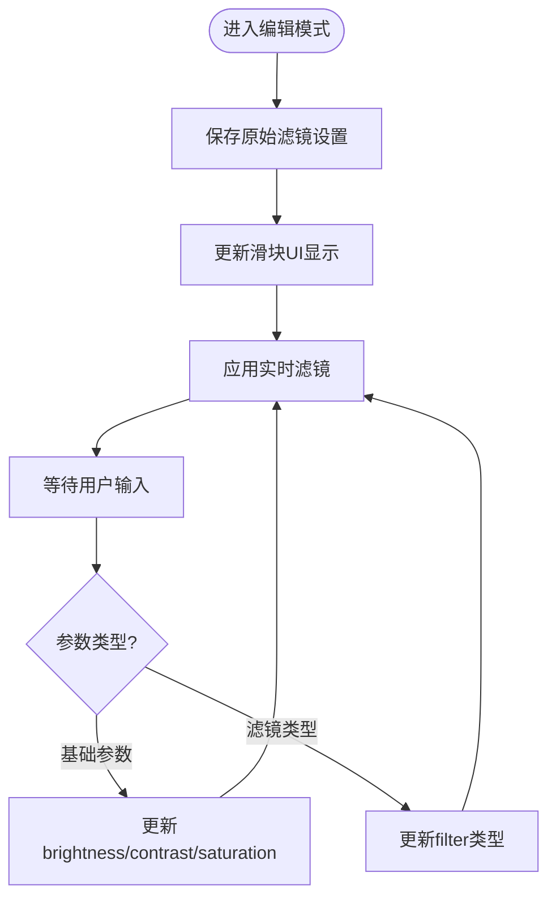
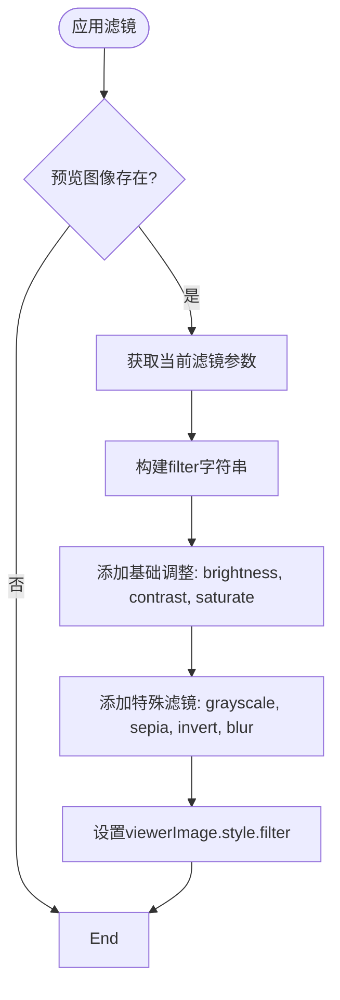
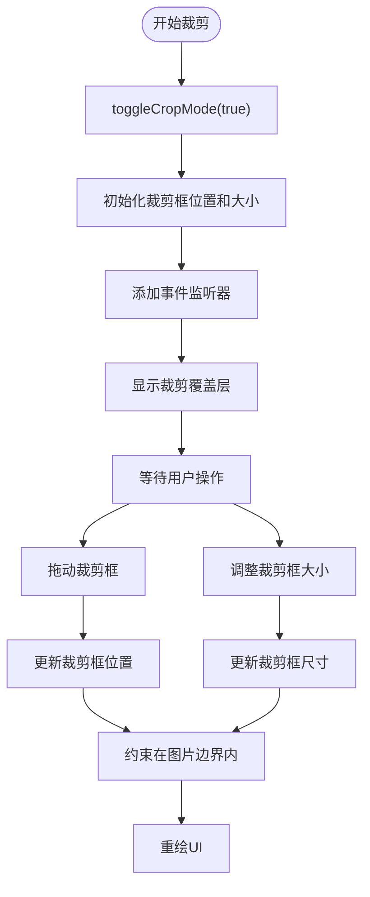
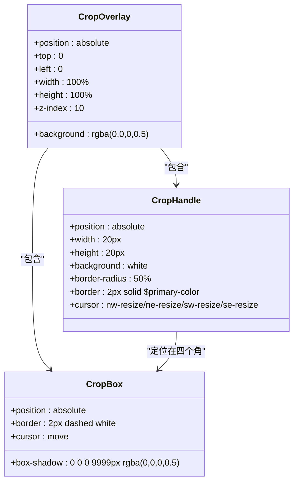
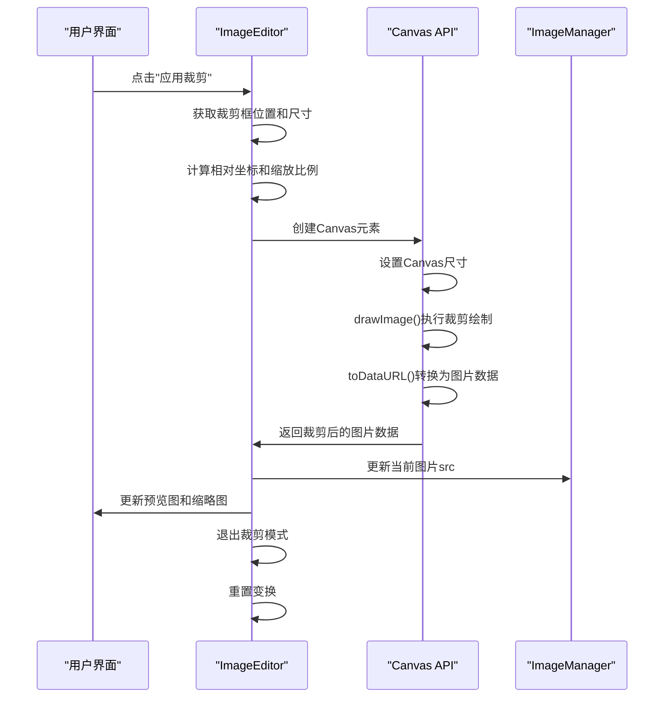
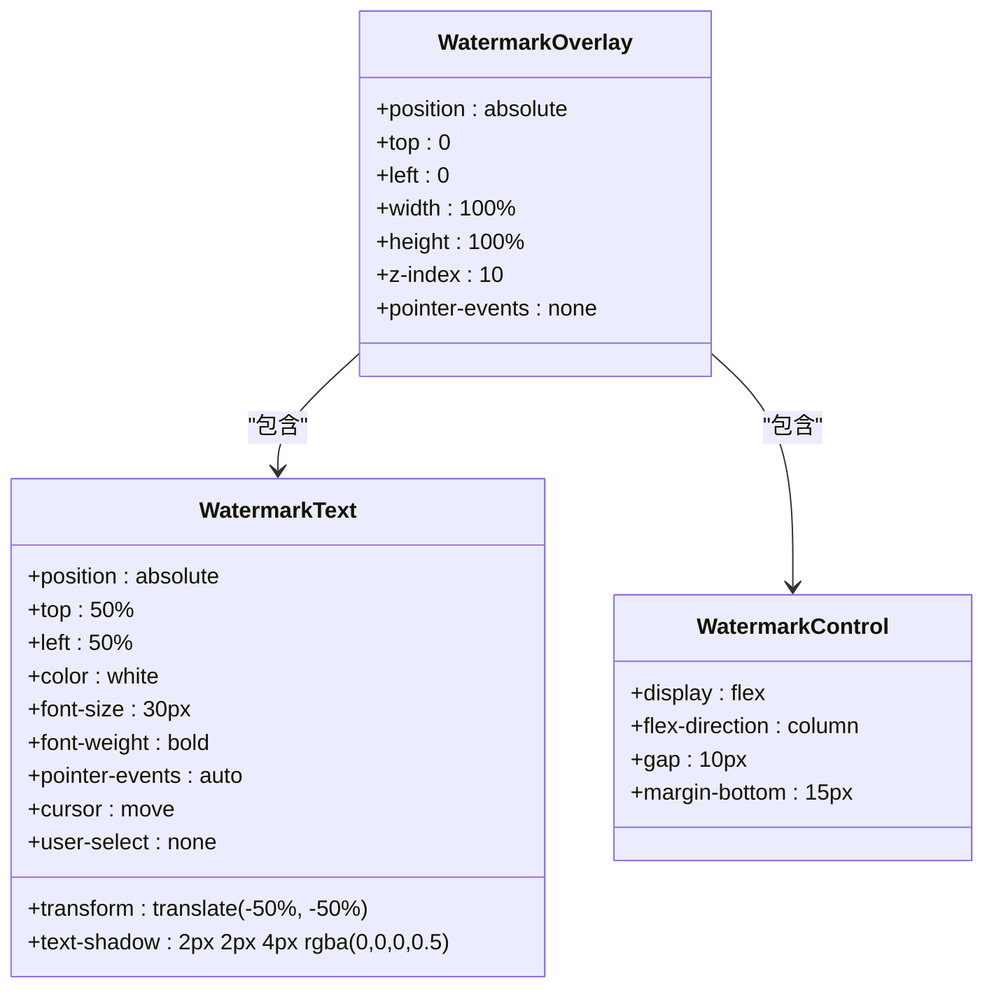
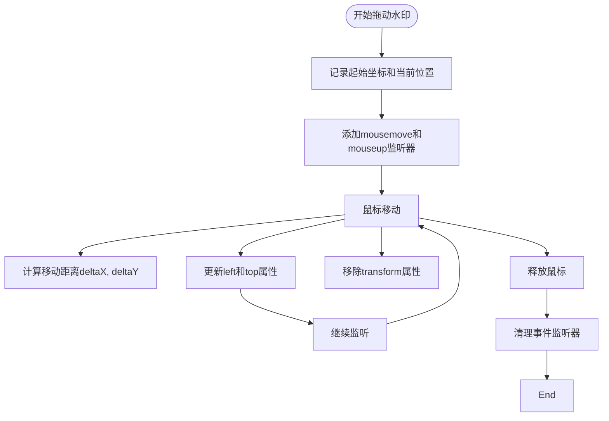
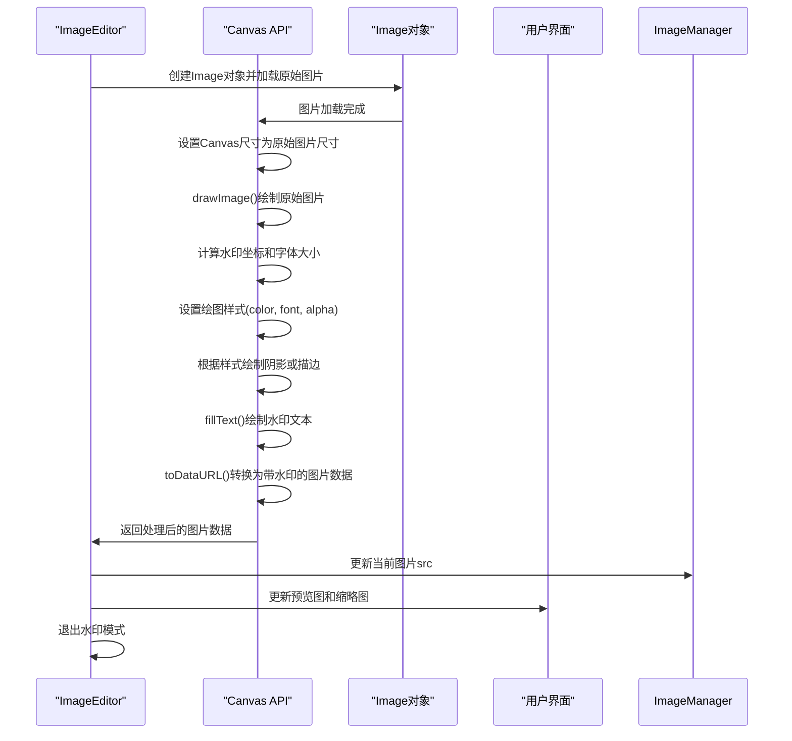
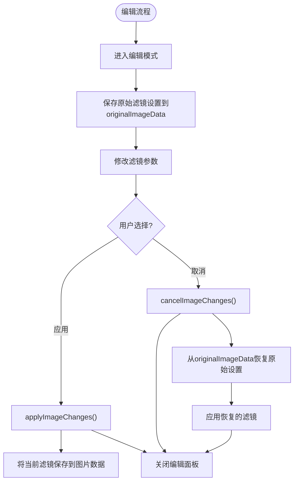

# 图像编辑

<cite>
**本文档中引用的文件**  
- [editor.js](file://js/editor.js)
- [_crop.scss](file://src/scss/_crop.scss)
- [_watermark.scss](file://src/scss/_watermark.scss)
- [ui.js](file://js/ui.js)
- [eventHandler.js](file://js/eventHandler.js)
- [imageManager.js](file://js/imageManager.js)
- [viewer.js](file://js/viewer.js)
- [core.js](file://js/core.js)
</cite>

## 目录
1. [简介](#简介)
2. [图像滤镜编辑](#图像滤镜编辑)
3. [裁剪功能实现](#裁剪功能实现)
4. [水印功能实现](#水印功能实现)
5. [编辑状态管理](#编辑状态管理)
6. [常见问题排查](#常见问题排查)

## 简介
liteImagePreviewer 提供了完整的图像编辑功能，包括亮度、对比度、饱和度调节，多种滤镜应用，图像裁剪以及文字/图片水印添加。本文档深入剖析 `editor.js` 的核心实现机制，详细说明各项编辑功能的技术细节和交互流程。

**Section sources**
- [editor.js](file://js/editor.js#L1-L50)
- [core.js](file://js/core.js#L1-L29)

## 图像滤镜编辑

### 滤镜参数管理
`ImageEditor` 类通过 `imageFilters` 对象管理当前编辑状态下的滤镜参数，包括亮度、对比度、饱和度和特殊滤镜效果。当进入编辑模式时，系统会保存当前图片的原始滤镜设置，以便在取消编辑时恢复。

**Diagram sources**
- [editor.js](file://js/editor.js#L15-L25)
- [editor.js](file://js/editor.js#L100-L150)

### CSS Filter 动态设置
系统通过 `applyFilters()` 方法动态生成 CSS filter 字符串并应用到预览图像上。该方法根据当前滤镜参数构建 filter 字符串，支持亮度、对比度、饱和度的基础调整，以及灰度、怀旧、反色、模糊等特殊滤镜效果。

**Diagram sources**
- [editor.js](file://js/editor.js#L150-L180)
- [ui.js](file://js/ui.js#L100-L120)

### 事件绑定与参数传递
滤镜编辑的事件绑定在 `eventHandler.js` 中完成，通过监听滑块输入事件和滤镜按钮点击事件，调用 `updateFilter()` 方法更新相应参数，并实时应用滤镜效果。

**Section sources**
- [editor.js](file://js/editor.js#L180-L220)
- [eventHandler.js](file://js/eventHandler.js#L100-L120)

## 裁剪功能实现

### 裁剪模式控制
裁剪功能通过 `toggleCropMode()` 方法控制，该方法切换裁剪覆盖层的显示状态，并管理裁剪相关UI元素的显示/隐藏。进入裁剪模式时，系统会初始化裁剪框并添加相应的事件监听器。

**Diagram sources**
- [editor.js](file://js/editor.js#L220-L260)
- [_crop.scss](file://src/scss/_crop.scss#L1-L50)

### 裁剪框渲染与交互
裁剪框的样式定义在 `_crop.scss` 文件中，使用半透明黑色背景和虚线边框突出显示裁剪区域。系统通过 `initCropBox()` 方法计算裁剪框的初始位置和大小（默认为图片的60%），并考虑图片在容器中的偏移。

**Diagram sources**
- [_crop.scss](file://src/scss/_crop.scss#L1-L100)
- [editor.js](file://js/editor.js#L260-L350)

### Canvas 裁剪与更新
`applyCrop()` 方法使用 Canvas API 执行实际的裁剪操作。系统首先计算裁剪区域相对于原始图片的坐标，然后根据缩放比例将裁剪区域绘制到 Canvas 上，最后将 Canvas 转换为 Data URL 并更新图片数据。

**Diagram sources**
- [editor.js](file://js/editor.js#L500-L580)
- [imageManager.js](file://js/imageManager.js#L1-L50)

**Section sources**
- [editor.js](file://js/editor.js#L220-L600)

## 水印功能实现

### 水印层结构
水印功能通过 `toggleWatermarkMode()` 方法控制，水印层的DOM结构包含一个透明的覆盖层和可拖动的水印文本元素。水印文本的初始位置居中，支持用户拖动调整位置。

**Diagram sources**
- [_watermark.scss](file://src/scss/_watermark.scss#L1-L50)
- [editor.js](file://js/editor.js#L600-L650)

### 位置定位与透明度控制
系统通过 `startWatermarkDrag()`、`watermarkDrag()` 和 `endWatermarkDrag()` 方法实现水印的拖动功能。水印的位置通过 `left` 和 `top` CSS 属性控制，拖动时会移除 `transform` 属性以确保定位准确。

**Diagram sources**
- [editor.js](file://js/editor.js#L700-L750)
- [_watermark.scss](file://src/scss/_watermark.scss#L50-L90)

### 叠加渲染逻辑
`applyWatermark()` 方法使用 Canvas API 将水印叠加到原始图片上。系统首先加载原始图片到 Canvas，然后根据缩放比例计算水印在 Canvas 上的坐标，最后使用 Canvas 的绘图上下文绘制水印文本。

**Diagram sources**
- [editor.js](file://js/editor.js#L750-L850)
- [imageManager.js](file://js/imageManager.js#L1-L50)

**Section sources**
- [editor.js](file://js/editor.js#L600-L850)
- [_watermark.scss](file://src/scss/_watermark.scss#L1-L90)

## 编辑状态管理

### 状态保存与撤销
系统通过 `saveOriginalImageData()` 方法在进入编辑模式时保存原始滤镜设置，在用户取消编辑时通过 `cancelImageChanges()` 方法恢复这些设置。应用更改时，当前滤镜参数会被保存到图片数据中。

**Diagram sources**
- [editor.js](file://js/editor.js#L80-L100)
- [editor.js](file://js/editor.js#L190-L220)

### 事件绑定流程
所有编辑相关的事件绑定都在 `eventHandler.js` 中完成，通过 `bindEvents()` 方法集中管理。系统监听滑块输入、按钮点击、键盘快捷键等事件，调用相应的编辑方法。

**Section sources**
- [editor.js](file://js/editor.js#L190-L220)
- [eventHandler.js](file://js/eventHandler.js#L100-L150)

## 常见问题排查

### 裁剪失真问题
裁剪失真通常是由于缩放比例计算不准确导致的。系统通过 `naturalWidth/naturalHeight` 与显示尺寸的比例来计算正确的缩放因子，确保裁剪后的图片保持原始质量。

**解决方案**:
1. 确保使用 `img.naturalWidth` 和 `imgRect.width` 计算水平缩放比例
2. 确保使用 `img.naturalHeight` 和 `imgRect.height` 计算垂直缩放比例
3. 在 `drawImage()` 时应用正确的缩放比例

**Section sources**
- [editor.js](file://js/editor.js#L540-L560)

### 水印偏移问题
水印偏移通常是由于坐标转换错误导致的。系统在应用水印时会根据原始图片与显示图片的缩放比例转换坐标，确保水印位置准确。

**解决方案**:
1. 使用 `getBoundingClientRect()` 获取显示尺寸
2. 使用 `naturalWidth/naturalHeight` 获取原始尺寸
3. 计算缩放比例 `scaleX = naturalWidth / displayWidth`
4. 将显示坐标乘以缩放比例得到Canvas坐标

**Section sources**
- [editor.js](file://js/editor.js#L780-L800)