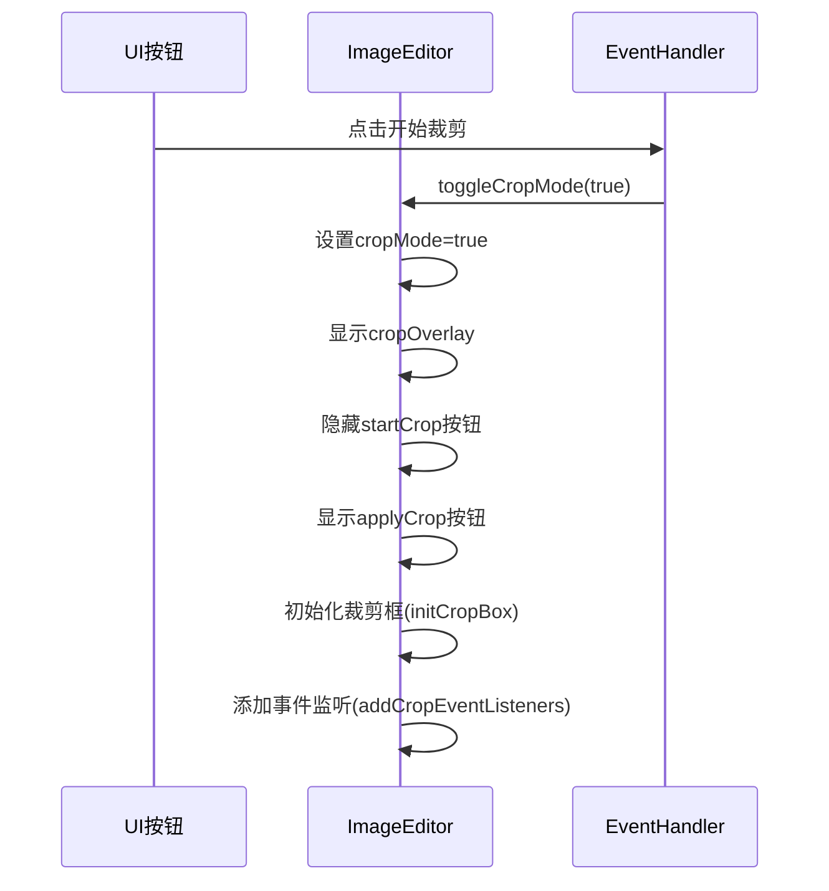
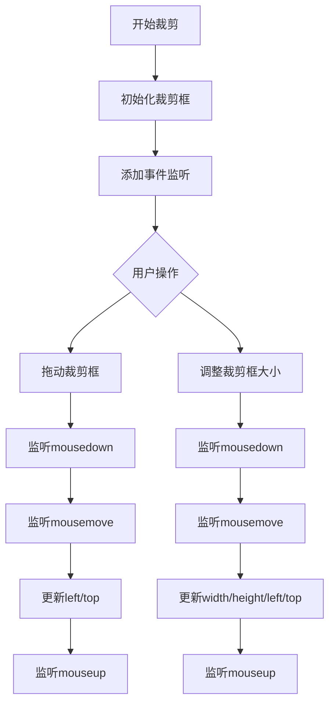

# 图像裁剪

<cite>
**本文档引用的文件**  
- [editor.js](file://js/editor.js)
- [_crop.scss](file://src/scss/_crop.scss)
- [ui.js](file://js/ui.js)
- [eventHandler.js](file://js/eventHandler.js)
</cite>

## 目录
1. [功能概述](#功能概述)
2. [裁剪模式触发机制](#裁剪模式触发机制)
3. [裁剪框初始化流程](#裁剪框初始化流程)
4. [鼠标与触摸事件监听](#鼠标与触摸事件监听)
5. [裁剪框视觉表现](#裁剪框视觉表现)
6. [Canvas API 裁剪实现](#canvas-api-裁剪实现)
7. [裁剪比例锁定与响应式适配](#裁剪比例锁定与响应式适配)
8. [图像质量控制建议](#图像质量控制建议)
9. [常见问题分析与修复](#常见问题分析与修复)

## 功能概述
liteImagePreviewer 的图像裁剪功能允许用户通过交互式界面选择并裁剪图像的特定区域。该功能由 `ImageEditor` 类驱动，结合 SCSS 样式定义和事件处理机制，实现了完整的裁剪工作流：从触发裁剪模式、调整裁剪区域到最终应用裁剪结果。整个过程依赖于 DOM 操作、事件监听和 Canvas API 的协同工作。

**Section sources**
- [editor.js](file://js/editor.js#L0-L30)

## 裁剪模式触发机制
裁剪模式通过点击 UI 上的“开始裁剪”按钮触发，该按钮绑定事件监听器，调用 `ImageEditor` 实例的 `toggleCropMode(true)` 方法。此方法不仅设置内部状态 `cropMode` 为 true，还控制相关 UI 元素的显示与隐藏，如显示裁剪覆盖层和“应用裁剪”按钮，同时隐藏“开始裁剪”按钮。

**Diagram sources**
- [eventHandler.js](file://js/eventHandler.js#L58-L83)
- [editor.js](file://js/editor.js#L159-L193)

## 裁剪框初始化流程
`initCropBox()` 方法负责创建和定位初始的裁剪框。它首先获取 DOM 中的 `.crop-box` 和 `.crop-handle` 元素的引用。然后，通过 `getBoundingClientRect()` 计算图片在容器中的实际显示尺寸和偏移位置。裁剪框的初始宽度和高度被设置为图片显示尺寸的 60%，并通过计算居中位置来确定其 `left` 和 `top` 值，确保裁剪框初始时位于图片中央。

**Section sources**
- [editor.js](file://js/editor.js#L195-L222)

## 鼠标与触摸事件监听
当裁剪模式被激活时，`addCropEventListeners()` 方法会注册一系列事件监听器：
- **拖动裁剪框**：为 `.crop-box` 元素添加 `mousedown` 事件，触发 `startCropBoxDrag`。当鼠标在文档上移动（`mousemove`）时，执行 `cropBoxDrag` 来更新裁剪框位置，并在鼠标抬起（`mouseup`）时通过 `endCropBoxDrag` 结束拖动。
- **调整裁剪框大小**：为四个 `.crop-handle` 元素分别添加 `mousedown` 事件，触发 `startCropResize`。随后的 `mousemove` 事件调用 `cropResize` 来根据鼠标移动距离和手柄位置动态调整裁剪框的尺寸和位置。

**Diagram sources**
- [editor.js](file://js/editor.js#L224-L258)
- [editor.js](file://js/editor.js#L283-L324)
- [editor.js](file://js/editor.js#L322-L351)

## 裁剪框视觉表现
裁剪框的视觉样式由 `_crop.scss` 文件定义。核心组件包括：
- **裁剪覆盖层** (`crop-overlay`)：一个覆盖整个预览区域的半透明黑色层（`rgba(0, 0, 0, 0.5)`），用于突出显示裁剪区域。
- **裁剪框** (`crop-box`)：一个虚线边框（`border: 2px dashed white`）的绝对定位元素，其内部通过 `box-shadow` 技巧创建了一个巨大的内阴影，颜色与覆盖层相同，从而在视觉上形成了“挖空”的效果，只让裁剪框内的图像可见。
- **裁剪手柄** (`crop-handle`)：四个位于裁剪框四角的白色圆形按钮，带有彩色边框，用于调整大小。它们通过绝对定位放置在裁剪框边缘之外，并设置了不同的 `cursor` 样式（如 `nw-resize`），以提供直观的交互反馈。

**Section sources**
- [_crop.scss](file://src/scss/_crop.scss#L0-L799)

## Canvas API 裁剪实现
当用户点击“应用裁剪”时，`applyCrop()` 方法被调用。该方法的核心是使用 Canvas API 执行实际的图像裁剪：
1.  **坐标计算**：首先，根据裁剪框的 `left`、`top`、`width`、`height` 以及图片在容器中的偏移量，计算出裁剪区域在原始图像上的相对位置（`relativeCropLeft`, `relativeCropTop`）。
2.  **缩放比例计算**：由于显示的图片尺寸可能与原始尺寸不同，需要计算 `scaleX` 和 `scaleY` 比例，将视图坐标映射到原始图像坐标。
3.  **Canvas 绘制**：创建一个 `canvas` 元素，其尺寸设置为裁剪区域在原始图像中的实际像素大小。使用 `ctx.drawImage()` 方法，从原始图像中指定的源区域（考虑了缩放比例）绘制到整个 Canvas 上。
4.  **数据更新**：将 Canvas 转换为 Data URL（`toDataURL`），并用此新数据更新当前图片对象的 `src`、预览图和缩略图，从而完成裁剪。

**Section sources**
- [editor.js](file://js/editor.js#L396-L433)

## 裁剪比例锁定与响应式适配
当前实现中，裁剪功能允许自由调整大小，但未直接实现 1:1 或 4:3 等固定比例锁定。比例锁定的逻辑需要在 `cropResize` 方法中扩展。当检测到比例锁定启用时，应根据用户拖动的手柄，动态计算并强制 `newWidth` 和 `newHeight` 保持预设比例。响应式适配主要通过使用 `getBoundingClientRect()` 获取图片的实时显示尺寸来实现，这确保了裁剪框的初始化和边界检查始终基于当前视口下的实际布局，从而在不同屏幕尺寸下都能正确工作。

**Section sources**
- [editor.js](file://js/editor.js#L353-L394)

## 图像质量控制建议
为了在裁剪后保持最佳图像质量，建议在调用 `canvas.toDataURL()` 时指定图像格式和质量参数。例如，使用 `canvas.toDataURL('image/jpeg', 0.95)` 可以生成一个质量为 95% 的 JPEG 图像，这比默认的 PNG 格式更节省空间，同时保持高视觉质量。此外，在处理高分辨率图像时，应考虑在 Canvas 绘制前进行适当的降采样，以避免内存溢出或性能下降。

## 常见问题分析与修复
- **裁剪区域偏移**：此问题通常源于坐标计算错误。`applyCrop()` 方法中通过精确计算图片在容器中的偏移量（`imgOffsetX`, `imgOffsetY`）并将其从裁剪框位置中减去，有效解决了因图片未完全填充容器而导致的偏移问题。
- **高分辨率图像失真**：Canvas 在处理超大图像时可能因内存限制而失败。修复方案是引入一个最大尺寸限制，在绘制到 Canvas 前对原始图像进行缩放，或使用 `createImageBitmap` API 进行更高效的处理。
- **移动端手势冲突**：当前实现主要针对鼠标事件，可能与触摸手势（如双指缩放）冲突。修复方案是为触摸设备添加专门的 `touchstart`、`touchmove` 和 `touchend` 事件监听器，并在事件处理中调用 `preventDefault()` 来阻止默认的页面滚动或缩放行为。

**Section sources**
- [editor.js](file://js/editor.js#L256-L284)