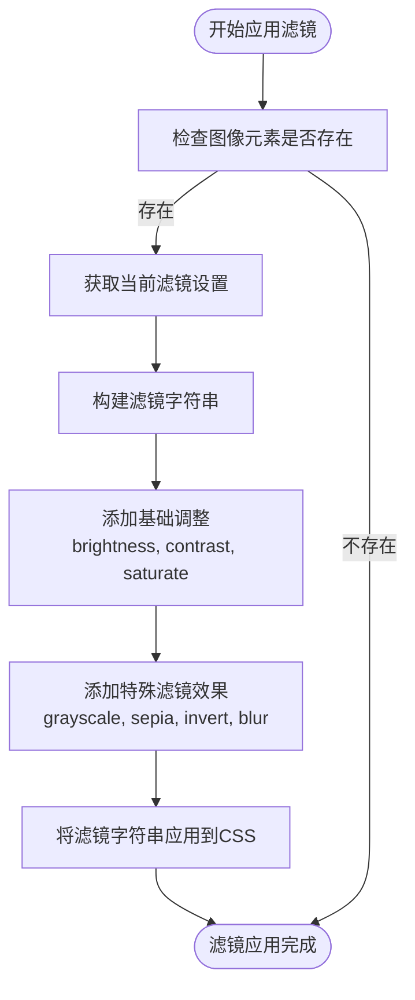
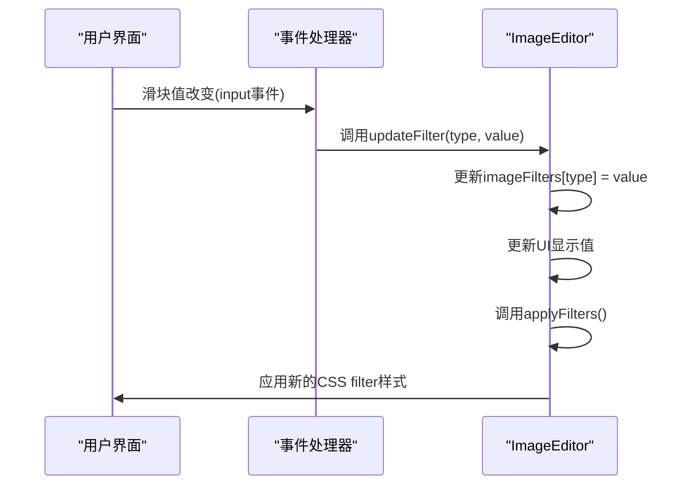
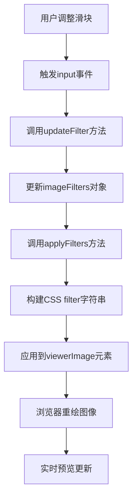
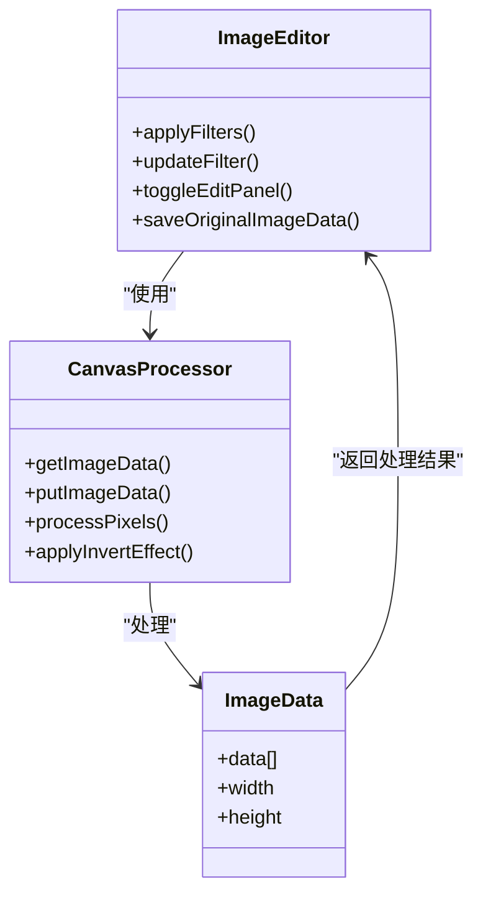
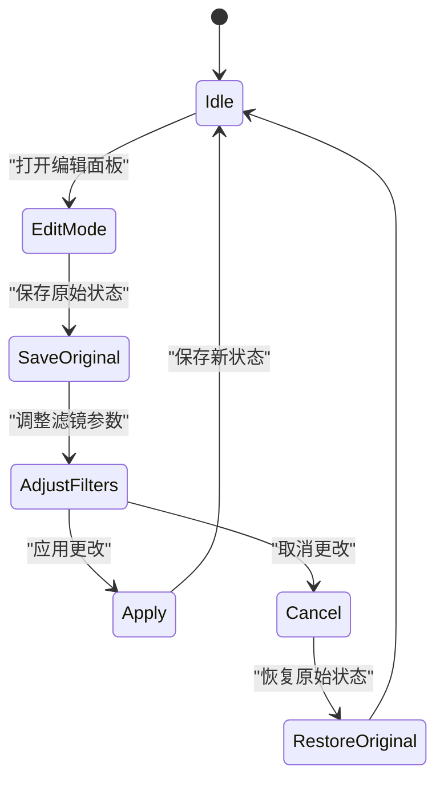
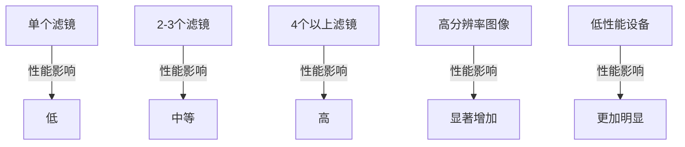
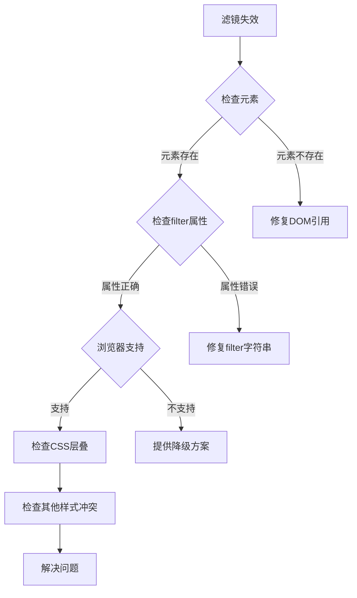

# 滤镜调节

<cite>
**本文档引用文件**   
- [editor.js](file://js/editor.js)
- [ui.js](file://js/ui.js)
- [imageManager.js](file://js/imageManager.js)
- [eventHandler.js](file://js/eventHandler.js)
- [style.css](file://style.css)
</cite>

## 目录
1. [简介](#简介)
2. [滤镜实现机制](#滤镜实现机制)
3. [事件绑定与参数计算](#事件绑定与参数计算)
4. [实时预览更新流程](#实时预览更新流程)
5. [像素级处理机制](#像素级处理机制)
6. [状态保存与重置](#状态保存与重置)
7. [性能影响与优化](#性能影响与优化)
8. [常见问题排查](#常见问题排查)
9. [结论](#结论)

## 简介
liteImagePreviewer 是一个轻量级的图片预览工具，提供了丰富的图像编辑功能，其中滤镜调节是其核心功能之一。本文档深入解析基于 CSS filter 属性的滤镜实现机制，详细说明 editor.js 如何通过 JavaScript 动态设置 brightness、contrast、saturate、grayscale、invert 等滤镜值。

**Section sources**
- [editor.js](file://js/editor.js#L0-L30)
- [imageManager.js](file://js/imageManager.js#L0-L20)

## 滤镜实现机制

### 滤镜参数定义
在 `ImageEditor` 类的构造函数中，定义了初始的滤镜参数：

```javascript
this.imageFilters = {
    brightness: 100,
    contrast: 100,
    saturation: 100,
    filter: 'none'
};
```

这些参数分别对应亮度、对比度、饱和度和特殊滤镜效果，初始值均为默认状态。

**Section sources**
- [editor.js](file://js/editor.js#L10-L15)

### 滤镜类型支持
系统支持多种滤镜效果，包括：
- **brightness**: 调整图像亮度
- **contrast**: 调整图像对比度
- **saturate**: 调整图像饱和度
- **grayscale**: 转换为黑白图像
- **sepia**: 应用复古色调
- **invert**: 反色效果
- **blur**: 模糊效果

**Section sources**
- [editor.js](file://js/editor.js#L122-L142)
- [index.html](file://index.html#L85-L104)

### 滤镜应用流程
滤镜应用通过 `applyFilters()` 方法实现，该方法根据当前滤镜设置生成 CSS filter 字符串并应用到图像元素上。



**Diagram sources**
- [editor.js](file://js/editor.js#L78-L120)

## 事件绑定与参数计算

### 滑块输入事件绑定
系统通过事件监听器将滑块输入与滤镜参数更新关联起来：



**Diagram sources**
- [eventHandler.js](file://js/eventHandler.js#L35-L59)
- [editor.js](file://js/editor.js#L78-L90)

### 参数计算与组合
当用户调整滑块时，系统执行以下步骤：

1. 接收新的滤镜值
2. 更新内部滤镜参数对象
3. 更新UI上的数值显示
4. 重新计算并应用所有滤镜效果

```javascript
updateFilter(type, value) {
    this.imageFilters[type] = value;
    
    // 更新滑块值显示
    if (type !== 'filter') {
        const valueDisplay = document.querySelector(`#${type}`).nextElementSibling;
        if (valueDisplay) {
            valueDisplay.textContent = `${value}%`;
        }
    }
    
    // 应用滤镜
    this.applyFilters();
}
```

**Section sources**
- [editor.js](file://js/editor.js#L78-L90)

## 实时预览更新流程

### 滤镜字符串构建
系统通过 `applyFilters()` 方法构建完整的 CSS filter 字符串：

```javascript
applyFilters() {
    if (!this.core.ui.elements.viewerImage) return;

    const currentImage = this.core.imageManager.images[this.core.imageManager.currentIndex];
    const filters = this.editMode ? this.imageFilters : currentImage.filters;

    if (!filters) return;

    const { brightness, contrast, saturation, filter } = filters;
    let filterString = ``;

    // 添加基础调整
    filterString += `brightness(${brightness}%) `;
    filterString += `contrast(${contrast}%) `;
    filterString += `saturate(${saturation}%) `;

    // 添加滤镜效果
    switch (filter) {
        case 'grayscale':
            filterString += `grayscale(100%) `;
            break;
        case 'sepia':
            filterString += `sepia(100%) `;
            break;
        case 'invert':
            filterString += `invert(100%) `;
            break;
        case 'blur':
            filterString += `blur(5px) `;
            break;
    }

    this.core.ui.elements.viewerImage.style.filter = filterString;
}
```

**Section sources**
- [editor.js](file://js/editor.js#L92-L120)

### 实时更新机制
实时预览的更新流程如下：



**Diagram sources**
- [editor.js](file://js/editor.js#L78-L120)

## 像素级处理机制

### Canvas 像素处理
虽然主要滤镜效果通过 CSS 实现，但系统也具备通过 Canvas 进行像素级处理的能力：



**Diagram sources**
- [editor.js](file://js/editor.js#L0-L754)
- [viewer.js](file://js/viewer.js#L0-L50)

### 反色效果实现
反色效果可以通过两种方式实现：

1. **CSS 方式**：使用 `invert(100%)` 滤镜
2. **Canvas 像素操作**：遍历每个像素并取反

```javascript
// CSS方式实现反色
filterString += `invert(100%) `;

// Canvas像素操作方式（概念性代码）
function applyInvertEffect(imageData) {
    const data = imageData.data;
    for (let i = 0; i < data.length; i += 4) {
        data[i] = 255 - data[i];     // R
        data[i+1] = 255 - data[i+1]; // G
        data[i+2] = 255 - data[i+2]; // B
        // Alpha通道保持不变
    }
    return imageData;
}
```

**Section sources**
- [editor.js](file://js/editor.js#L132-L135)

## 状态保存与重置

### 滤镜状态保存
当用户打开编辑面板时，系统会保存当前图片的原始滤镜设置：

```javascript
saveOriginalImageData() {
    const currentImage = this.core.imageManager.images[this.core.imageManager.currentIndex];
    this.originalImageData = { ...currentImage.filters } || {
        brightness: 100,
        contrast: 100,
        saturation: 100,
        filter: 'none'
    };
}
```

**Section sources**
- [editor.js](file://js/editor.js#L78-L85)

### 滤镜状态重置
系统提供两种重置机制：

1. **单个参数重置**：通过重置按钮将特定参数恢复到默认值
2. **全部重置**：取消编辑时恢复到原始状态



**Diagram sources**
- [editor.js](file://js/editor.js#L143-L161)

### 应用与取消流程
```javascript
// 应用图像更改
applyImageChanges() {
    // 保存当前滤镜设置到图片数据
    const currentImage = this.core.imageManager.images[this.core.imageManager.currentIndex];
    currentImage.filters = { ...this.imageFilters };
    
    // 关闭编辑面板
    this.toggleEditPanel(false);
}

// 取消图像更改
cancelImageChanges() {
    // 恢复原始滤镜设置
    if (this.originalImageData) {
        this.imageFilters = { ...this.originalImageData };
        this.applyFilters();
    }
    
    // 关闭编辑面板
    this.toggleEditPanel(false);
}
```

**Section sources**
- [editor.js](file://js/editor.js#L143-L161)

## 性能影响与优化

### 多滤镜叠加性能
当多个滤镜叠加时，浏览器需要执行复杂的图形计算，可能影响性能：



**Diagram sources**
- [editor.js](file://js/editor.js#L92-L120)

### 性能优化建议
1. **限制滤镜数量**：避免同时应用过多滤镜效果
2. **延迟应用**：在用户停止调整后短暂延迟再应用滤镜
3. **分辨率适配**：在低性能设备上降低预览分辨率
4. **硬件加速**：确保使用 GPU 加速的 CSS 属性

### 优化实现示例
```javascript
// 概念性优化代码
class OptimizedImageEditor extends ImageEditor {
    constructor(core) {
        super(core);
        this.filterTimeout = null;
    }
    
    updateFilter(type, value) {
        this.imageFilters[type] = value;
        
        // 清除之前的定时器
        if (this.filterTimeout) {
            clearTimeout(this.filterTimeout);
        }
        
        // 延迟应用滤镜，避免频繁重绘
        this.filterTimeout = setTimeout(() => {
            this.applyFilters();
            this.filterTimeout = null;
        }, 100); // 100ms延迟
    }
}
```

**Section sources**
- [editor.js](file://js/editor.js#L78-L90)

## 常见问题排查

### 滤镜失效问题
当滤镜效果不显示时，可能的原因及解决方案：



**Diagram sources**
- [editor.js](file://js/editor.js#L92-L120)
- [style.css](file://style.css#L0-L799)

### 浏览器兼容性
不同浏览器对 CSS filter 属性的支持情况：

| 浏览器 | 支持情况 | 注意事项 |
|--------|----------|----------|
| Chrome | 完全支持 | 需要较新版本 |
| Firefox | 完全支持 | 需要较新版本 |
| Safari | 完全支持 | 需要较新版本 |
| Edge | 完全支持 | 需要较新版本 |
| IE | 不支持 | 需要提供降级方案 |

**Section sources**
- [style.css](file://style.css#L0-L799)

### 过度模糊解决方案
当模糊效果过于强烈时，可以采取以下措施：

1. **限制模糊半径**：在代码中设置最大模糊值
2. **提供预设选项**：让用户选择轻度、中度、重度模糊
3. **实时性能监控**：根据设备性能动态调整模糊强度

```javascript
// 限制模糊强度的示例
applyFilters() {
    // ... 其他代码
    
    switch (filter) {
        case 'blur':
            // 限制最大模糊半径
            const maxBlurRadius = 10; // px
            const blurRadius = Math.min(5, maxBlurRadius); // 当前为5px
            filterString += `blur(${blurRadius}px) `;
            break;
    }
    
    // ... 其他代码
}
```

**Section sources**
- [editor.js](file://js/editor.js#L138-L140)

## 结论
liteImagePreviewer 的滤镜系统通过 CSS filter 属性实现了高效、流畅的图像效果调节。系统采用模块化设计，将滤镜参数管理、事件处理、状态保存等功能分离，确保了代码的可维护性和扩展性。

核心优势包括：
- **实时预览**：通过事件驱动机制实现即时反馈
- **状态管理**：完善的保存与重置机制保障用户体验
- **扩展性**：易于添加新的滤镜效果
- **性能优化**：利用浏览器原生 CSS 滤镜实现高性能渲染

未来可考虑的改进方向：
1. 增加更多高级滤镜效果
2. 实现滤镜预设保存功能
3. 添加滤镜动画过渡效果
4. 优化移动端触摸操作体验

该滤镜系统的实现为类似图像处理应用提供了有价值的参考模式。