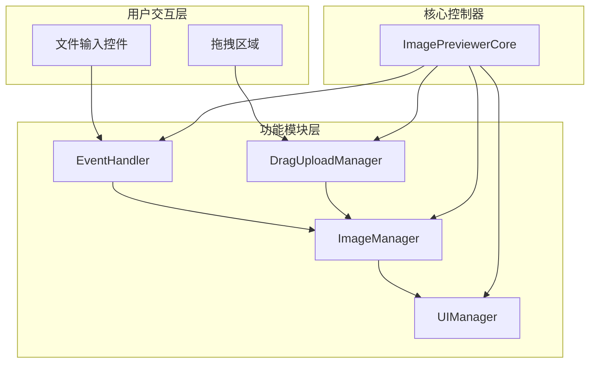
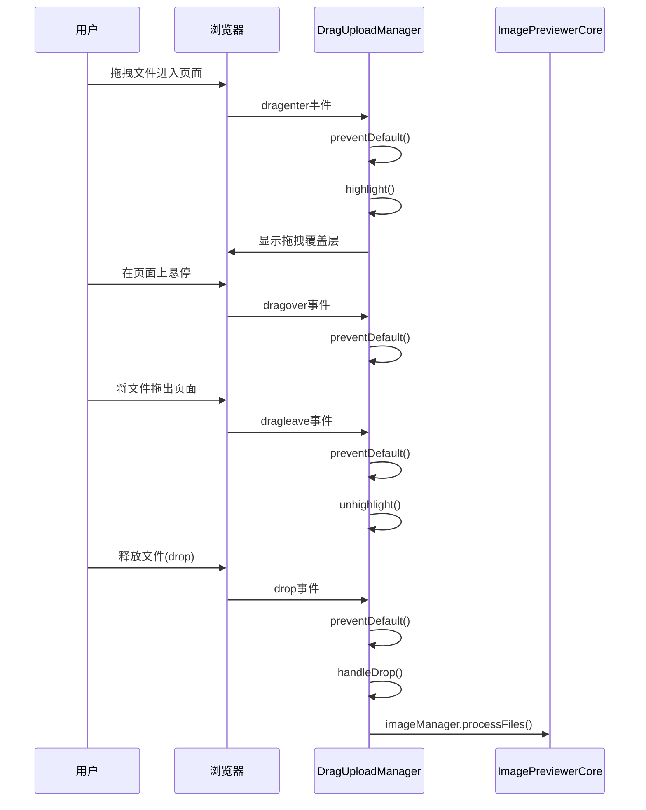
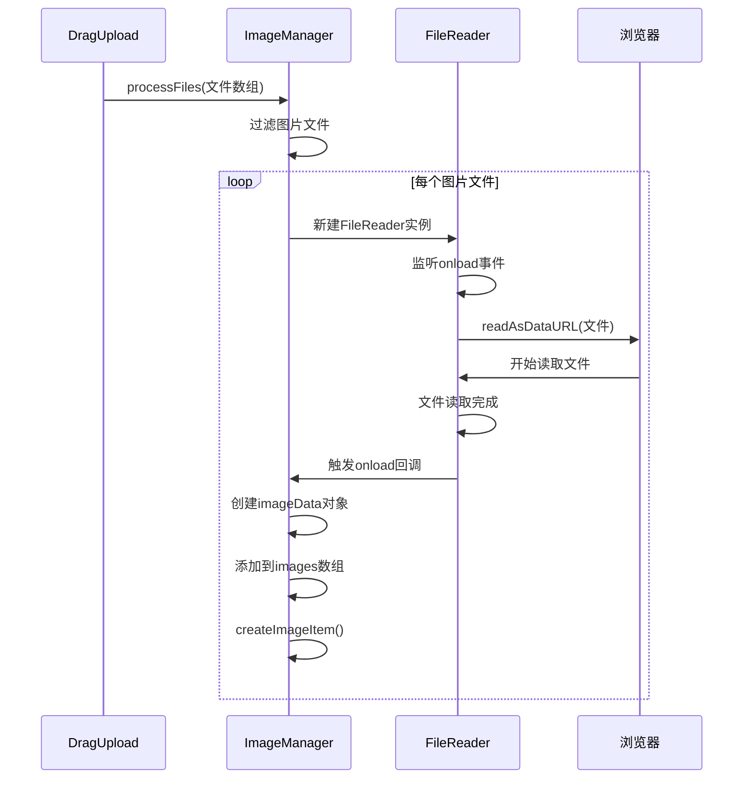
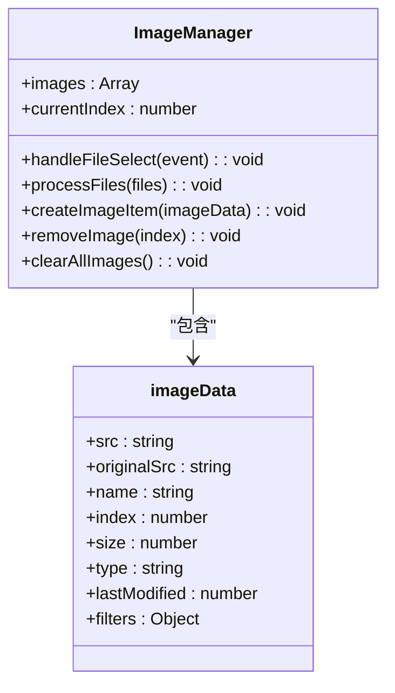
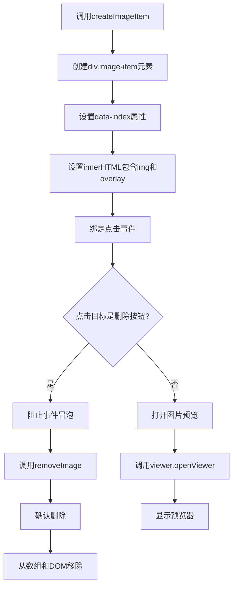
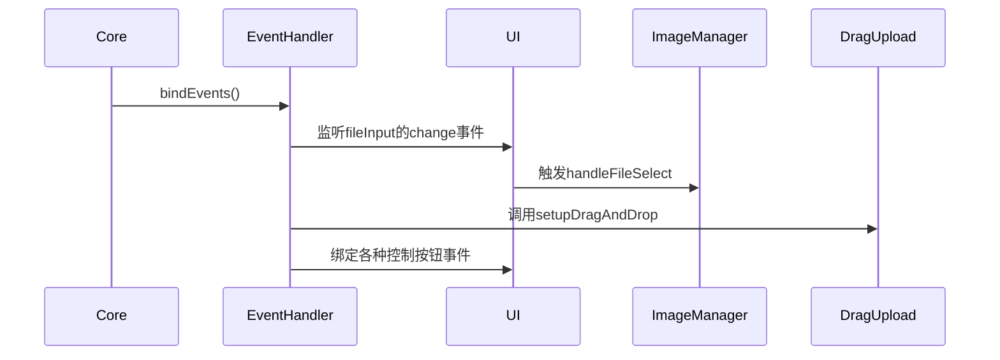
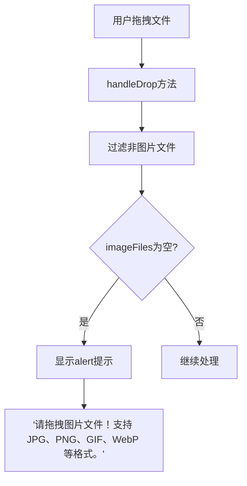
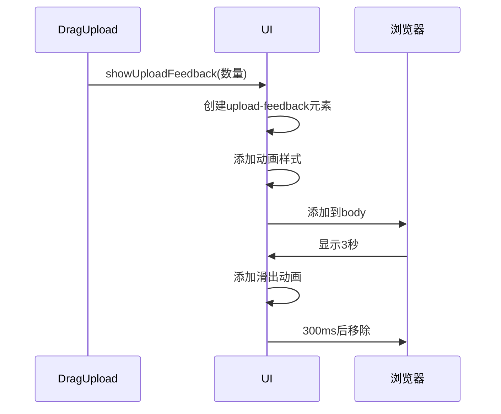
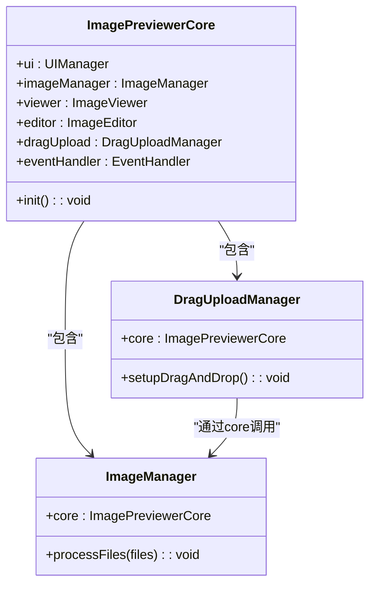
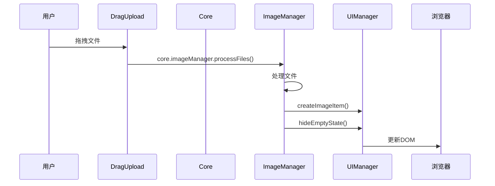

# 图片上传

<cite>
**本文档引用的文件**  
- [dragUpload.js](file://js/dragUpload.js)
- [imageManager.js](file://js/imageManager.js)
- [core.js](file://js/core.js)
- [ui.js](file://js/ui.js)
- [eventHandler.js](file://js/eventHandler.js)
- [index.html](file://index.html)
</cite>

## 目录
1. [简介](#简介)
2. [上传功能架构](#上传功能架构)
3. [拖拽上传机制](#拖拽上传机制)
4. [文件读取与处理流程](#文件读取与处理流程)
5. [图片添加与UI更新](#图片添加与ui更新)
6. [事件绑定与用户交互](#事件绑定与用户交互)
7. [错误处理与反馈机制](#错误处理与反馈机制)
8. [核心控制器集成](#核心控制器集成)
9. [使用示例与用户流程](#使用示例与用户流程)

## 简介
liteImagePreviewer 提供了两种图片上传方式：通过文件输入控件选择图片和通过拖拽操作上传。本系统深入解析其上传功能的实现机制，涵盖从用户交互、事件监听、文件处理到UI更新的完整流程。

## 上传功能架构
图片上传功能由多个模块协同工作，形成清晰的职责分离架构。核心组件包括拖拽管理器、图片管理器、UI控制器和事件处理器。



**图示来源**  
- [core.js](file://js/core.js#L1-L28)
- [eventHandler.js](file://js/eventHandler.js#L1-L215)
- [dragUpload.js](file://js/dragUpload.js#L1-L218)
- [imageManager.js](file://js/imageManager.js#L1-L196)
- [ui.js](file://js/ui.js#L1-L126)

## 拖拽上传机制
拖拽上传功能由 `DragUploadManager` 类实现，通过监听一系列拖拽事件来提供流畅的用户交互体验。

### 事件监听与默认行为阻止
`DragUploadManager` 在 `setupDragAndDrop` 方法中注册了关键的拖拽事件监听器，确保拖拽操作能够正确触发视觉反馈并处理文件。



**图示来源**  
- [dragUpload.js](file://js/dragUpload.js#L10-L100)

### 视觉反馈实现
当用户拖拽文件进入页面时，系统会显示一个半透明的覆盖层，提供清晰的视觉反馈。该覆盖层包含图标、标题和格式支持信息，增强用户体验。

```mermaid
flowchart TD
A[开始拖拽] --> B{文件是否进入页面?}
B --> |是| C[阻止默认行为]
C --> D[添加drag-over类]
D --> E[创建拖拽覆盖层]
E --> F[显示"拖拽图片到这里上传"]
F --> G[支持格式提示]
B --> |否| H[文件离开页面]
H --> I[移除drag-over类]
I --> J[删除覆盖层]
```

**图示来源**  
- [dragUpload.js](file://js/dragUpload.js#L60-L150)

## 文件读取与处理流程
文件上传后，系统通过 `FileReader` API 将文件读取为 Data URL 格式，以便在网页中直接显示。

### FileReader 工作机制
`ImageManager` 类中的 `processFiles` 方法负责处理上传的文件，使用 `FileReader` 异步读取文件内容。



**图示来源**  
- [imageManager.js](file://js/imageManager.js#L34-L66)
- [dragUpload.js](file://js/dragUpload.js#L170-L190)

### 文件类型校验
系统在处理文件前会进行严格的类型校验，确保只处理图片文件。

```mermaid
flowchart TD
A[获取文件列表] --> B{遍历每个文件}
B --> C[检查file.type.startsWith('image/')]
C --> |是| D[添加到imageFiles数组]
C --> |否| E[跳过该文件]
D --> F{imageFiles长度>0?}
F --> |是| G[继续处理]
F --> |否| H[显示错误提示]
H --> I["alert('请拖拽图片文件！')"]
```

**图示来源**  
- [dragUpload.js](file://js/dragUpload.js#L175-L185)
- [imageManager.js](file://js/imageManager.js#L40-L45)

## 图片添加与UI更新
`ImageManager` 负责将新图片添加到图片列表，并更新UI以显示缩略图。

### addImage 方法实现
虽然实际方法名为 `createImageItem`，但其功能等同于 `addImage`，负责创建图片项的DOM元素并添加到页面。



**图示来源**  
- [imageManager.js](file://js/imageManager.js#L0-L32)
- [imageManager.js](file://js/imageManager.js#L68-L120)

### 缩略图创建流程
当新图片被添加时，系统会创建相应的缩略图DOM元素，并绑定必要的事件监听器。



**图示来源**  
- [imageManager.js](file://js/imageManager.js#L68-L120)
- [ui.js](file://js/ui.js#L80-L100)

## 事件绑定与用户交互
事件系统是整个上传功能的核心，确保用户操作能够正确触发相应的功能。

### 事件绑定初始化
`EventHandler` 类负责绑定所有用户交互事件，包括文件选择、拖拽上传和各种控制按钮。



**图示来源**  
- [eventHandler.js](file://js/eventHandler.js#L10-L30)
- [core.js](file://js/core.js#L5-L10)

### 文件输入控件集成
除了拖拽上传，系统还支持传统的文件选择方式，通过隐藏的文件输入控件实现。

```mermaid
flowchart TD
A[用户点击"选择图片文件"按钮] --> B[触发隐藏的fileInput]
B --> C[用户选择文件]
C --> D[fileInput触发change事件]
D --> E[EventHandler.handleFileSelect]
E --> F[ImageManager.processFiles]
F --> G[创建缩略图]
G --> H[更新UI]
```

**图示来源**  
- [index.html](file://index.html#L15)
- [eventHandler.js](file://js/eventHandler.js#L10)
- [imageManager.js](file://js/imageManager.js#L3)

## 错误处理与反馈机制
系统实现了完善的错误处理和用户反馈机制，提升用户体验。

### 无效文件处理
当用户尝试上传非图片文件时，系统会显示明确的错误提示。



**图示来源**  
- [dragUpload.js](file://js/dragUpload.js#L180-L185)

### 重复文件检测
系统会检测并防止相同名称的图片被重复添加，避免数据冗余。

```mermaid
flowchart TD
A[处理单个文件] --> B[检查images数组]
B --> C[find(img => img.name === file.name)]
C --> D{找到同名文件?}
D --> |是| E[跳过添加]
D --> |否| F[继续处理]
E --> G[console.log("图片已存在")]
```

**图示来源**  
- [imageManager.js](file://js/imageManager.js#L42-L47)

### 上传成功反馈
上传成功后，系统会显示短暂的反馈提示，确认操作结果。



**图示来源**  
- [dragUpload.js](file://js/dragUpload.js#L195-L218)

## 核心控制器集成
上传功能与 `ImagePreviewerCore` 紧密集成，通过模块化设计实现高内聚低耦合。

### 模块初始化
`ImagePreviewerCore` 在构造函数中初始化所有功能模块，并建立它们之间的引用关系。



**图示来源**  
- [core.js](file://js/core.js#L2-L28)
- [dragUpload.js](file://js/dragUpload.js#L1-L5)
- [imageManager.js](file://js/imageManager.js#L1-L3)

### 事件通知机制
各模块通过核心控制器相互调用，形成清晰的事件通知链。



**图示来源**  
- [dragUpload.js](file://js/dragUpload.js#L188)
- [imageManager.js](file://js/imageManager.js#L34)
- [ui.js](file://js/ui.js#L40)

## 使用示例与用户流程
以下是用户使用图片上传功能的典型流程和预期反馈。

### 拖拽上传流程
```mermaid
flowchart TD
A[用户将图片文件拖入浏览器窗口] --> B[页面显示蓝色半透明覆盖层]
B --> C[显示"拖拽图片到这里上传"提示]
C --> D[用户释放文件]
D --> E[覆盖层消失]
E --> F[系统处理图片文件]
F --> G[右上角显示"成功上传X张图片！"]
G --> H[缩略图出现在图片列表中]
H --> I[空状态提示消失]
```

### 文件选择流程
```mermaid
flowchart TD
A[用户点击"选择图片文件"按钮] --> B[打开文件选择对话框]
B --> C[用户选择一个或多个图片文件]
C --> D[对话框关闭]
D --> E[系统处理选中的文件]
E --> F[缩略图出现在图片列表中]
F --> G[清空按钮显示]
G --> H[空状态提示消失]
```

### 预期用户反馈
| 用户操作 | 视觉反馈 | 系统行为 |
|--------|--------|--------|
| 拖拽文件进入页面 | 显示蓝色半透明覆盖层，包含上传提示 | 阻止默认拖拽行为 |
| 释放图片文件 | 覆盖层消失，出现成功提示 | 读取文件并创建缩略图 |
| 选择非图片文件 | 显示红色警告对话框 | 忽略该文件 |
| 上传重复名称图片 | 控制台输出日志 | 跳过该文件 |
| 成功上传图片 | 右上角显示绿色成功提示 | 更新图片列表 |

**图示来源**  
- [dragUpload.js](file://js/dragUpload.js#L195-L218)
- [imageManager.js](file://js/imageManager.js#L42-L47)
- [ui.js](file://js/ui.js#L40-L50)