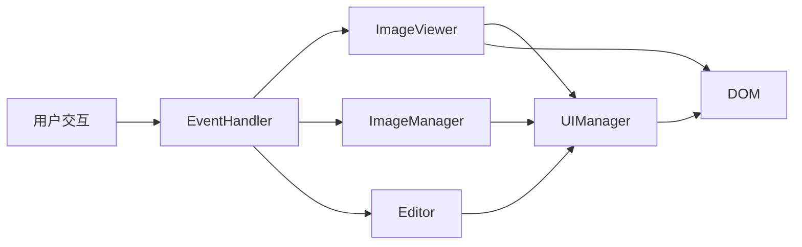
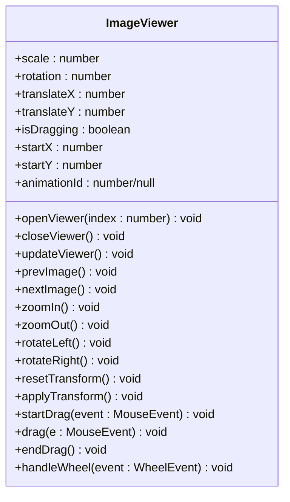
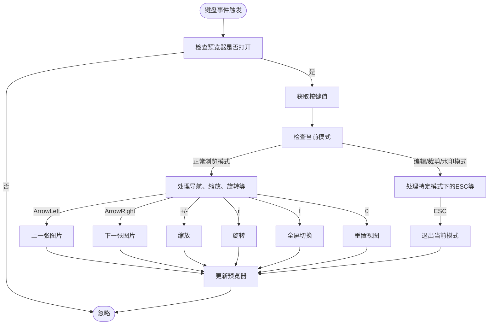
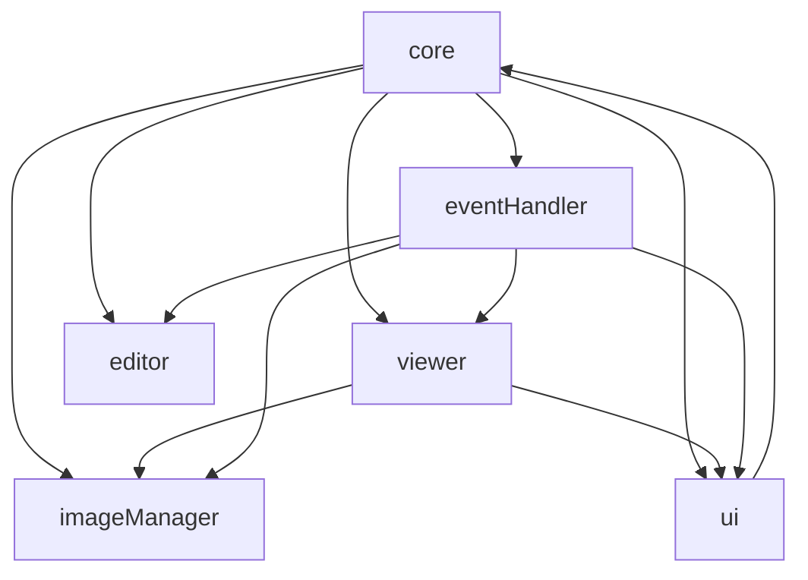

# 图片预览

<cite>
**本文档中引用的文件**  
- [viewer.js](file://js/viewer.js)
- [ui.js](file://js/ui.js)
- [eventHandler.js](file://js/eventHandler.js)
- [core.js](file://js/core.js)
- [imageManager.js](file://js/imageManager.js)
</cite>

## 目录
1. [简介](#简介)
2. [项目结构](#项目结构)
3. [核心组件](#核心组件)
4. [架构概览](#架构概览)
5. [详细组件分析](#详细组件分析)
6. [依赖分析](#依赖分析)
7. [性能考虑](#性能考虑)
8. [故障排除指南](#故障排除指南)
9. [结论](#结论)

## 简介
`liteImagePreviewer` 是一个轻量级的网页图片预览工具，支持图片的缩放、旋转、拖拽、全屏、重置等交互功能。本文档将深入分析其图片预览功能的实现机制，重点讲解 `viewer.js` 和 `ui.js` 如何协同工作，实现流畅的用户交互体验。同时，文档将涵盖键盘事件、鼠标滚轮缩放、DOM结构管理与状态控制等关键特性，并提供常见问题的解决方案和性能优化建议。

## 项目结构
项目采用模块化设计，JavaScript 代码按功能拆分为多个文件，CSS 使用 SCSS 预处理器进行组织。核心功能由 `js/` 目录下的多个类文件实现，通过 `core.js` 进行统一初始化和协调。

```mermaid
graph TB
subgraph "JavaScript 模块"
core[core.js]
viewer[viewer.js]
ui[ui.js]
eventHandler[eventHandler.js]
imageManager[imageManager.js]
editor[editor.js]
dragUpload[dragUpload.js]
end
subgraph "样式与资源"
scss[src/scss]
index[index.html]
style[style.css]
end
core --> viewer
core --> ui
core --> eventHandler
core --> imageManager
core --> editor
core --> dragUpload
ui --> index
scss --> style
style --> index
```

**Diagram sources**
- [core.js](file://js/core.js#L1-L28)
- [js/](file://js/)

## 核心组件
系统的核心由 `ImagePreviewerCore` 类驱动，它负责初始化所有功能模块，包括 `UIManager`（UI管理）、`ImageViewer`（图片查看器）、`ImageManager`（图片管理）和 `EventHandler`（事件处理）。`ImageViewer` 类是实现图片预览功能的核心，它管理图片的缩放、旋转、平移和全屏等状态，并通过 `applyTransform` 方法将这些状态应用到DOM元素上。

**Section sources**
- [core.js](file://js/core.js#L1-L28)
- [viewer.js](file://js/viewer.js#L1-L152)

## 架构概览
整个应用遵循清晰的分层架构。`core.js` 作为应用的入口和协调中心，初始化所有模块。`ui.js` 负责管理所有DOM元素的引用和UI状态更新。`imageManager.js` 负责图片数据的加载、存储和管理。`viewer.js` 封装了图片预览的所有交互逻辑。`eventHandler.js` 则作为事件的中枢，将用户的操作（如点击、键盘、鼠标）分发给相应的功能模块。



**Diagram sources**
- [core.js](file://js/core.js#L1-L28)
- [eventHandler.js](file://js/eventHandler.js#L1-L214)
- [viewer.js](file://js/viewer.js#L1-L152)
- [ui.js](file://js/ui.js#L1-L126)

## 详细组件分析

### ImageViewer 类分析
`ImageViewer` 类是图片预览功能的核心，它通过维护一个变换状态（缩放、旋转、平移）来控制图片的显示效果。

#### 图片变换与交互
该类通过一系列方法实现图片的交互控制。`zoomIn` 和 `zoomOut` 方法通过调整 `scale` 属性来实现缩放，缩放比例被限制在0.1到5之间。`rotateLeft` 和 `rotateRight` 方法通过增减90度来改变 `rotation` 属性。`resetTransform` 方法将所有变换状态重置为初始值。这些方法最终都调用 `applyTransform` 方法，将变换状态组合成CSS `transform` 字符串并应用到 `viewerImage` 元素上。



**Diagram sources**
- [viewer.js](file://js/viewer.js#L1-L152)

**Section sources**
- [viewer.js](file://js/viewer.js#L1-L152)

#### 鼠标拖拽与性能优化
为了实现图片拖拽，`ImageViewer` 监听 `mousedown`、`mousemove` 和 `mouseup` 事件。`startDrag` 方法记录鼠标按下时的初始位置和当前的平移值。`drag` 方法在鼠标移动时计算新的平移值。为了优化性能，`drag` 方法使用 `requestAnimationFrame` 来确保变换的更新与浏览器的刷新率同步，避免了频繁的DOM操作导致的卡顿。`animationId` 用于取消上一帧的动画，确保性能。

**Section sources**
- [viewer.js](file://js/viewer.js#L103-L138)

#### 全屏与状态管理
`toggleFullscreen` 方法利用浏览器的Fullscreen API实现全屏切换。它检查 `document.fullscreenElement` 来判断当前是否处于全屏状态，然后调用 `requestFullscreen` 或 `exitFullscreen` 方法。`openViewer` 和 `closeViewer` 方法通过控制预览器容器的 `display` 样式来显示或隐藏预览窗口，同时修改 `document.body` 的 `overflow` 属性，以防止在预览时页面滚动。

**Section sources**
- [viewer.js](file://js/viewer.js#L78-L99)

### UIManager 类分析
`UIManager` 类负责管理所有与用户界面相关的DOM元素和状态更新。

#### DOM结构与元素管理
`initElements` 方法初始化一个 `elements` 对象，将所有关键的DOM元素（如预览器容器、图片元素、控制按钮等）存储为属性，便于其他模块快速访问。这种集中管理的方式避免了在代码各处重复调用 `document.getElementById`，提高了代码的可维护性。

**Section sources**
- [ui.js](file://js/ui.js#L15-L80)

#### 界面协调与状态更新
`updateViewerUI` 方法是UI协调的核心。当图片切换或状态改变时，`ImageViewer` 会调用此方法。它负责更新预览图片的 `src` 属性、显示当前图片的名称和序号，并根据当前图片在列表中的位置，启用或禁用“上一张”和“下一张”按钮。这确保了UI状态与应用逻辑始终保持同步。

**Section sources**
- [ui.js](file://js/ui.js#L108-L126)

### 事件处理机制分析
`EventHandler` 类是连接用户操作与功能实现的桥梁。

#### 键盘事件支持
`bindEvents` 方法为 `document` 绑定了 `keydown` 事件监听器，指向 `handleKeydown` 方法。该方法首先检查预览器是否处于打开状态。然后，它根据不同的按键执行相应操作：`ArrowLeft`/`ArrowRight` 切换图片，`+`/`-` 进行缩放，`r` 旋转，`f` 切换全屏，`0` 重置视图，`ESC` 退出全屏或关闭编辑面板。代码中通过检查 `editMode`、`cropMode` 等状态，确保在编辑模式下不会触发图片浏览的快捷键。



**Diagram sources**
- [eventHandler.js](file://js/eventHandler.js#L95-L176)

**Section sources**
- [eventHandler.js](file://js/eventHandler.js#L24-L176)

#### 鼠标滚轮缩放
`bindEvents` 方法为预览器容器绑定了 `wheel` 事件。`handleWheel` 方法首先检查事件目标是否在编辑面板内，如果是，则允许滚动事件通过（不进行缩放），以保证用户可以在编辑面板内滚动查看选项。否则，阻止默认的滚动行为，并根据 `deltaY` 的正负值调用 `zoomIn` 或 `zoomOut` 方法，实现滚轮缩放。

**Section sources**
- [eventHandler.js](file://js/eventHandler.js#L31-L33)
- [viewer.js](file://js/viewer.js#L139-L152)

## 依赖分析
各模块之间存在明确的依赖关系。`core.js` 依赖于所有其他模块，是顶层协调者。`viewer.js` 依赖于 `ui.js` 来获取DOM元素，依赖于 `imageManager.js` 来获取当前图片信息。`eventHandler.js` 依赖于 `viewer.js`、`ui.js` 和 `imageManager.js` 来触发具体的操作。`ui.js` 依赖于 `core.js` 来访问其他模块。这种依赖关系形成了一个清晰的功能调用链。



**Diagram sources**
- [core.js](file://js/core.js#L1-L28)
- [viewer.js](file://js/viewer.js#L1-L152)
- [ui.js](file://js/ui.js#L1-L126)
- [eventHandler.js](file://js/eventHandler.js#L1-L214)

**Section sources**
- [core.js](file://js/core.js#L1-L28)
- [viewer.js](file://js/viewer.js#L1-L152)
- [ui.js](file://js/ui.js#L1-L126)
- [eventHandler.js](file://js/eventHandler.js#L1-L214)

## 性能考虑
该项目在性能方面做了多项优化。首先，`imageManager.js` 使用 `IntersectionObserver` 实现了图片的懒加载，只有当图片项进入视口时才开始加载图片资源，大大减少了初始加载时间。其次，`viewer.js` 在处理鼠标拖拽时，使用 `requestAnimationFrame` 来批量更新DOM，避免了在 `mousemove` 事件中频繁操作DOM导致的性能瓶颈。此外，`imageManager.js` 在删除图片时会调用 `URL.revokeObjectURL` 来释放内存，防止内存泄漏。

**Section sources**
- [imageManager.js](file://js/imageManager.js#L47-L67)
- [viewer.js](file://js/viewer.js#L118-L132)
- [imageManager.js](file://js/imageManager.js#L146-L154)

## 故障排除指南

### 图片加载失败
**问题**：图片无法显示，预览器为空。
**解决方案**：
1.  检查文件输入是否选择了有效的图片文件（`type.startsWith('image/')`）。
2.  确认 `FileReader` 的 `onload` 事件是否被正确触发。
3.  检查 `imageManager.js` 中 `createImageItem` 方法生成的 `data-src` 是否正确。
4.  确保 `IntersectionObserver` 正常工作，图片项已进入视口。

**Section sources**
- [imageManager.js](file://js/imageManager.js#L24-L45)

### 缩放或拖拽卡顿
**问题**：在进行缩放或拖拽操作时，界面响应迟缓或不流畅。
**解决方案**：
1.  确认 `requestAnimationFrame` 已正确应用在 `drag` 方法中。
2.  检查是否有其他耗时的JavaScript操作阻塞了主线程。
3.  考虑图片文件过大，浏览器渲染压力大，可尝试压缩图片或优化CSS。

**Section sources**
- [viewer.js](file://js/viewer.js#L118-L132)

### 全屏模式无法进入
**问题**：点击全屏按钮无反应。
**解决方案**：
1.  检查浏览器是否支持Fullscreen API。
2.  查看控制台是否有错误信息，`toggleFullscreen` 方法中已包含 `catch` 块来捕获并打印错误。
3.  确认 `viewer` 元素是否具有触发全屏的权限（通常需要用户手势）。

**Section sources**
- [viewer.js](file://js/viewer.js#L88-L94)

## 结论
`liteImagePreviewer` 通过模块化的设计和清晰的职责划分，实现了一个功能完整且交互流畅的图片预览器。`ImageViewer` 类通过维护变换状态并利用CSS `transform` 实现了核心的缩放、旋转和拖拽功能。`UIManager` 类集中管理DOM元素，确保了UI状态的准确更新。`EventHandler` 类则有效地将用户的各种输入（鼠标、键盘）映射到具体的功能调用上。项目在性能方面也考虑周全，采用了懒加载和 `requestAnimationFrame` 等优化手段。整体代码结构清晰，易于维护和扩展。