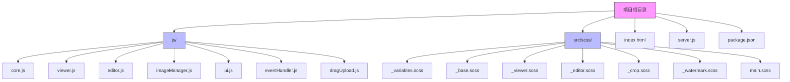
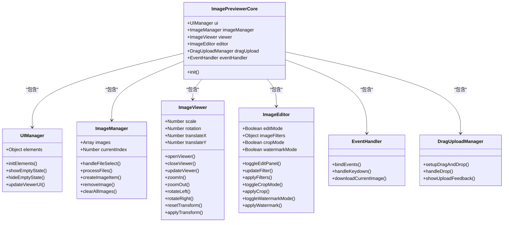
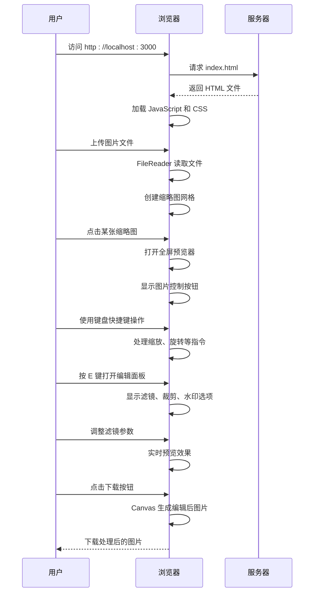

# 项目概述

<cite>
**本文档引用文件**  
- [README.md](file://README.md)
- [package.json](file://package.json)
- [server.js](file://server.js)
- [js/core.js](file://js/core.js)
- [js/viewer.js](file://js/viewer.js)
- [js/editor.js](file://js/editor.js)
- [js/imageManager.js](file://js/imageManager.js)
- [js/ui.js](file://js/ui.js)
- [js/eventHandler.js](file://js/eventHandler.js)
- [js/dragUpload.js](file://js/dragUpload.js)
- [src/scss/main.scss](file://src/scss/main.scss)
</cite>

## 目录
1. [简介](#简介)
2. [项目结构](#项目结构)
3. [核心功能与定位](#核心功能与定位)
4. [整体架构风格](#整体架构风格)
5. [快速体验流程](#快速体验流程)
6. [技术实现路径](#技术实现路径)
7. [差异化优势](#差异化优势)
8. [适用场景](#适用场景)
9. [总结](#总结)

## 简介

liteImagePreviewer 是一个基于 Web 技术的轻量级图片预览与编辑工具，旨在为用户提供简洁高效的图片浏览、上传、缩放、旋转、全屏查看及基础编辑功能。该项目特别适合集成到代码编辑器（如 VSCode、Trae）中使用，具备无依赖、易集成、低资源消耗等优势。

项目采用模块化 JavaScript 设计，结合 Sass 驱动的响应式 UI 和 Node.js 构建的本地开发环境，确保了良好的可维护性和扩展性。通过 README.md 提供的说明，用户可以快速启动服务并体验完整的图片处理流程。

**Section sources**
- [README.md](file://README.md#L1-L143)

## 项目结构

项目采用清晰的目录结构，便于开发者理解和维护：

```
.
├── js/                    # JavaScript 模块
│   ├── core.js            # 应用核心控制器
│   ├── viewer.js          # 图片查看器逻辑
│   ├── editor.js          # 图片编辑功能
│   ├── imageManager.js    # 图片管理器
│   ├── ui.js              # 用户界面控制器
│   ├── eventHandler.js    # 事件处理器
│   └── dragUpload.js      # 拖拽上传管理
├── src/scss/              # Sass 样式源码
│   ├── _variables.scss    # 变量定义
│   ├── _base.scss         # 基础样式
│   ├── _viewer.scss       # 查看器样式
│   ├── _editor.scss       # 编辑器样式
│   ├── _crop.scss         # 裁剪样式
│   ├── _watermark.scss    # 水印样式
│   └── main.scss          # 样式入口文件
├── index.html             # 主页面
├── server.js              # 本地服务器
├── package.json           # 项目依赖配置
└── build.js               # 构建脚本
```



**Diagram sources**
- [js/core.js](file://js/core.js#L1-L28)
- [src/scss/main.scss](file://src/scss/main.scss)

**Section sources**
- [js/core.js](file://js/core.js#L1-L28)
- [src/scss/main.scss](file://src/scss/main.scss)

## 核心功能与定位

liteImagePreviewer 定位于提供轻量级但功能完整的图片预览与编辑解决方案。其核心功能包括：

### 基础预览功能
- **多图片支持**：可同时选择和预览多张图片
- **缩放功能**：支持鼠标滚轮和按钮缩放（0.1x - 5x）
- **旋转功能**：90度左右旋转
- **拖拽移动**：鼠标拖拽移动图片位置
- **全屏模式**：沉浸式全屏预览体验
- **重置视图**：一键恢复原始状态

### 图片编辑功能
- **滤镜调整**：亮度、对比度、饱和度调节
- **预设滤镜**：灰度、复古、反色、模糊等效果
- **裁剪功能**：可视化裁剪框，支持拖拽调整
- **水印功能**：文字水印，支持位置、颜色、样式自定义

### 交互体验
- **键盘快捷键**：完整键盘操作支持（ESC关闭、←→切换、+-缩放等）
- **响应式设计**：适配桌面和移动设备
- **现代化UI**：简洁美观的用户界面
- **主题系统**：支持多种主题切换（默认、暗黑、海洋、日落、森林）

**Section sources**
- [README.md](file://README.md#L15-L80)
- [js/editor.js](file://js/editor.js#L1-L754)

## 整体架构风格

项目采用模块化 JavaScript 架构，各功能组件职责分明，通过核心控制器进行协调。

### 模块化设计
- **ImagePreviewerCore**：应用核心，初始化并协调各模块
- **ImageViewer**：负责图片查看逻辑（缩放、旋转、导航）
- **ImageEditor**：处理图片编辑功能（滤镜、裁剪、水印）
- **ImageManager**：管理图片数据和文件操作
- **UIManager**：控制用户界面状态和DOM操作
- **EventHandler**：统一处理用户交互事件
- **DragUploadManager**：实现拖拽上传功能

### 技术栈
- **前端**：纯 JavaScript + HTML + CSS（Sass）
- **样式**：Sass 预处理器，模块化 SCSS 文件
- **服务器**：Node.js + Express，提供静态文件服务
- **构建**：Sass 编译、并发任务管理（concurrently）



**Diagram sources**
- [js/core.js](file://js/core.js#L1-L28)
- [js/ui.js](file://js/ui.js#L1-L126)
- [js/imageManager.js](file://js/imageManager.js#L1-L196)
- [js/viewer.js](file://js/viewer.js#L1-L153)
- [js/editor.js](file://js/editor.js#L1-L754)
- [js/eventHandler.js](file://js/eventHandler.js#L1-L214)
- [js/dragUpload.js](file://js/dragUpload.js#L1-L218)

**Section sources**
- [js/core.js](file://js/core.js#L1-L28)
- [js/ui.js](file://js/ui.js#L1-L126)

## 快速体验流程

用户可以通过以下简单步骤快速体验 liteImagePreviewer 的完整功能：

### 1. 启动服务
```bash
npm install
npm start
```
或使用开发模式：
```bash
npm run dev
```

### 2. 上传图片
- 点击"选择图片"按钮
- 或直接将图片文件拖拽到页面任意位置

### 3. 预览与编辑
- **查看图片**：点击缩略图进入预览模式
- **基本操作**：
  - 鼠标滚轮：缩放图片
  - 拖拽：移动图片位置
  - R键：顺时针旋转90度
  - F键：切换全屏模式
- **编辑功能**：
  - E键：打开编辑面板
  - C键：开启裁剪模式
  - W键：开启水印模式
  - Delete键：删除当前图片

### 4. 保存结果
- 编辑完成后点击"下载"按钮
- 系统将生成带有"_edited"后缀的文件



**Diagram sources**
- [server.js](file://server.js#L1-L15)
- [js/imageManager.js](file://js/imageManager.js#L1-L196)
- [js/viewer.js](file://js/viewer.js#L1-L153)
- [js/editor.js](file://js/editor.js#L1-L754)
- [js/eventHandler.js](file://js/eventHandler.js#L1-L214)

**Section sources**
- [README.md](file://README.md#L81-L143)
- [package.json](file://package.json#L1-L37)

## 技术实现路径

### 核心架构
项目采用面向对象的模块化设计，通过 `ImagePreviewerCore` 类统一管理各个功能模块：

```javascript
class ImagePreviewerCore {
    constructor() {
        this.ui = new UIManager(this);
        this.imageManager = new ImageManager(this);
        this.viewer = new ImageViewer(this);
        this.editor = new ImageEditor(this);
        this.dragUpload = new DragUploadManager(this);
        this.eventHandler = new EventHandler(this);
        this.init();
    }
}
```

### 图片处理
- **滤镜应用**：使用 CSS `filter` 属性实现实时预览
- **裁剪功能**：Canvas 绘制实现无损裁剪
- **水印添加**：Canvas 绘制文字水印，支持阴影、描边等效果
- **图片下载**：Canvas 转 Blob 实现编辑后图片下载

### 性能优化
- **懒加载**：使用 Intersection Observer 实现缩略图懒加载
- **内存管理**：及时释放 Blob URL 防止内存泄漏
- **事件优化**：使用 `requestAnimationFrame` 优化拖拽性能

**Section sources**
- [js/core.js](file://js/core.js#L1-L28)
- [js/editor.js](file://js/editor.js#L1-L754)
- [js/imageManager.js](file://js/imageManager.js#L1-L196)

## 差异化优势

liteImagePreviewer 相较于其他图像处理库具有以下显著优势：

### 轻量级设计
- **无外部依赖**：仅依赖 Express 和 Multer 用于服务器端
- **低资源消耗**：纯前端实现，不依赖后端图像处理
- **快速加载**：模块化设计，按需加载功能

### 易集成性
- **独立运行**：可作为独立应用运行
- **嵌入友好**：易于集成到现有 Web 应用中
- **API 清晰**：模块化接口设计，便于二次开发

### 用户体验
- **键盘友好**：完整的键盘快捷键支持
- **响应式设计**：适配各种设备尺寸
- **实时预览**：所有编辑操作即时反馈
- **主题切换**：支持多种视觉主题

### 功能完整性
- **基础功能完备**：缩放、旋转、全屏等一应俱全
- **编辑功能实用**：滤镜、裁剪、水印满足日常需求
- **交互流畅**：拖拽上传、键盘操作体验优秀

**Section sources**
- [README.md](file://README.md#L1-L143)
- [package.json](file://package.json#L1-L37)

## 适用场景

### 个人用途
- **个人图库预览**：快速浏览本地图片收藏
- **快速图像调整**：简单的亮度、对比度调整
- **图片分享准备**：添加水印、裁剪后分享

### 开发者用途
- **代码编辑器插件**：集成到 VSCode 等编辑器中
- **Web 应用组件**：作为图片预览组件嵌入项目
- **学习示例**：模块化 JavaScript 应用的优秀范例

### 教育用途
- **前端教学**：展示模块化设计和事件处理
- **Canvas 教学**：演示 Canvas 在图像处理中的应用
- **Sass 教学**：展示 Sass 在实际项目中的使用

**Section sources**
- [README.md](file://README.md#L1-L143)

## 总结

liteImagePreviewer 是一个功能完整、设计精良的轻量级图片预览与编辑工具。它通过模块化的 JavaScript 设计、Sass 驱动的响应式 UI 和 Node.js 构建的本地开发环境，为用户提供了一个高效、易用的图片处理解决方案。

项目不仅满足了基本的图片预览需求，还提供了实用的编辑功能，同时保持了轻量级和易集成的特点。其清晰的代码结构和良好的文档使其成为前端开发者的理想选择，无论是作为独立工具使用，还是作为组件集成到更大的项目中。

**Section sources**
- [README.md](file://README.md#L1-L143)
- [js/core.js](file://js/core.js#L1-L28)